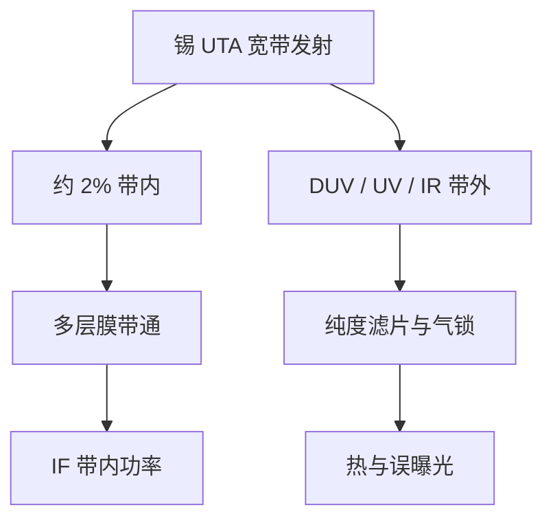

# EUV 光源带宽与带外

多层膜只给大约 2% 的带内窗口；锡等离子体更宽，红外驱动光与深紫外带外都要在进扫描腔之前被当成杂质处理。

<footer>—— 据 Mo/Si 多层膜带宽的公开光学事实，以及 ASML / Cymer 对 in-band / out-of-band 的公开讨论</footer>

[上一课](/litho/euv-power-throughput)把产能写成带内 IF 功率的会计。缺口是：瓦数里只有对准 [Mo/Si](/litho/euv-multilayer-mirror) 布拉格窗口的那一段在成像；其余是带外（out-of-band, OoB），加热、曝光胶的错误层、抬 flare 底座。本课钉 2% 带内与 OoB。光源课序在此收束光谱；投影链上的散射 flare 从[蔡司光学](/litho/zeiss-euv-optics)之后另开一课。

## 问题

锡的 UTA 在 13.5 nm 附近亮，但不是激光单色线。多层膜近正入射的反射通带大约 2% 量级（$\Delta\lambda/\lambda$），六面投影再乘一次，系统就是窄带滤波器。带内功率定义为落在这扇窗里、能被收集镜与 POB 传到硅片的 EUV。窗外的极紫、紫外、可见和 10.6 μm CO₂ 漏光，不进瑞利分辨率，却进热和胶。

剂量传感器若把 OoB 也算进「能量」，硅片上的带内 $D$ 会偏。胶对 DUV 带外往往比 13.5 nm 更敏感，浅层或底层会被错误曝光，侧壁与驻波假设崩掉。红外则主要是热：掩模、pellicle 和镜子吃到非成像功率。功率会计必须先定义带内，才能谈 TPT。

### 2% 从哪来

布拉格多层的通带宽度由对数、消光和周期数决定，量产 Mo/Si 的公开量级是约 2%。光源 UTA 必须与这扇窗重叠，CE 才有意义——CE 的分子是带内 EUV，不是等离子体的全波段辐射。窗太窄，CE 掉；窗太宽，色差与层间匹配变差。系统设计停在与锡 UTA 对齐的那一档，而不是「越单色越好」的光谱仪思维。

「带内」是合同带宽，通常指 13.5 nm 附近约 2% 的积分，不是示波器上的瞬时峰值波长。引用 ASML/Cymer 功率里程碑时，默认这个定义。

## 方法

光谱纯度靠多层膜本身的滤波，再加光路里的光谱纯度滤片（spectral purity filter）和气体吸收，把 CO₂ 红外和 DUV OoB 挡在照明之前。收集镜已经是第一道带通；IF 附近的滤片与光阑继续削 OoB。氢柱对带内也有吸收，流量是清洗与 $T_{\mathrm{gas}}$ 的折中，上一课写过。

计量上，带内功率用多层膜标定的探测器；OoB 用对红外/DUV 敏感的通道分开盯。剂量环必须用带内通道，否则收集镜变脏（带内 $R$ 掉得比某些 OoB 快）时，环会加错能量。

### 与色差、胶和热的接口

窄带使投影色差可管，这是全反射系统相对折射 DUV 的优势之一。剩余带宽仍随视场角走，多层周期的角漂移会把通带挪一点，等于场相关的光谱权重。胶的吸收边在 EUV 很陡，但对 DUV OoB 另有一条曲线——OoB 漏光像加了一层不受 OPC 控制的模糊曝光。红外则走 pellicle 热负荷，与带内吸收叠加。

## 机制

等离子体辐射近似各向同性的宽谱；收集立体角里既有 13.5 nm，也有邻近极紫和更长波。多层膜反射率在通带外迅速掉，但不是零，残余 OoB 经多次反射仍可能到达掩模。CO₂ 主脉冲的 10.6 μm 若未被滤净，会沿部分金属与膜结构传播，成为纯热源。预脉冲若用固体激光，又多一路可见/近紫外，到不了 POB，却能在源舱加杂散。

带内变窄等于把 CE 分子变小，激光白烧。带内变宽等于让胶看见更多「非设计」光谱，NILS 与驻波模型失配。量产停在与六镜通带匹配的 2% 量级，是能量与成像的同一扇窗。

不要把 CO₂ 的 10.6 μm 画进投影物镜。LPP 课已经强调：曝光光束是锡的自发发射。本课补的是：自发发射里只有约 2% 窗口算合同光。

## 边界

本课不编造滤片透过率曲线，也不把实验室单镜 80% 峰值反射写成系统带内效率。光源课序到带宽为止：滴、预脉冲、碎屑、收集镜寿命、P–dose–TPT、光谱。后课光学链路上的 flare 是多层粗糙散射，不是 OoB 的别名——两者都抬底座，来源不同。

引用：Bakshi 对 UTA 与多层带宽；ASML/Cymer 对 in-band power 与 spectral purity 的公开用语。不要发明未公布的瓦数分配（百分之几红外、百分之几 DUV）。

OoB 与 flare 口误最常见。OoB 是错误波长；flare 是正确波长走了错误角度。OPC 补 flare 密度，补不了胶对 DUV 的额外感光。

## 小结

- 合同功率是多层膜约 2% 通带内的带内 EUV，不是等离子体全谱。
- CE 的分子按带内定义；窗与锡 UTA 对齐是 13.5 nm 路线的光谱前提。
- OoB（DUV 与 CO₂ 红外等）贡献热和误曝光，靠多层带通与纯度滤片削减。
- 剂量环必须走带内通道，否则脏镜与滤片老化会加错能量。
- 光源光谱到此钉死；投影散射 flare 另课展开。
- 出处：多层膜 2% 带宽的公开光学；ASML / Cymer in-band / OoB 公开讨论。
