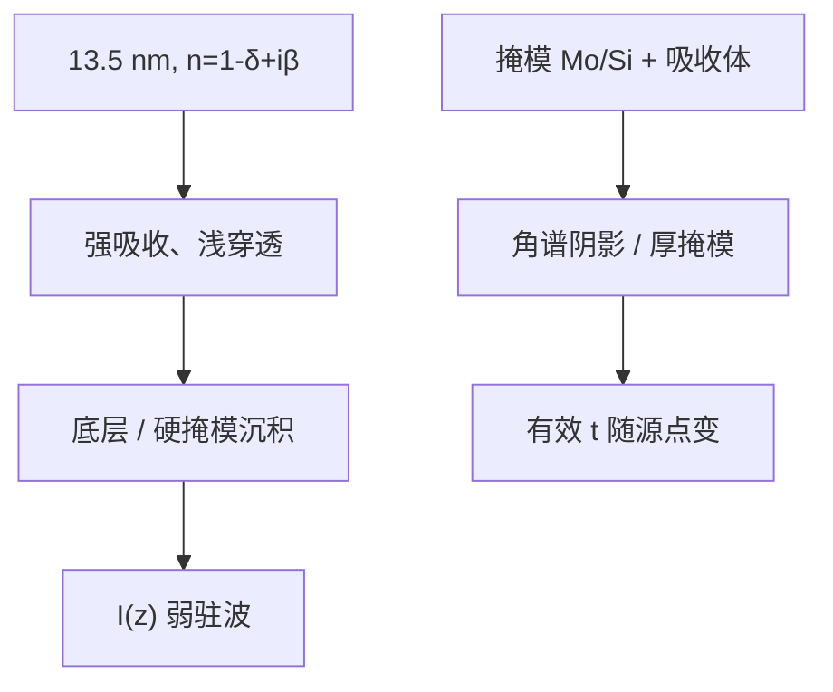

# EUV 的薄膜效应

13.5 nm 上几乎所有固体都强吸收、折射率接近 1 而有小的 $\delta+i\beta$；没有 DUV 式的透明胶加高反衬底那一套 BARC 零点，但仍有界面、底层与掩模多层。

<footer>—— EUV 光学常数 $\delta,\beta$ 的惯例；底层与多层见 Levinson、Mack 及公开的 EUV 材料讨论</footer>

[上一课](/litho/topography-reflection)把 DUV 台阶反射收完。缺口是：补层薄膜课序若只停在 193 nm Fresnel，会把 **EUV** 误写成「再做一层 BARC」。本课钉 13.5 nm 薄膜效应与 DUV 的差，结束「胶下面的反射」课序。不重写 EUV 随机缺孔，不重推 $k_1\lambda/\mathrm{NA}$。

## 问题

EUV 折射率常写成 $n=1-\delta+i\beta$，$\delta,\beta$ 都小但 $\beta$ 足以在几十纳米内吃掉光束。胶本身必须吸收才能产酸或交联，底层（underlayer）也吸收，衬底反射远弱于 DUV 金属垫上的镜面回波。DUV 摆动那种「高 $|r|$ × 透明胶」的深驻波不再是主叙事；取而代之的是：有限穿透深度里的能量沉积轮廓、底层反射的残波、以及掩模 Mo/Si 多层的角谱与阴影。

缺口因此是换一套光学常数语言，而不是把 TARC/BARC 名词平移到真空腔。主干[EUV 底层](/litho/euv-underlayer)与[多层镜](/litho/euv-multilayer-mirror)已有产线侧；本课接到薄膜矩阵：$\delta,\beta,d$ 仍进同一类递推，只是数的量级变了。

### 掩模侧也是薄膜

晶圆胶下是吸收栈；掩模是多层反射加吸收体。斜入射（Chief ray）让吸收体有阴影，等效物 $t$ 随源点变，薄物体 TCC 近似变差——[阿贝对 Hopkins](/litho/abbe-vs-hopkins) 已预告。本课强调：EUV「薄膜效应」同时发生在掩模与晶圆，DUV 课序主要发生在晶圆。

High-NA EUV 角更大，掩模 3D 与晶圆沉积的角谱更苛刻，但仍不是浸没水层。不要把浸没矢量分析里的 $n\approx 1.44$ 抄过来。

## 方法

晶圆：用 $\delta,\beta$ 多层算胶 + underlayer + 硬掩模的吸收 $I(z)$，看残反射是否仍足以在薄胶里造出可测的节点。优化底层是为黏附、二次电子、反射控制与刻蚀，光学只是其中一行。摆动仍可能以弱振幅出现，工作点逻辑与 DUV 相同，但周期按 13.5 nm 和该胶的 $n\approx 1$ 来，数值完全不同。

掩模：多层 Bragg 条件随 $\theta$ 走，源点环上反射率不匀，进照明的有效 $S$ 带薄膜指纹。计算上用厚掩模衍射（每个源点一次）或近似域分解，而不是单张薄 $t$。

### 与随机性的边界

吸收强意味着光子在体积内计数少，随机课管泊松与化学噪声。本课只管确定的电磁沉积轮廓。加厚胶提高吸收也增加体积噪声，RLS 三角在薄膜选择上出现，不在本课展开成缺陷率公式。

## 机制

$\beta$ 大，往返振幅 $e^{-2k\beta d}$ 迅速衰减，底面回波弱，这就是「EUV 不太需要 DUV 式 BARC」的电磁原因。仍需要底层，是因为界面化学、二次电子来源、以及残留反射在超薄胶里相对权重上升。掩模多层把入射角写进反射相位，物频谱带着角依赖的复权重，二维孔和线端的有效核随照明环变化，比 DUV 薄铬更狠。

形貌：前层台阶在 EUV 上既改局域厚度，又改斜入射阴影，上一课与掩模 3D 叠加。平坦化动机不消失。

## 边界

本课不给某代 NXE 的胶厚与底层纳米规格。光学常数随密度、氧化、碳污染变，$\delta,\beta$ 表必须对应实际膜，不能抄真空元素表当产线栈。禁止发明 arXiv 编号或未公开反射率曲线。傅里叶骨架（卷积、TCC、SOCS）在 EUV 上仍用，只是 $P$ 与 $t$ 换成矢量厚掩模与吸收沉积。

薄膜课序到此：反射率 → 摆动 → 选厚 → TARC → 多层 BARC → 形貌 → EUV。

## 小结

- EUV 用 $\delta+i\beta$，强吸收使 DUV 式深驻波减弱，底层仍必要。
- 薄膜矩阵形式还在，数的量级与优化目标变了。
- 掩模多层与斜入射阴影是 EUV 特有的「薄膜成像」项。
- 弱摆动仍按工作点选厚，周期不是 193 nm 那一套。
- 补层「傅里叶光学与成像续」在此结束。
- 出处：Born &amp; Wolf（分层）；Mack、Levinson；EUV 光学常数惯例。
