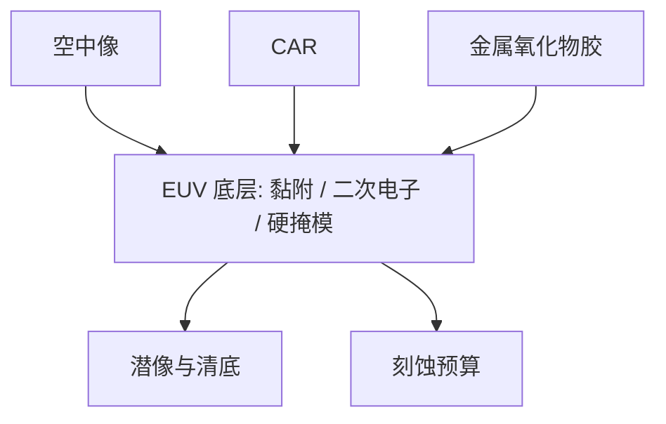

# EUV 底层

胶不是直接坐在器件膜上成像的。底层决定黏附、二次电子、出气隔离和刻蚀预算；换胶化学而不换底层，等于只换了记录介质的上半截。

<footer>—— 据 Levinson 对底层 / 抗反射层的产线讨论，以及公开的 EUV 底层功能划分整理</footer>

[上一课](/litho/tin-oxide-resist)（锡氧胶化学）。把记录介质分到 CAR 与金属氧化物两条工作点。缺口不是再选一次 PAG 或锡氧笼，而是薄膜下面那一层：EUV 胶往往只有十几纳米量级，黏附、衬底毒化、二次电子和硬掩模预算都压在 underlayer 上。本课钉底层功能。接触孔的随机缺失，留给[下一课](/litho/stochastic-holes)。

## 问题

DUV 的 BARC 首先是为驻波与衬底反射服务的。[衬度曲线](/litho/resist-contrast-curve)已经警告过：无 BARC 时 $T(E)$ 会振荡。EUV 的 13.5 nm 在大多数叠层上反射弱，驻波不再是第一理由。薄胶却把另一组问题抬上来：旋涂膜在疏水或金属表面上掉、CAR 被衬底碱或金属离子淬灭出 footing、出气打到多层膜、显影后的浮雕扛不住干法。

金属氧化物胶更薄、自身可当硬掩模，但仍要平面化、黏附和二次电子管理。缺口因此是「胶种选定之后，栈怎么接」，不是重讲 RLS 三角。

### 底层不是把 DUV BARC 涂薄一点

EUV 底层常见功能叠在同一膜或两层栈上：黏附与浸润、平面化、二次电子产额、出气阻挡、刻蚀选择比、阻挡衬底对酸的毒化。公开讨论里它可以是旋涂碳、含硅、含金属的有机无机杂化，而不是「抗反射涂料换波长」。把 KrF BARC 配方直接减厚，会在黏附和二次电子上同时失手。

二次电子可以从底层射进胶，等效增加吸收事件。这能抬灵敏度，也会把界面附近的模糊和随机一起改写。底层不是光学上的透明垫片。

## 方法

选底层要和上一课的胶种绑死。CAR：优先防 footing、控酸在界面的淬灭/反射，并给有机胶一个够用的刻蚀硬掩模。金属氧化物：优先黏附、平面化、以及显影液不钻蚀界面；硬掩模功能部分由胶自身承担，底层改管图形转移的下一段。换胶批次等于换底层模型，OPC 紧凑抗蚀剂模块要重校准，不能只改剂量。

涂布在轨道上完成：膜厚、烘烤、与胶的层间混合窗口都是工艺旋钮。过烘会改变二次电子产额与应力；欠烘则溶剂残留、黏附垮。本课不把轨道食谱写成唯一表，只要求窗口实验声明底层。

### 与空中像的接口

底层改的是界面处的有效剂量与黏附，不改物镜 TCC。但界面二次电子会给潜像加一个轴向不对称的模糊，侧壁和清底剂量跟着走。E–D 窗若在换底层后搬家，先查界面而不是先怪照明。

## 机制

EUV 光子在胶里吸收长度短，相当一部分能量停在膜下半与界面。底层若含较高原子序数，局部二次电子产额上升，靠近界面的脱保护或交联被加强——灵敏度看起来「免费」提高，其实是把事件统计从胶体挪到界面。CAR 的酸若被衬底淬灭，底部溶解变慢，孔清不干净；底层把胶与衬底隔开，是化学隔离，不是光学隔离。

刻蚀端，薄 CAR 几乎必须靠底层当硬掩模；金属氧化物胶把选择比买在自身骨架上，底层更多是黏附与平坦。两种胶的失败模式不同：前者是转印时胶先没，后者是涂布缺陷和金属沾污。Levinson 把底层放进工艺栈而不是镜头规格，原因在此。

### 出气与沾污是栈的合同

EUV 真空里，胶与底层的出气会打到多层膜。底层可以当阻挡，也可以自己成为出气源。金属底层还要过腔体沾污门。实验室里好看的 LER，若底层颗粒或针孔把缺孔密度抬起来，产线不会收。合同是缺陷密度与镜头污染，不是底层折射率表。

报 EUV 胶数据必须写底层：材料族、厚度、烘烤。只报「某金属胶更敏」而省略 underlayer，和只报模型 loss 不报数据预处理是同一类误导。

## 边界

本课不把某供应商的底层牌号写成节点标准，也不把 DUV BARC 的光学厚度公式搬来算 EUV。驻波课的抗反射设计在这里降为次要项，但高反射衬底（某些金属）仍可能要单独处理，不能说「EUV 永不需要抗反射」。

后课默认：说到 EUV 胶，栈包含底层；换胶或换底层都要重做剂量、黏附和随机尾部。缺孔统计如何成为良率墙，下一课才展开，不在这里用平均 CD 代替。

平面化失败会把局部焦面抬成底层厚度图。看起来像扫描机调平，根子在旋涂。先量底层均匀性，再拧工件台。

后课需要的定义到此为止：underlayer 是功能栈，不是 BARC 的别名。

## 小结

- EUV 底层接在 CAR / 金属氧化物胶之后，管黏附、二次电子、隔离与刻蚀预算。
- 驻波不再是第一理由；把 DUV BARC 减厚当 EUV 底层会失手。
- 换胶必须换底层模型；界面二次电子会改灵敏度与模糊。
- 合同是缺陷、出气与沾污，不是折射率。
- 随机缺孔下一课。
- 出处：Levinson, *Principles of Lithography*；公开的 EUV 底层功能讨论。
