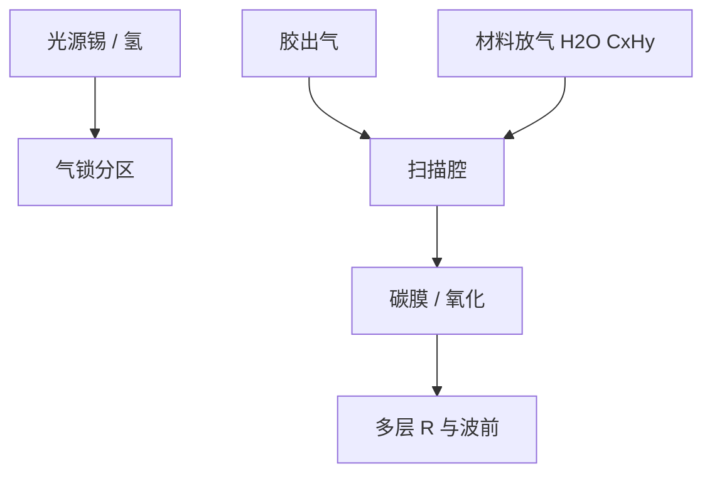

# 真空与污染控制

13.5 nm 的吸收长度逼整机抽真空；残余水、碳氢和锡决定镜子能亮多久。泵速解决本底，解决不了持续的质量源。

<footer>—— 据 Bakshi 真空与碳污染；ASML 对 EUV 真空分区的公开架构</footer>

[上一课](/litho/hydrogen-plasma-mirrors)把镜面写成氢等离子体壁。缺口是腔体尺度的物种清单：水、碳氢、氧、锡、胶出气。它们在 EUV 下裂解，变成碳膜或氧化。掩模如何在这张真空里被吸住，留给[下一课](/litho/euv-reticle-chuck)。

## 问题

氢等离子体课管的是已经到镜子上的 H 和离子。污染控制管的是谁被允许进入扫描腔。几个帕的碳氢或水，沿程吸收和表面裂解就够把多层变暗。光源舱持续注入锡；硅片侧光刻胶出气；运动台的电缆、润滑和光刻胶溶剂是碳源。真空泵把本底压下去，挡不住这些源——必须分区、差动抽气、材料认证和烘烤。

缺口是把「EUV 要真空」从光学课的一句话写成污染预算。没有固体窗，分区靠缝和气流，与 DGL 同族，但对象从锡扩展到全机放气。

碳膜在 EUV 下生长可以极快。公开叙事把碳氢分压和材料放气写成光学寿命的一等项，而不是设施附录。

## 方法

分区：光源（脏、氢多、锡）→ IF 通道 → 照明/投影（干净）→ 掩模腔 → 硅片腔。每一级差压和泵口，物种的扩散平均自由程被切断。材料：低放气、EUV 兼容，禁止普通油脂。胶出气用底层/烘烤和剂量管理约束；随机效应加剂量会加重出气，污染与工艺绑定。

计量：残余气体分析（RGA）盯水、碳氢、氧；光学盯反射率漂移。联锁：破真空、异常质量数、氢安全。恢复：投影镜以防为主，过激氧清洗会改多层，通常不作为日常手段。

### 胶剂量是污染源项

随机效应加剂量，出气质量流往往一起升。污染预算因此与工艺窗口绑定：把某层剂量加倍，碳生长斜率可能先于 CD 均值越界。底层和胶配方的放气资格要在接近扫描机的 EUV + 氢下做，不能只做残余气体谱的实验室烘烤。

## 机制

EUV 光子约 92 eV，打断分子键的效率远高于 DUV。吸附的碳氢裂解成难挥发性碳，缺氢时生长，有氢时与 CH₄ 通道竞争——氢等离子体课的自由基在全腔尺度上既是清洗剂也是反应物。水提供氧，氧化硅层和帽层，周期和应力漂，figure 跟着走。锡若突破气锁，投影镜没有收集镜那种可换性，是灾难项。

不要把同步辐射束线的真空规范整段粘成 NXE 图纸。机制相同：无窗、差分、碳污染；几何和氢流量是光刻机自己的。

## 边界

本课不写静电吸盘如何夹 6 英寸版，下一课才进入掩模台。不重写 DUV 浸没水控。开盖维护是污染事件，恢复反射率的时间要进稼动，不能当「抽真空就干净」。出处：Bakshi 碳污染与真空；ASML 真空/氢架构；DGL 与氢等离子体课。

## 小结

- 真空是吸收长度和表面化学的共同前提；泵必须配分区与材料认证。
- 碳、水、锡是三条并行污染，氢与它们竞争而非万能溶剂。
- 下一课：在这张真空里夹住反射掩模。
- 出处：Bakshi；ASML。
