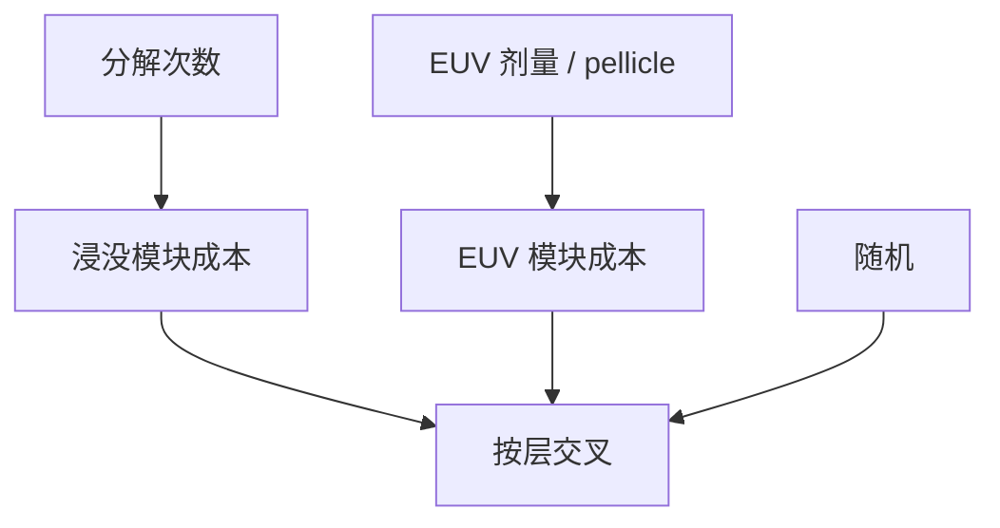

# EUV 对多重曝光的成本交叉

交叉点是「一张 EUV 替换几次浸没 + 切线」在周期、套刻与掩模上的平衡，随剂量、pellicle 和层类型移动。

<footer>—— 对照 ASML 与代工对 EUV 插入临界层、浸没保留次临界层的公开叙事</footer>

[上一课](/litho/cost-per-layer-wafer)给出按层加总。缺口是决策：某层该不该从 LELE/SAQP 迁 EUV。本课钉成本交叉。[DUV 多重代价](/litho/duv-multipattern-cost) 已写 7/5 nm 结构；这里收成交叉逻辑。机台本身多贵，留给[下一课](/litho/tool-price-depreciation）。

## 问题

EUV 单次买回二维与减张数、减同层套刻；付出源功率、随机剂量、掩模、pellicle。浸没多重买分辨率，付出步骤与设计规则。交叉点按层：密孔可能早迁，宽松金属可能永不迁。高 NA 再改一次交叉（半场、更贵机台、薄胶）。

缺口是**移动的平衡**，不是「EUV 总更贵」或「总更便宜」。不填美元交叉点。

### 公开叙事可引用结构

ASML 把浸没定位为多重与次临界工作马，NXE 为临界层。混跑与 cross-match 是交叉之后仍存在的状态，不是过渡年特写。

随机悬崖可以把「光学上该迁 EUV」的层留在多重，或迫使 EUV 双重。交叉含随机，不只含 wph。

## 方法

对候选层：列 DUV 模块步骤 vs EUV 模块步骤，加套刻风险、设计自由度、掩模周期。灵敏度扫剂量与pellicle T。决策是 DTCO，不是财务单独。

## 机制

成本差 Δ ≈ (n_DUV · c_imm − c_EUV) + 掩模差 + 良率差。n_DUV 随节距涨；c_EUV 随剂量涨。交叉发生在 n 足够大且 c_EUV 被功率/pellicle 压下来时。这是结构式，系数来自当时厂数据，课文不编。

## 边界

不预测某年全球交叉。不把所有层一次迁完。交叉不消除浸没机需求。

后课默认：层决策看交叉结构；下一课机台价格与折旧如何把 c_imm、c_EUV 变成会计数字。

## 小结

- 交叉按层，随分解次数、EUV 剂量与随机移动。
- 混跑是稳态；浸没仍服务次临界层。
- 只比较结构，不编美元交叉点。
- 出处：ASML/代工公开插入叙事；与多重代价课衔接。
