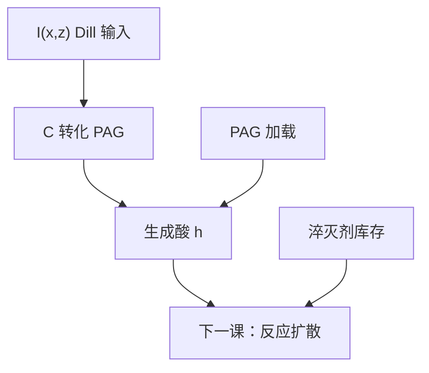

# 曝光动力学与光酸生成

Dill 的 $C$ 写出 PAC 怎么被消耗；化学放大还要把同一段曝光读成酸的出生。动力学在曝光结束时停止，催化不在这里开始。

<footer>—— 据 Dill 曝光方程与 Ito / Willson 产酸接口；Mack 对 PAC/PAG 转化的表述整理</footer>

[上一课](/litho/dill-parameters)把 $A$、$B$、$C$ 钉成胶内吸收与 $m$ 的速率。缺口是：[CAR](/litho/car-resist) 的潜像不是抑制剂分数，而是酸浓度。本课把曝光动力学接到光酸生成。[PAG 与淬灭剂](/litho/pag-quencher)已经说明酸从哪来、碱钉阈值；这里只补曝光时段的速率，不重写那一对配方旋钮。PEB 里酸怎么走，留给[下一课](/litho/peb-reaction-diffusion)。

## 问题

Dill 方程的 $m$ 对 DNQ 就是 PAC 分数。CAR 里对应物是未转化 PAG 分数：曝光把 PAG 打成酸（DUV 上直接或经敏化；EUV 上经二次电子，本课先承认路径不同，不写截面表）。低剂量、无耗尽时，酸浓度近似与吸收能量成正比，看起来像「$C$ 乘剂量」。剂量高了，PAG 耗尽，$m$ 指数下降，产酸饱和——这是曝光动力学，不是 PEB 增益。

缺口因此是：把上一课的 $\partial m/\partial t=-CIm$ 读成酸源项 $h=h_0(1-m)$（或等价的 PAG 转化分数），并声明淬灭剂在曝光结束时几乎还没动。把酸图直接写成空中像 $I(x)$，等于假定转化永远线性、碱为零。

### 曝光结束，催化尚未开始

室温下脱保护速率通常可以忽略。扫描狭缝走过之后，晶圆上只有酸与剩余 PAG、预置碱。Ito / Willson 的放大发生在后烘。本课禁止用「化学增益」解释曝光时段的灵敏度：增益还没开机。

EUV 一次 92 eV 吸收可经电离产多颗酸，有效「量子产率」可以大于 1，仍是曝光事件，不是 PEB 循环。Kozawa 的电离路径改的是本课源项的预因子，不改「曝光写酸、PEB 用酸」的分工。

## 方法

紧凑写法：指定 $C$ 与初始 PAG 加载，沿狭缝时间积分 $I(x,z,t)$，得到转化分数与酸浓度 $h(x,z)$。漂白若 $A\neq 0$，必须与强度联立，否则底部酸会被高估。表征：用 $E_0$ 扫胶、或用指示剂看产酸，但 $E_0$ 还含显影与 PEB，不能单独反解 $C$——标定要固定后烘再拆。

与[淬灭剂](/litho/pag-quencher)的接口：曝光模块输出的是生成酸；有效酸要等下一课中和。本课可以承认「碱在膜里」，但速率方程仍把中和留给 PEB 温度下的扩散–反应。把中和写进曝光积分，等于给室温一个虚假的催化时钟。

## 机制

DUV：光子把鎓盐 PAG 打成超强酸，量子效率通常小于 1，受聚合物吸收分流——上一课的 $B$ 并不全是 PAG。酸一旦生成，在曝光时间尺度上基本钉在出生点附近；室温扩散长度远小于 PEB 的 $\ell$。EUV：吸收截面由高 Z 与聚合物共同决定，二次电子把能量交给 PAG，源项在空间上已经带一颗纳米核——那颗核的模型是随机课序的题目，本课只把平均产酸写进 $h$。

线性区：$h\propto(1-e^{-CE})$ 一类饱和形式（细节随是否用剂量还是局部强度积分而变）。OPC 紧凑胶若用「有效剂量 × 灵敏度」，等于取了这个函数的切线；PAG 耗尽或漂白强时切线撒谎。

不要把「更敏」写成更大的 $C$。加 PAG 加载、加 PEB、减淬灭都能降 $E_0$，只有第一种主要改本课的源项幅度。

## 边界

不写 PAG 分子式，不把某胶的量子产率当节点规格。不重推 CAR 循环——[化学放大](/litho/car-resist)已经钉过。下一课默认本课交出平均酸图 $h(x,z)$，再在 PEB 温度下做反应–扩散。随机计数把 $h$ 换成离散分子，那是后一单元；本课仍是连续场。

## 小结

- 曝光动力学把 Dill $C$ 读成 PAG 转化与酸源项；催化不在曝光里。
- 低剂量近线性，高剂量 PAG 耗尽饱和。
- 淬灭剂库存带到 PEB，不在室温积分里被「用掉」。
- EUV 电离可让每光子酸数 $\gt 1$，仍属曝光源项。
- 「更敏」未必是更大的 $C$。
- 出处：Dill 曝光方程；Ito / Willson 产酸；Mack 教材中的 PAG 转化。
