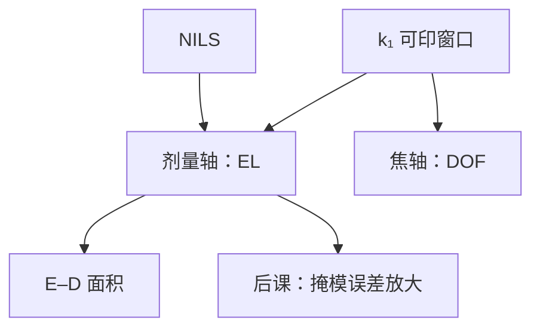

# 曝光宽容度

$k_1$ 窗口已经问「这一层还印不印得动」；曝光宽容度把其中一根轴写成剂量还能漂几个百分点。

<footer>—— 据 Levinson, Principles of Lithography 与 Mack 对 exposure latitude 及工艺窗口的定义整理</footer>

[上一课](/litho/k1-factor-window)把 $k_1$ 从名义工作点改成可印窗口：RET 买的是面积，不是又一个更小的 $\lambda/\mathrm{NA}$。缺口是把窗口的**剂量轴**单独命名。本课钉曝光宽容度（EL）：最佳焦距附近，CD 仍落在规格内的相对剂量宽度。掩模 CD 误差如何被放大，留给[下一课](/litho/meef)。波长台阶仍不是本课的题目。

## 问题

$k_1$ 窗口在概念上混着节距、照明、二维图形与「剂量–焦距还剩多少」。产线要在曝光机上拧的是剂量（$\mathrm{mJ/cm^2}$）。缺口因此是：在最佳焦面（或指定焦面）上，把合格剂量区间写成相对量

$$
\mathrm{EL}=\frac{E_\mathrm{max}-E_\mathrm{min}}{E_\mathrm{center}},
$$

其中 $E_\mathrm{max}$、$E_\mathrm{min}$ 是 CD 碰到规格带两端（常用目标 $\pm 10\%$）的剂量。只报「窗口很大」而不报 EL，无法判断剂量控制、均匀性与光源功率抖动还剩多少余量。

EL 是窗口在剂量轴上的切片，不是胶的 $\gamma$ 的别名。$\gamma$ 陡可以切锐，但光学 NILS 不够时，EL 仍然瘦。

### EL 不是 DOF

焦深是 $z$ 轴宽度，EL 是 $E$ 轴相对宽度。两者在 E–D 图上围成面积，可以此消彼长：离轴照明常买 DOF、不一定买 EL。比较不同 RET 必须两根轴都看，不能只把 $k_1$ 压低当成绩。

EL 要声明图形、规格带与焦面。密线、孤立线、孔的 EL 不同；层的剂量必须同时养活重叠窗口里最窄的那一根轴。

## 方法

实验：曝光矩阵在最佳焦附近扫剂量，量 CD，读规格带内的 $E$ 区间，除以中心剂量。模拟：阈值或校准胶模型上对 $I(x)$ 做同样的切。光学预言来自 NILS 课：相对 CD 误差随相对剂量误差涨、随 NILS 降，因而 EL 与 NILS 同向。Mack 把 NILS 当 EL 的空中像代理；硅片 EL 还要扣扩散、计量偏置。

$k_1$ 降低时，通带边缘调制变弱，NILS 掉，EL 先于「名义分辨率」关门。RET 若只把某一节距的对比抬上去，EL 的成绩单仍是重叠窗口里最差的图形。

### 与 k₁ 窗口的接口

上一课的成功判据是窗口面积可量产。本课把面积的一条边标成 EL。另一条边是 DOF（Bossung 横切）。后课 MEEF 是第三种误差源：掩模 CD 不稳时，即使 EL 数字好看，晶圆 CD 仍可能出格——那不是剂量轴，不要塞进本课的公式。

剂量单位是 $\mathrm{mJ/cm^2}$，EL 是无量纲（常报百分数）。不要把 EL 与焦深纳米加总成一个「越大越好」而不声明规格与图形。

## 机制

阈值切在空中像斜坡上。剂量升高，相对阈值下移，两边外扩或内缩（视正负胶与线/空）。斜坡越陡（NILS 越大），同样 $\Delta E/E$ 引起的 $\Delta\mathrm{CD}/\mathrm{CD}$ 越小，规格带内能容纳的剂量区间越宽。零级偏置抬高 $I_\mathrm{min}$，切点落到缓区，EL 崩掉——这与 $k_1$ 靠近单次地板是同一光学事实的剂量读出。

扫描机的剂量均匀性、狭缝积分、脉冲能量抖动，全部吃 EL。控制余量必须小于本课定义的窗口，而不是等于它。

### 后课默认的接口

说到工艺窗口的剂量轴，就是 EL，须附规格与图形。说到压 $k_1$，默认要检查 EL 是否还活着，而不是只看名义半节距。MEEF 下一课另开误差通道。

## 边界

EL 不含套刻、不含缺陷密度、不含刻蚀后偏置——除非量的就是刻蚀后 CD。EUV 随机失效可能在平均 CD 仍合格时先关窗，那是随机课的尾部。本课不编造某代机台「EL 必须大于百分之几」的内部门槛；教科书用 $\pm 10\%$ CD 只是常用举例，不是物理常数。

波长换档会同时改 NILS 与剂量绝对量，那是波长课；本课在固定 $\lambda$、$\mathrm{NA}$ 下谈相对剂量宽度。

## 小结

- EL 是最佳焦附近 CD 合格的相对剂量宽度，是 $k_1$ 窗口的剂量轴。
- 它与 DOF 正交；面积才是层窗口。
- 光学上 EL 随 NILS 涨，随 $k_1$ 贴近地板而瘦。
- 必须声明图形与规格带；$\gamma$ 不能替代 NILS。
- 下一课：掩模 CD 误差的放大不走剂量轴。
- 出处：Levinson, *Principles of Lithography*；Mack, *Fundamental Principles of Optical Lithography*。
