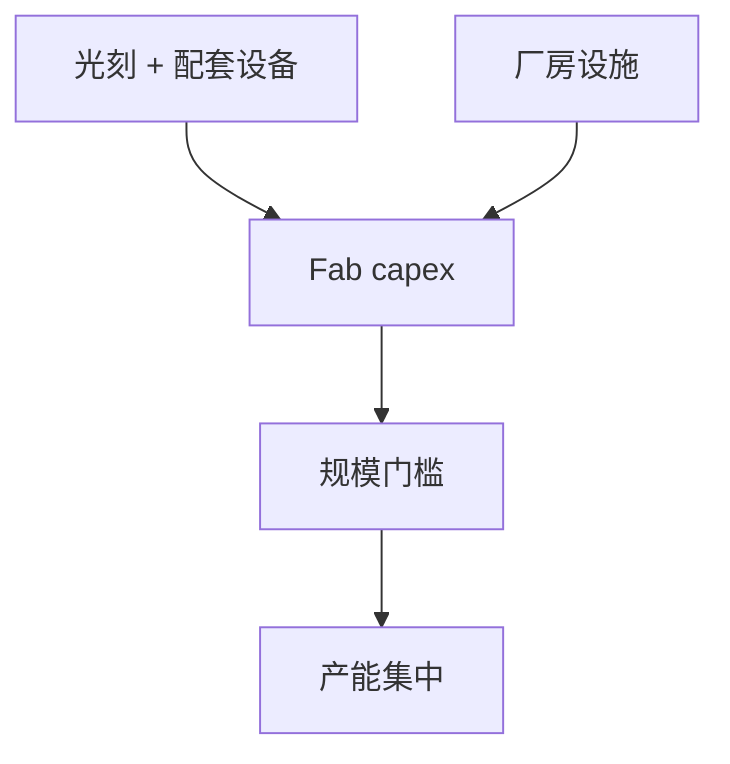

# 晶圆厂资本开支

先进逻辑厂的资本开支里，光刻设备占很大一截，但不是全部：洁净室、电源、真空、刻蚀与计量一起付款。

<footer>—— 对照领先晶圆厂 capex 结构的公开产业讨论；不编造某厂亿美元数</footer>

[上一课](/litho/capacity-planning-bottleneck)数了瓶颈台数。缺口是整张支票。本课钉晶圆厂资本开支。摩尔叙事如何从光刻视角阅读，留给[下一课](/litho/moore-litho-view）。

## 问题

Capex = 厂房 + 设施（电、水、超纯、真空、排气）+ 设备（光刻、刻蚀、薄膜、CMP、检测、植入）。EUV 还要源、氢、锡、特殊真空。高 NA 再加更大的工具与设施接口。光刻占比高，但把 capex 全写成「ASML 发票」会漏掉设施与配套。周期：建设年与设备安装年的现金流不同，规划课的台数是峰值工具，不是第一年就全部到齐。

缺口是**整厂支票**，不是单机折旧公式。不引用未核实的「某厂 200 亿美元」当定律。

### 光刻占比随节点变

迁 EUV 提高光刻份额；3D NAND 把份额推向刻蚀（后课）。逻辑与存储的 capex 结构不同，不能用一个百分比。

出口管制与交货期会把 capex 计划变成「有钱买不到」——供应链课将展开。

## 方法

情景：目标 wpm × 瓶颈台数 × 单价 + 设施因子。灵敏度：EUV 层数、高 NA 插入年。与折旧：capex 是现金；折旧是后续晶圆成本。两者都要看，对象不同。

## 机制

固定成本极高导致必须规模：小厂摊不进先进光刻。这是代工集中的资本原因之一，不完全是技术秘密。

## 边界

不给投资建议。不把 capex 当运营成本。各国补贴改变谁付支票，不改变物理台数。

后课默认：先进光刻有规模门槛；下一课用摩尔定律的光刻读法看为什么支票越来越大仍在开。

## 小结

- Fab capex 含水电厂房与全套设备，光刻是大头但非全部。
- 逻辑与存储结构不同；EUV/高 NA 抬光刻份额。
- 规模门槛推动产能集中。
- 出处：晶圆厂 capex 结构的公开产业讨论。
