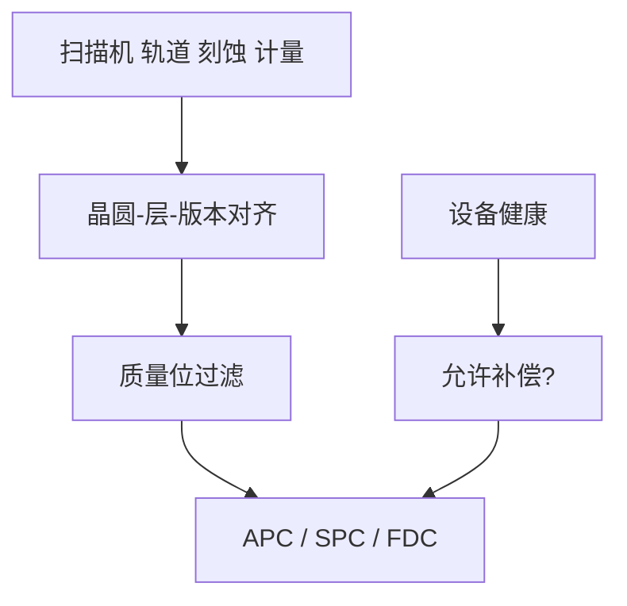

# 厂级数据闭环

闭环的带宽由数据能不能按时、按键、按版本到达执行器决定；算法再好，也对不上错层、过期、未匹配的数。

<footer>—— 对照 SEMI 工厂数据与 APC 接口通称；晶圆厂 MES / FDC 与光刻控制的公开架构</footer>

[上一课](/litho/tool-to-tool-overlay)要求按机台对存指纹。缺口是系统：计量、扫描机、轨道、刻蚀、MES 如何把 ton 级数据收成可用状态。本课钉厂级数据闭环。虚拟计量如何在缺测时充数，留给[下一课](/litho/virtual-metrology）。

## 问题

数据闭环：晶圆 id、层、食谱、机台、卡盘、OPC 版本、计量机、时间戳，必须能 join。FDC（故障检测）吃传感器，APC 吃计量，SPC 吃残差，分派吃规格。缺公共键，现场只能做单机小闭环， holistic 停留在幻灯片。延迟：套刻结果晚于下一批已曝光，反馈环开路。

缺口是**合同与延迟**，不是买一套大数据平台。版本：模型与校正项集必须随数据走，否则用新核解释旧热点。

### FDC 不是 APC

振动、激光气体、RF 反射报警的是设备健康，应抑制 APC 或扣留，而不是把振动当 CD 去补剂量。两类系统要握手：FDC 红则 APC 停。

SEMI E133 等描述 APC 系统接口。本课用其精神：数据质量位、限幅、审计，不背诵条款号当内容。

## 方法

架构：采集 → 上下文对齐 → 质量过滤 → 分发给 APC/SPC/FDC/良率。审计：谁改了剂量偏置。与重工：状态位。与设计：热点坐标回写 LFD 库要走变更控制，不能让产线热点自动改库。安全：配方下载权限。

延迟预算要按环写：套刻反馈允许晚一批，CD 前馈（胶厚）必须在曝光前到达。对不齐的数据宁可不补，也不要补错层。这是 SEMI APC 接口强调质量位的原因。

## 机制

闭环有效带宽 $\approx$ 1 /（计量周期 + 对齐 + 队列）。上下文错误等价于增益反号。数据质量位（对焦失败、SEM 充电）必须进滤波器，否则 EWMA 被野点拉跑——匹配与 SPC 课的操作化。

对齐失败等价于增益反号。FDC 红应关掉 APC，避免把振动当 CD 去补剂量。

## 边界

不写具体商业 MES 商标当物理定律。不进入大模型训练栈。网络安全只点名权限。

后课默认：闭环有上下文键、质量位和 FDC 门。下一课在计量稀疏处用虚拟计量，仍受同一质量合同约束。

## 小结

- 厂级闭环靠 join 键、延迟和质量位，而不是靠算法名称。
- FDC 健康门应能关掉 APC。
- 模型版本随数据走。
- 出处：SEMI APC/工厂数据接口通称；FDC–APC 分工的产线架构。
