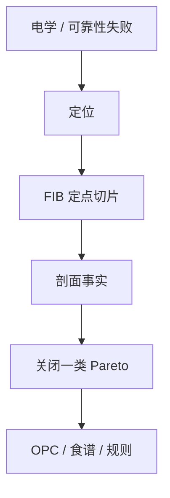

# 失效分析 TEM / FIB

顶视 SEM 看见的是投影；FIB 切开、TEM 看原子衬度，才把桥、虚空、偏 via 和损伤层从猜测变成剖面事实。

<footer>—— 对照半导体失效分析中 FIB 制样与 TEM 的公开方法；JEOL / 产线 FA 通称</footer>

[上一课](/litho/reliability-patterning-defects)把寿命写成几何代理。缺口是取证：探针失败或可靠性失败的那颗管芯，剖面究竟是 OPC 桥、刻蚀底切、via 未对准还是填充虚空。本课钉 FIB/TEM 在图形化链上的位置，并结束「集成、控制与良率」。节点怎么命名、钱怎么算，交给下一课程第一课[节点命名与实际尺寸](/litho/node-naming）。

## 问题

FIB（聚焦离子束）定点切开失败位，做成 TEM 薄片。TEM 给侧壁角、底脚、via 覆盖、硬掩模剩余、损伤层厚度。顶视 CD 合格的失效，往往在这里分叉：覆盖为零、弓形腰斩、或随机孔未打开。样本少而贵，不能当 APC 计量，但能校准「LRC 代理是否撒谎」。

缺口是**把 FA 接回模型版本**，不是写电镜光学。一次 TEM 应能关闭 Pareto 上的一类，并触发 OPC/食谱/规则之一，而不是只进相册。

### 制样也是工艺

离子减薄会损伤、镀层会改衬度、定位误差会切错 via。FA 结论要含切面是否过特征中心。EUV 胶剖面更难，常看 AEI 后硬掩模。

FA 选件有偏：只切最惨的管芯，会高估系统严重度。应与失效模式的统计抽样计划一起设计。

## 方法

流程：电学定位 → 检测/复检坐标 → FIB 标记 → TEM → 分类回写（系统桥 / 套刻 / 填充 / 损伤）。与计量：TEM 锚 CD-SEM 偏置（匹配课的低频真值）。与 3D 胶模型：截面是校准集，不是全芯片。周期：SRAM 阵列适合做有代表性的切。

每份 TEM 报告应指向本课程已有机制中的一条，并给出关闭动作（改核、改食谱、改规则、或确认是个案颗粒）。没有动作的相册不算学习。半导体 FA 的 FIB/TEM 方法是工具；闭环才是本课的课点。

## 机制

顶视把三维投影成边；失效往往是 z 向的（未打穿、虚空、底切）。TEM 衍射与 Z 衬度区分材料。FIB 的 Ga 注入可能被误读为损伤，要用低损伤制样或等离子体 FIB。结论必须映射到本课程已有的机制：钝化、ARDE、套刻树、随机打开。

TEM 关闭的是 Pareto 上的一类，并校准顶视代理。没有动作的截面相册不算学习。

## 边界

FA 不是量产计量，吞吐不允许。不发明未公开的原子像「标准图谱」。本课不进入大模型或限价簿。下一课程改谈节点经济，不再切薄片。

后课默认：关键失效模式要有 TEM 锚，代理规则才可信。图形化课程序列在此交给路线图与成本。

## 小结

- FIB/TEM 把顶视猜测收成剖面，用于关闭 Pareto 类并校准代理。
- 样本少、有偏，不能进 APC。
- 制样损伤要进结论的不确定度。
- 出处：半导体 FA 中 FIB/TEM 公开方法；与计算光刻/刻蚀剖面的校准关系。
