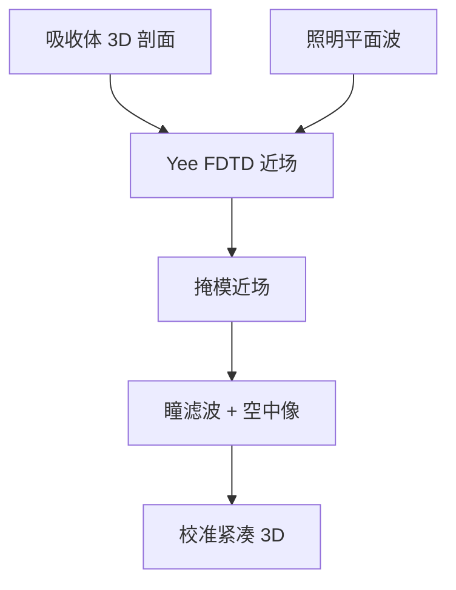

# FDTD 掩模仿真

掩模开口的电磁不是薄屏基尔霍夫：时域有限差分把吸收体当真实 3D 散射体来步进麦克斯韦方程。

<footer>—— 对照 Yee 网格 FDTD（Taflove 传统）在掩模近场中的应用</footer>

[上一课](/litho/mask-cost-cycle)收完掩模厂的钱与周期。缺口是：为什么 MPC 与 AIMS 必须存在——开口里的场不是设计多边形的投影。本课起仿真门，钉 FDTD 掩模仿真。周期结构的频域另一条路，留给[下一课](/litho/rcwa）。

## 问题

晶圆 OPC 的紧凑核假定掩模近场可从透过率图快速得到。[掩模 3D](/litho/mask-3d-effect) 已经声明厚吸收体、斜入射、侧壁让这个假定裂开。FDTD（finite-difference time-domain）在 Yee 网格上对 $E$、$H$ 交错步进，自然含色散、吸收、斜入射（经宽带或斜波技术），适合孤立缺陷、修复补丁、非周期拐角。代价是体积网格：纳米级吸收体 + 若干波长的空气/多层，内存与时间把全芯片排除在外。

缺口是**近场真解的一种算法**，不是再讲一次成像 TCC。把 FDTD 当全芯片 OPC 引擎，量级错了。

### 与薄屏的差在哪用

薄屏足够时，FDTD 只浪费。差出现在：EUV 吸收体厚度与波长同量级、DUV attPSM 边、高 NA 大角度、缺陷体积。校准紧凑 3D 模型需要 FDTD（或 RCWA）当老师，而不是当每步前向。

网格要解析趋肤深度与尖角。欠采样会假装侧壁不重要。收敛研究属于方法，不是可选项。

## 方法

域：吸收体剖面（来自 [侧壁课](/litho/mask-etch-sidewall)）+ 多层（EUV）+ PML 吸收边界。激励：扫描机照明方向的平面波集合，再按光源积分。输出：掩模近场或等效薄屏修正，交给远场成像。与 AIMS 对照验证材料光学常数是否用对。

用途分层：热区与缺陷用 FDTD；周期线栅用下一课 RCWA 更便宜。

## 机制

Yee 算法是麦克斯韦的中心差分，数值色散与稳定条件（CFL）限制时间步。金属与高 k 材料要用色散模型（Debye/Drude 一类），否则能量不守恒、相位边错。近场含倏逝分量，传播到晶圆瞳后被 NA 截断——所以 FDTD 的价值是把通带内那部分算对，不是把近场每一个纳米细节都印到硅上。

## 边界

FDTD 不替代胶随机，不算全芯片。材料 $n,k$ 测不准时，网格再密也错。不要发明 arXiv 编号或未公开的「比 RCWA 永远准」。

后课默认：非周期掩模电磁可以用 FDTD 当参考；周期重复结构有更匹配的模态展开。

## 小结

- FDTD 解掩模 3D 麦克斯韦，服务缺陷、拐角与校准，不服务全芯片迭代。
- 通带内的近场才进晶圆；倏逝分量被 NA 丢掉。
- 剖面与 $n,k$ 是输入合同。
- 出处：Taflove FDTD 传统；掩模 EMF 仿真的公开光刻应用。
