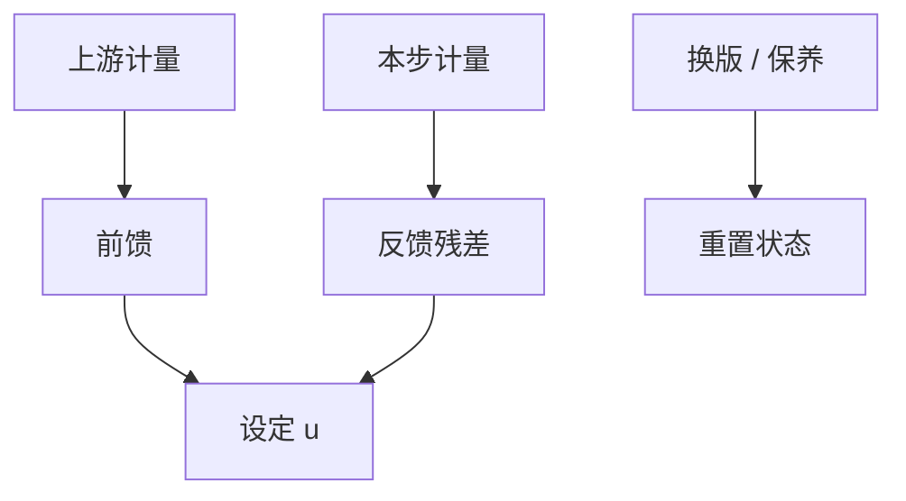

# 前馈与反馈 run-to-run

前馈用已经量到的上游扰动去改本步设定；反馈用本步结果去改下一步。Run-to-run 把两者收成批与批之间的控制器，而不是片内毫秒环。

<footer>—— 对照 Moyne 等对半导体 run-to-run 控制的论述；SEMI 对 R2R 的通称</footer>

[上一课](/litho/apc)给出厂级控制器骨架。缺口是信息方向：胶厚已经量了，还要不要等本层 CD 回来再补？本课钉前馈与反馈的 R2R。抽样计划决定这些环看见什么，留给[下一课](/litho/sampling-plan）。

## 问题

前馈例子：涂胶后测厚度 → 改扫描机剂量；CMP 后厚度图 → 改焦点地图；刻蚀前开口率 → 改过刻。反馈例子：本批 ADI CD → 下批剂量；本批套刻 → 下批网格。前馈快、不消耗本层返工，但依赖上游计量与模型；反馈慢、能纠正模型误差，但已经曝光的片救不回。

缺口是**不要两条环抢同一个旋钮**。厚度前馈已经加了剂量，CD 反馈再加一刀，会振荡。状态要共享或分层：前馈改预期，反馈只吃残差。

### Run-to-run 不是片内

扫描机剂量传感器是片内/脉冲级。R2R 的节拍是批、或若干片。把 R2R 增益调成片内，计量延迟会让控制器打自己。YieldStar 或独立套刻机的延迟必须以节拍建模。

换胶桶、换版、换机是事件，不是噪声。R2R 应在事件处重置或切模型，否则前馈用错斜率。

## 方法

设计：列扰动（厚度、开口率、机台 id）、列执行器、指定前馈模型与反馈残差。滤波：EWMA / Kalman 一类，本课不推公式，只要求延迟与方差进设计。与刻蚀偏置课一致：刻蚀前馈可动过刻，不把残差送给扫描机。限幅与解耦：多输入多输出时先配对（CD–剂量，overlay–网格）。

前馈模型用工程实验片估斜率，并在保养后重估。R2R 文献把「事件」写成重置条件；本课要求事件列表进 MES（换胶、换版、换机、PM），而不是靠人记得去按重置。

## 机制

前馈：$u = u_0 + K_\mathrm{ff}(x_\mathrm{up} - x_\mathrm{nom})$。反馈：对 $y - T$ 积分。两者加在设定上。若 $K_\mathrm{ff}$ 的模型与真实斜率不符，反馈会长期顶着一个偏置——看起来「反馈在工作」，其实前馈模型该修。事件检测把状态机从「跟踪」切到「重新辨识」。

前馈与反馈加在同一执行器上时必须分层。事件重置切模型，避免换胶后的旧斜率把剂量拉飞。

## 边界

R2R 不替代 SPC 停机规则。不在本课写虚拟计量（后课）。不发明控制器专利细节。

后课默认：前馈吃已知扰动，反馈只吃残差，事件要重置。下一课抽样决定环的可观测性。

## 小结

- 前馈用上游量，反馈吃残差；二者必须分层以免抢旋钮。
- R2R 节拍是批，必须含计量延迟。
- 事件切模型，不当成噪声滤掉。
- 出处：半导体 run-to-run 控制传统；SEMI R2R/APC 通称。
