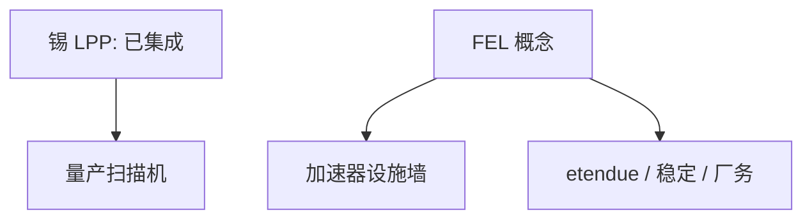

# 自由电子激光 EUV 源

FEL 能在 13.5 nm 给出高平均功率的设想长期存在；工业扫描机仍绑在锡 LPP 上，因为源必须与 etendue、剂量稳定和厂务一起交货。

<footer>—— 对照 FEL 作为 EUV 源概念与 LPP 锡源量产路径的公开讨论</footer>

[上一课](/litho/biochip-litho)离开 IC。缺口是逻辑源是否只能 LPP。[EUV LPP 锡](/litho/euv-lpp-tin) 已钉量产路径。本课钉 FEL 概念。Hyper-NA 之后的物理墙，留给最后一课[post-hyper-na-limits](/litho/post-hyper-na-limits）。

## 问题

自由电子激光：相对论电子束在波荡器中辐射，波长可调，原则上高平均功率、窄带。吸引点：减轻锡碎片、提高功率天花板。墙：加速器规模与成本、运行、etendue 与扫描机照明匹配、时间结构（脉冲）与胶随机、厂内落地。LPP 已经与 NXE 集成、有学习曲线；FEL 是另一套设施型源。

缺口是**源必须是可交货模块**，不是光谱更漂亮就赢。把 FEL 当「LPP 之后必然」，忽略加速器工业与扫描机光学合同。

### 与单一来源

FEL 若成功，可能改变源集中格局，但扫描机光学仍集中。供应链课的结构不会自动消失。

同步辐射束线做过 EUV 研究曝光，那是实验站，不是 300 wph 工厂源。

## 方法

评估：功率、dose 稳定性、etendue、占地、可用性、碎片。对照 LPP 的已知耗材（锡、collector）。研究项目可引用公开 FEL-EUV 设想，不把未建装置当量产。

## 机制

LPP 把激光能量耦合进锡等离子体；FEL 把电子束能量耦合进辐射。后者效率与束品质绑定，设施像光源实验室。扫描机要的是进入照明器的可用光子，不是源点的峰值亮度 alone。

## 边界

不预测 FEL 取代年份。不发明装置功率数字。不贬低研究价值。

后课默认：量产源仍是 LPP 合同；下一课在投影光学与随机的物理极限上问 Hyper-NA 之后还剩什么。

## 小结

- FEL 是高功率 EUV 源概念，尚未替代已集成的锡 LPP。
- 墙在设施、etendue 匹配与交货，不只在波长。
- 研究束线 ≠ 工厂源。
- 出处：FEL-EUV 概念与 LPP 量产路径的公开讨论。
