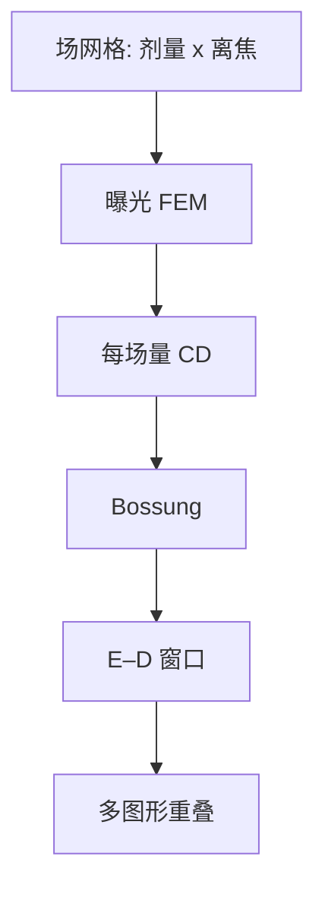

# 焦散矩阵 FEM

工艺窗口不是画在纸上的椭圆。晶圆上按场变焦、变剂量，显影后量 CD，那张矩阵才是 E–D 图的实验源。

<footer>—— 据 Mack 对 focus–exposure matrix 与 Bossung 测量的定义</footer>

[上一课](/litho/ed-process-window)把合格区画成剂量–离焦平面上的重叠面积，并假定每个 $(E,z)$ 都有一个 CD 读数。缺口是：这个读数从哪次曝光来。本课把窗口铺成焦散矩阵（FEM, focus–exposure matrix）：场与场之间阶梯式改焦距和剂量，得到 Bossung 的数据骨架。空间均匀性（CDU）留给[下一课](/litho/cdu-uniformity），本课默认矩阵里的场代表「同一工艺点」。

## 问题

E–D 窗是切过规格带之后的面积。没有矩阵，窗口只是模拟器里的等高线。产线缺口是一次可执行的曝光计划：哪些场走哪些 $(E,z)$，步进多大，图形类别如何铺在同一片上，显影后量哪些垫。Mack 把 FEM 写成测量 Bossung 的标准动作，而不是又一种窗口定义。

只扫焦或只扫剂量，得到的是窗的一条边。禁戒节距、孤立/密线若不同场才出现，重叠窗会假造。矩阵必须让关键图形在同一曝光条件下共存，否则交集没有实验对应物。

### 矩阵消耗的是工艺预算，不是理论自由度

每一场是一次不可复用的 $(E,z)$ 样本。场太多，晶圆与机时爆；场太少，Bossung 插值撒谎，isofocal 位置会漂。楔形调焦可以在一场内铺焦轴，剂量仍要按场或按扫描变。缺口是采样密度对窗口面积的误差，不是再推一次 $\mathrm{DOF}\propto\lambda/\mathrm{NA}^2$。

FEM 上的「最佳焦」是矩阵里 CD 对焦最不敏感或落在规格中心的那一档，不一定等于扫描机当日的最佳调平。把 FEM 最佳焦直接写成产品曝光焦，会把矩阵的离散网格当成连续真值。

## 方法

典型做法：晶圆按曝光场排列成网格，一轴步进剂量，一轴步进离焦（或用 focus drilling / 楔形在扫描方向铺焦）。显影后在每场的计量垫上量 CD，画 Bossung，切规格，得 EL 与 DOF，再与模拟对照。判据可加侧壁、残胶、桥连；EUV 孔层应另叠缺孔，不在平均 CD 矩阵里假装零缺陷。

模拟器校准后可以加密 $(E,z)$，但验收以硅片 FEM 为准。换胶、换底层、换照明，矩阵要重打。RET 改了禁戒节距，旧 FEM 的重叠窗作废。

### 与产品曝光的分工

FEM 是短环学习：故意把许多场打出规格，为的是看见边界。产品晶圆走窗口中心附近的窄带，不再铺满矩阵。把 FEM 的边缘场拿去报产能或套刻，是把实验设计当成产量。

## 机制

剂量步进沿衬度曲线移动等剂量面；焦步进改变 NILS 与空中像调制。两者正交地改 CD，所以矩阵必须是二维的。扫描机的剂量是狭缝积分，离焦是调平与镜头场曲的叠加——FEM 的「设定焦」是工件台指令，不是晶圆每点真焦。场内已有焦指纹时，一场内的 CD 已经在扫一小段 Bossung；矩阵步进若小于该指纹，网格会和指纹缠在一起。

浸没与 High-NA 焦轴预算薄，FEM 的焦步进要更密，否则窗口在采样之间被漏掉。剂量轴则受光源稳定与胶 $\gamma$ 限制：步进小于计量噪声就没有信息。

同一片 FEM 上 PEB 与显影必须尽量均匀。轨道把名义窗切碎时，矩阵读到的是破碎窗，不是光学 EL。先控轨道，再解释 Bossung 弯曲。

### 计量链要锁在矩阵上

上一课假设 CD 是真值。FEM 必须预先规定：SEM 还是散射测量、显影后还是刻蚀后、哪类图形、边缘算法。中途换计量，窗口面积会跳，看起来像工艺进步。

## 边界

FEM 不含套刻，不含跨批次漂移，除非你故意把不同批次的矩阵画在一张图上——那是稳定性，不是单次窗口。模拟未校准 $\ell$、$\gamma$ 时，加密网格只是光滑地错。禁戒节距要在照明固定后另扫节距，不能用一张剂量–焦矩阵代替。

后课默认：说到「打窗口」，就是打 FEM 并切重叠规格。CD 在晶圆上如何空间涨落，不是矩阵能回答的，下一课才是 CDU。

EL 百分比来自 FEM 在最佳焦处的剂量宽度。比较两张矩阵必须同一规格带、同一图形集、同一计量。面积竞赛否则无意义。

## 小结

- FEM 是把 E–D 窗铺到晶圆场网格上的实验，Bossung 的数据源。
- 关键图形要共场，重叠窗才有实验对应。
- 设定焦是工件台指令；场内指纹会与步进缠绕。
- 产品走窗中心，FEM 走边界，不要混报。
- 空间 CDU 下一课。
- 出处：Mack, *Fundamental Principles of Optical Lithography*。
