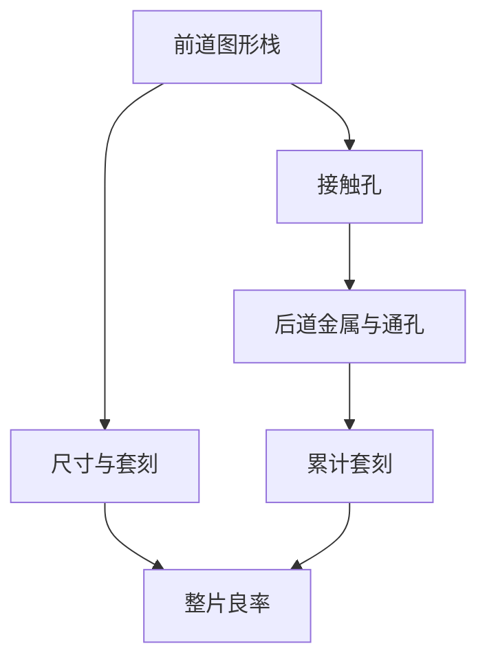

# 前道对后道图形化

前道定义晶体管，后道叠加金属互连；两段的图形目标、层数与套刻链不同，但必须在同一块晶圆上按顺序串起来。

<footer>—— 据 Mack, Fundamental Principles of Optical Lithography 对多层套刻与工艺流程中图形层的整理</footer>

[上一课](/litho/single-expose-limit)说明节距缩到一次曝光下限以下就要拆分或换波长。缺口是：这些图形发生在制造的哪一段？前道与后道各印什么、谁等谁、套刻怎样级联？本课把层序说清，仍不把成像与胶化学提前讲完。同一块晶圆上的层序不能对调。套刻只能对准已经存在的图形，不能跳层。

## 问题

[MOSFET 与栅长](/litho/mosfet-gate-length) 在前道；[接触孔、通孔与线](/litho/contact-via-line) 跨前道末端与后道。中间隔了许多步热处理与沉积。若不清楚顺序，无法理解「栅对有源」与「M1 对接触」哪一层在等哪一层，也无法理解新工具为何先上某些关键层而不是所有金属层一起换。缺口是组织逻辑：同一块晶圆上的层序不能对调，套刻只能对准已经存在的图形。

### 前道后道不是两台无关的光刻

同一晶圆、同一套对准策略。后道的第一层金属必须打中前道留下的接触。套刻误差沿层累加：前道偏了，后道再准也只能对到已经偏的标记。把 FEOL 与 BEOL 理解成两个工厂各印各的，会丢掉这条链。

前道：阱、有源、栅、侧墙、源漏、接触。后道：M1 到 Mn 与通孔、钝化。中间层局部互连的划分随厂家略异，本课用「接触为界」的粗分。

## 方法

顺序：先做成晶体管，再打开接触到 M1，再一层层金属与通孔往上叠。每一图形层有掩模数据、目标尺寸、相对前层或基准标记的套刻规范。前道层数较少但尺寸与对准往往最严；后道层数多，累计对准预算与缺陷机会都多。

前道的热预算高：注入与退火会改尺寸，栅层一旦定了不能在后道「再印一次栅」。后道温度更低，层可以一直加，但每一层都继承下面已经冻住的对准。因此关键套刻往往发生在接触对栅、M1 对接触，而不是最高一层金属对第一层阱。这是层序给图形化的约束，与光学公式无关。

新的图形化能力（更短波长、或多重图形化）通常先给节距最紧、对成品率最敏感的层，而不是按名字「整代切换」。这与 [节点名不再等于栅长](/litho/node-vs-gate-length) 同一句：看表，不看代际口号。

前道关键层少、后道层数多：曝光机时的分配往往是「几层极严、许多层中等」，而不是每层同一套工具。本课只点层序，不排机台日历。

## 机制

图形化是前道到后道的公共语言：每一层都是「先画出平面图案，再交给后续模块」。前道误差传给后道；成品率看所有层，不是只看最细的那一层。下一课 [良率、缺陷密度与芯片面积](/litho/yield-defect-die-area) 把缺陷与面积写成式子，给本课程收束。

工具可以共用同一类曝光设备，但薄膜栈、硬掩模与对准策略不同。前道常对着硅、多晶与浅槽；后道对着介质沟槽与铜。同一套对准标记体系必须从第一层阱一直活到钝化，否则后道「对准」只是对到一块已经漂了的参考。本课只强调：层序固定，套刻级联。不进入轨道、光源与物镜模块。

层数本身也是成品率压力。每加一层图形，就多一次缺陷机会、一次套刻、一次临界尺寸尾部。这不是让人少做金属层——互连层数由电路决定——而是解释为何后道层数多的产品对图形化稳定性更敏感。与 [单次曝光极限](/litho/single-expose-limit) 合看：最密的那几层决定要不要拆分图形，其余较松的层仍占用对准与缺陷预算。

## 边界

本课不对照某一家代工厂的层名表。环栅、背面供电会改前道后道分界，属后课或附录。成像公式、胶与照明配方不在本课。

中间层（局部互连、接触以上的短走线）在不同流程里会划进前道或后道，但套刻逻辑不变：每一层对准已经存在的图形。本课用接触为界只是为了说话方便。后课默认：前道定晶体管，后道叠互连，接触为衔接；套刻沿层传递。下一课用缺陷密度与面积解释为何图形质量直接变成成本。

## 小结

- 前道定晶体管，后道叠金属与通孔，顺序固定。
- 套刻级联：后道对准前道留下的位置。
- 新图形化能力先给最紧的层，不是整代口号式切换。
- 良率看所有层；下一课用缺陷与面积收束。
- 前道热预算高，栅一旦定了不能在后道重印；后道层数多、累计对准，接触是两段的衔接。
- 出处：Mack, *Fundamental Principles of Optical Lithography*。
