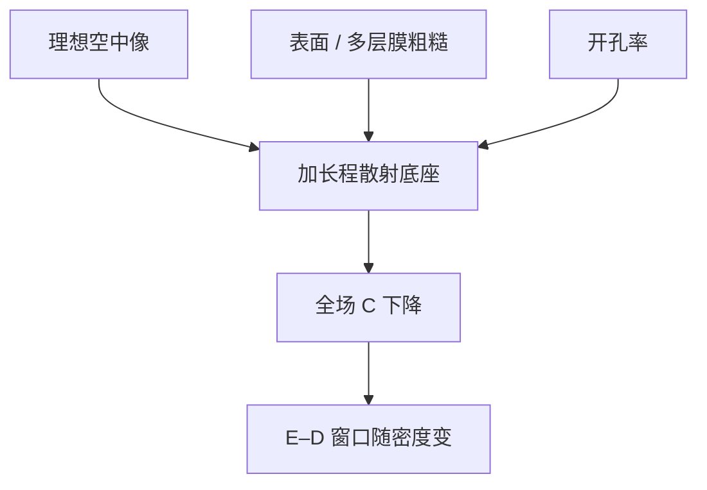

# 杂散光与 flare

Flare 是不该参与成像的光：散射与杂散把一份缓变底座加进空中像，暗区变亮，全场对比随图形密度而变。

<footer>—— 据 Mack、Levinson 对 flare 的定义；EUV 多层膜粗糙散射见 Bakshi 的公开论述</footer>

[上一课](/litho/yieldstar-dbo)（YieldStar 与扫描仪内计量）。在此之上，位置计量钉在标记上。缺口是剂量底座：镜头、腔体与掩模的散射并不进「理想 TCC」，却给 $I(x,y)$ 加上长程背景，使上一课程定义的对比度 $C$ 在全场尺度上下降。本课钉 flare。计量课程到此结束；水作介质抬 $\mathrm{NA}$ 从[下一课](/litho/arf-immersion)开始。

## 问题

空中像课的 $C$ 是局部、理想光学的。真实物镜有表面粗糙、镀膜缺陷、机械结构的反射，EUV 多层膜还有带内散射。一部分光离开设计的衍射级，以大范围晕斑落在晶圆上。暗区 $I_\mathrm{min}$ 被抬高，NILS 掉，E–D 窗口按图形密度缩——开阔区周围的密图形和密区里的孤立暗线，吃到的底座不同。

缺口因此是给这层底座一个名字和尺度，而不是再设计一套套刻垫。没有 flare，OPC 会把「开阔区 CD 偏大」修到掩模上，根子却在长程散射。

### Kirk 测试量的是总底座

经典 Kirk flare：在大暗区里开不同尺寸的亮垫（或反过来），看多大的暗区仍能被胶打印，从而估散射到该点的背景比例。它给出一个积分量，不自动给出点扩散的长尾形状。产线还要区分局部 flare（几十到几百微米）与全场/腔体杂散。

EUV 的 flare 往往比浸没 DUV 更疼：多层膜中频粗糙把可观能量打进散射，公开讨论里总 flare 可到几个百分点量级，且随空间频率分。具体机台数字用厂商公开值，不编造。

## 方法

建模把 flare 写成对空中像的长程卷积，或加一个与开孔率成正比的 DC 项再加中程核。OPC 必须吃进开孔率依赖：同一条线在 10% 与 70% 开孔率下有效剂量不同。补偿是局部剂量调整或掩模偏置，不能靠把 $\gamma$ 做陡来「切掉」DC——底座抬的是 $I_\mathrm{min}$，陡胶仍然看见被抬高的暗区。

清洁、镀膜、光阑和腔体黑化减 DUV 杂散；EUV 还靠多层膜中频粗糙规格、光阑与真空腔设计。Pellicle 挡的是颗粒，不是镜面散射。

### 与部分相干的区别

$\sigma$ 描述的是故意引入的照明光瞳填充，TCC 已经包含。Flare 是设计光路之外的能量再分配，通常不进标称 TCC，要另加。不要把「$\sigma$ 太大对比差」和「flare 抬 $I_\mathrm{min}$」写成同一个旋钮。

## 机制

短程散射（几微米内）有时与镜头像差难分，表现像对比损失。长程 flare 让晶圆上一点看见整场开孔率的加权和：亮场给暗图形漏光，等效剂量增加、CD 按衬度曲线移动。扫描狭缝积分会把狭缝外的杂散也扫进来，时间上仍是底座。

套刻标记的对比也会被 flare 稀释，但位移偏置不是 flare 的一阶效应；一阶是 CD 与窗口。把 overlay 漂移全写到 flare 上，会修错。

### 暗场掩模从源头减底座

版图与掩模类型决定开孔率。暗场（尽量少透光）让长程积分变小，这是设计规则与 att-PSM / 二元选择的接口，不是镜头镀膜能单独买到的。剂量补偿按局部透光率加减，只能扳回平均 CD，扳不回已经损失的 $C$。元件 TIS（总积分散射）是镜子合同，整机 flare 还含腔体与掩模，不能用一张镜子的 TIS 代替 Kirk 测试。

浸没水层的气泡、水印是流体缺陷，不是本课的镜头 flare。计量课程到此结束：CD、套刻、剂量底座三张尺子都已点名。

## 边界

本课不把某代 NXE 的 flare 百分比写成普适常数。也不讨论鬼像的每一个机械来源。浸没水中的气泡与颗粒散射是另一类缺陷，不要并进镜头 flare 规格。后课默认：说到对比度，量产还要问开孔率与 flare 模型是否在 OPC 里。

成像与胶的主干到计量为止已经闭合。下一课程从 ArF 浸没的介质 $n$ 重新加一档 $\mathrm{NA}$。镜头像差（球差、彗差）是设计波前，不是 flare；两者都会掉 NILS，修正手段不同——一个靠透镜与照明，一个靠散射控制与密度补偿。

全场开孔率随产品而变。存储器阵列几乎匀，逻辑后段疏密差大，flare 指纹更毒。同一台镜头、不同产品，有效 $C$ 可以不是同一个数。

成像与胶的主干到计量为止已经闭合。下一课程从 ArF 浸没的介质 $n$ 重新加一档 $\mathrm{NA}$。

## 小结

- Flare 是长程杂散底座，抬 $I_\mathrm{min}$，对比随开孔率变。
- Kirk 一类测试给积分量；OPC 需要有空间核的模型。
- 陡胶切不掉 DC；要减散射或按密度补偿剂量。
- $\sigma$ 是故意的部分相干，flare 不是。
- 计量课程结束；下一课进入浸没 DUV。
- 出处：Mack / Levinson 对 flare 的讨论；Bakshi, *EUV Lithography* 对多层膜散射。
