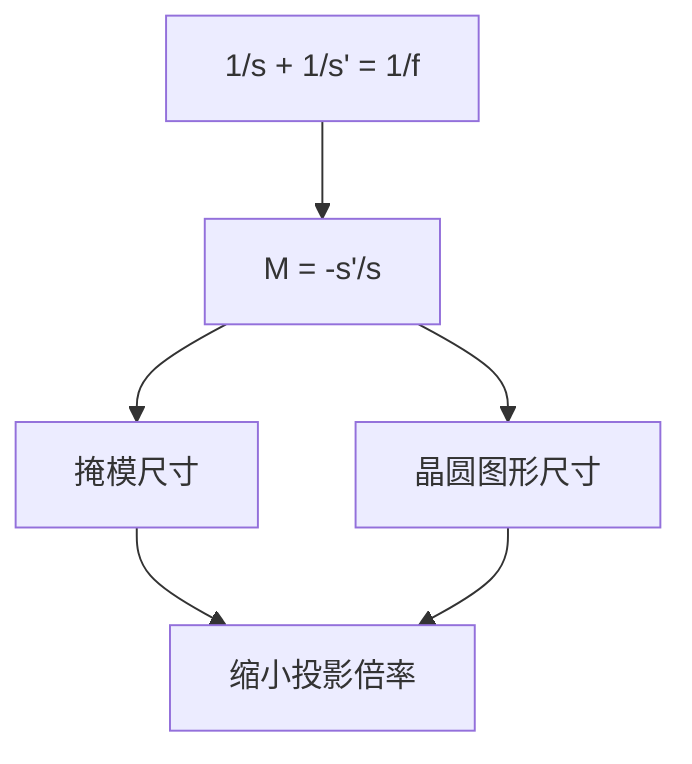

# 焦距、物距与横向放大

横向放大率等于像距与物距之比的负号；投影缩小把掩模图形按固定比例搬到晶圆，掩模 CD 与晶圆 CD 差一个 $|M|$。

<footer>—— 据 Hecht, Optics 对 lateral magnification 与共轭关系的整理</footer>

[上一课](/litho/thin-lens-equation)给出 $\frac{1}{s}+\frac{1}{s'}=\frac{1}{f}$。本课不重推该式。缺口是：像比物大还是小？$M$ 与掩模尺寸、晶圆 CD、物像双方孔径如何一起约束？后课光瞳与视场都默认横向放大是已知数。

## 问题

成像方程只含轴向距离，不直接说「掩模上 1 μm 在晶圆上是多少」。工程投影倍率常写 4:1 或 5:1，即 $|M|=1/4$ 或 $1/5$。若不会 $M=-s'/s$，无法把掩模图形与晶圆图形对应，也无法理解掩模缺陷缩小后为什么「看起来更小」（可印性仍是后课）。缺口是横向几何，不是再选一个焦距。

### 倒像的负号不是缺陷

$M<0$ 表示倒像：物方朝上的箭头，像方朝下。光刻投影通常倒像，套刻与掩模版图在数据上已经折过取向。把 $|M|$ 当成正数倍率没问题，但丢负号会在画光路时把上下搞反。本课保留负号，口头说「缩小四倍」时指绝对值。

$M=h'/h=-s'/s$。缩小：$|M|<1$，且由成像方程知 $|s'|<|s|$（会聚透镜、实像）。纵向放大约 $M^2$，焦深缩放后课才用。

## 方法

近轴横向放大率如上。与成像方程联立：给定 $f$ 与 $s$，先解 $s'$ 再得 $M$。固定 $f$ 时，$s\to f^+$ 则 $|M|\to\infty$（显微镜工况）；$s\gg f$ 则 $|M|\to 0$。投影光刻选中等缩小：掩模比晶圆大，便于制造与检验，又把物镜口径控制在可做的范围。

选 4:1 而不是 10:1，是掩模尺寸、物镜口径与视场的折中：缩得太狠，掩模上同一视场变得过大，或物方 NA 小到照明与对准都别扭。本课不优化这个数，只说明 $|M|$ 一旦选定，掩模与晶圆上的所有横向尺寸都按它换算，包括下一课视场光阑在两边的开口。

物方 NA 与像方 NA 通过 $|M|$ 关联（近轴、同一介质）：$\mathrm{NA}_{\mathrm{img}}\approx |M|\,\mathrm{NA}_{\mathrm{obj}}$。像方 NA 进入后课分辨率语言；物方 NA 决定掩模侧照明锥角。本课只把关系写下，不把分辨公式提前展开。

## 机制

缩小使掩模上的误差与缺陷在晶圆上按 $|M|$ 缩小——这是选 4:1 而不是 1:1 的经典理由之一。同时物镜要在像方张开更大的角，才能维持拉格朗日不变量（下一课 étendue 的近亲）。纵向放大 $M^2$ 意味着物方离焦到像方会被「压扁」或「拉长」；$|M|=1/4$ 时像方焦深对物方离焦不那么敏感，掩模轴向公差相对宽松。

畸变会让 $M$ 随视场位置变，套刻把畸变当误差预算，而不是把本课的常数 $M$ 作废。[几何像差一览](/litho/geometric-aberration-tour) 再分类。各向异性倍率（某些 EUV 投影 $M_x\neq M_y$）是机台特例，本课各向同性为零阶。

缩小还改掩模与晶圆上的缺陷「看起来」差一个 $|M|$：掩模上同样物理尺寸的缺陷，到晶圆按倍率缩小。可印性仍取决于缺陷的空间频率是否进得了光瞳，那是后课；本课只提供几何缩放。纵向放大 $M^2$ 则让物方离焦映射到像方时被压缩，掩模轴向公差相对晶圆焦深更宽，这是选缩小投影的另一条几何理由。

## 边界

本课 paraxial、薄透镜、单色、无光阑。谁限制光束截面、视场有多大，是下一课 [光阑、光瞳与视场](/litho/stop-pupil-fov)。也不讨论扫描狭缝如何把瞬时视场拼成全场。

纵向放大与折射率有关：物方、像方介质不同时，$M_{\mathrm{long}}$ 还要乘 $n$ 的比。浸没只改像方时，焦深换算要小心。后课默认：投影倍率 $|M|$ 已知；晶圆尺寸 = $|M|$ 乘掩模尺寸；像方与物方孔径角差一个 $|M|$。谈到「4 倍缩小」，就是本课的 $|M|$。

## 小结

- 横向放大 $M=-s'/s$；投影缩小 $|M|<1$，通常倒像。
- 掩模 CD 与晶圆 CD 差 $|M|$ 倍；物像双方 NA 也差 $|M|$。
- 纵向放大约 $M^2$，影响焦深与掩模轴向公差。
- 畸变使 $M$ 随视场变，属像差，不改零阶定义。
- 出处：Hecht, *Optics*；Born &amp; Wolf, *Principles of Optics*。
