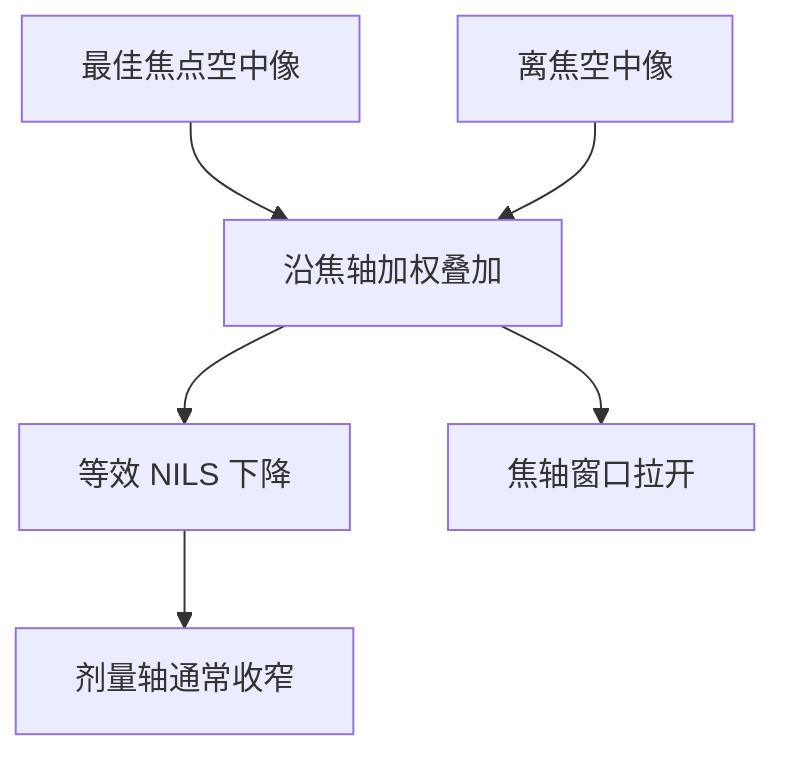

# Focus drilling

有时故意让同一点走过一段焦，用对比换焦深：窗在焦轴上被拉开，空中像不再是最佳焦点那一张。

<footer>—— 据 Mack 对焦深与工艺窗的讨论，以及 SPIE 文献对 focus drilling 的通称整理</footer>

[上一课](/litho/scanner-throughput)（扫描仪产能会计）。把剂量轴锁进闭环。缺口是：焦轴并不总是「越钉越尖」——厚胶、大地形、接触孔的可用焦深比光学瑞利焦深还要苛刻时，产线会故意走焦，把一场曝光摊在一段 $z$ 上。本课钉 focus drilling。成像与分辨率这门课到此结束；记录介质从[下一课](/litho/dnq-novolac)的 DNQ–Novolac 写起。

## 问题

剂量环保证 $E$ 进窗。调平环保证晶圆表面贴近最佳焦面。两者都默认：最佳焦是一个点，空中像取那一张。缺口出现在窗的焦轴太瘦、而片内地形或胶厚跨度比它更大的时候——植入层、厚胶、过孔，单焦点的 Bossung 在规格带里只剩一条缝。

Focus drilling 的答案是：同一场内让焦点扫过一个区间（分立的多次曝光，或扫描中连续走 $z$），每个晶圆点收到的是一段离焦空中像的剂量叠加。焦深被拉开，代价是调制下降，等效 NILS 变差。上一课刚钉住的剂量，往往还要加一点，才能把变钝的像再切到目标 CD。

### 不是调平失败的美化名

调平要把平均面放进窗；drilling 是在窗的定义上动手，故意加宽焦轴、收窄剂量轴。把 drilling 当成「台子调不平所以糊一把」，会把设备故障与工艺选择混在一起。本课默认调平是合格的，走焦是食谱。

名字来自 SPIE 与设备应用的通称，不是某篇独有发明。不要给它编造 arXiv 编号。Mack 把焦深与 E–D 窗讲清楚之后，这种「用对比买焦轴」的取舍是同一张图上的移动，而不是新的光学定律。

## 方法

实现大致三类：同一场分几次、每次偏一点焦再叠加剂量；扫描过程中工件台或镜头沿 $z$ 调制；光学上用可调的焦深元件拉宽轴向响应。分立多次的权重要声明：等剂量分焦与中间多、两头少，叠出来的等效像不同。无论哪一种，前向模型都是：把若干离焦空中像按剂量权重相加，再进胶阈值。OPC 与邻近曲线必须用这张叠加像去校准，不能沿用最佳焦模型。isol 与 dense 的 Bossung 弯曲方向若相反，drilling 的权重会偏帮一方、伤害另一方，重叠窗仍可能为零。

表征仍用 Bossung / E–D：drilling 之后，CD 对 $z$ 的曲线变平，对 $E$ 的曲线变陡。曝光宽容度通常变差。要声明图形类别——密线、孤立线、孔的叠加权重不同，重叠窗可能被某一类先切死。

### 何时值得买

地形高度差已经大于单焦点 DOF、而分辨率需求尚未顶死 $k_1$ 地板时，drilling 常见。临界逻辑栅极少靠它过日子，因为对比预算更贵。本课不把「先进层都 drilling」写成道德。

## 机制

离焦降低调制、改变侧瓣。若干张这样的像相加，阈值附近的斜率变缓，边缘对剂量更敏感，对 $z$ 反而不那么敏感——因为本来就已经在「焦的混合物」里。线宽粗糙度往往变差：切在更缓的坡上，同样的剂量与化学噪声变成更大的边抖。孔的随机失效在 EUV 上会更明显；本课停在平均窗，不把光子泊松提前做完。厚胶层里，走焦还可以让底部与顶部都吃到「还算能用」的像，代价是整层对比都不是最佳——这与 DNQ 漂白补底部是不同机制，下一课化学会对照着读。

与上一课的关系：drilling 之后目标剂量常上移，闭环仍然要锁新的 $E$，只是工作点变了。狭缝扫描平均是 $y$ 向光学指纹的平均；drilling 是 $z$ 向像的平均。两个算子可以同时存在，不要混名。

双曝光 LELE 是两套掩模的位置问题；focus drilling 通常仍是同一张掩模、同一套图形。不要把「曝光两次」都叫做双重图形。

## 边界

本课不给某层必须 drilling 的纳米地形阈值，也不把某次 SPIE 演示的焦深倍数写成镜头规格。浸没流体与喷淋跟随是另一课。胶对比 $\gamma$ 会改变 drilling 之后还能不能切出陡壁，化学从下一课程开始——本课只要求后课在提「窗」时声明有没有走焦。

成像栏到此：波长、NA、$k_1$、邻近、转印、套刻、扫描、剂量、走焦，默认已经读完。下一课不再回头解释狭缝。

## 小结

- Focus drilling 故意沿焦轴叠加空中像，用对比换焦深。
- 剂量轴通常变瘦，目标 $E$ 往往上移，闭环仍要锁。
- OPC 必须用叠加像校准；最佳焦模型会系统性偏。
- isol 与 dense 的叠加权重可能互伤，重叠窗仍可能为零。
- 与狭缝扫描平均正交：一个沿 $z$，一个沿扫描 $y$。
- 不是调平失败；默认调平合格，走焦是食谱。
- 成像与分辨率课程结束，下一课进入抗蚀剂化学。
- 出处：Mack, *Fundamental Principles of Optical Lithography*；SPIE 对 focus drilling 的通称与设备应用公开讨论。
