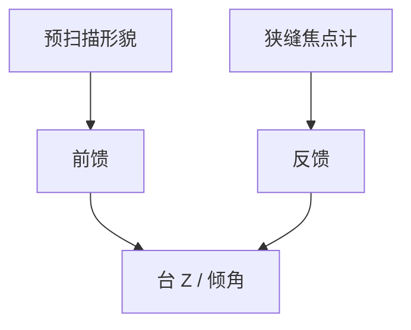

# 焦点传感与晶圆形貌

调平给出刚体；扫描时形貌还在变。焦点传感要跟狭缝下那一条带的高度，而不是跟晶圆中心一个数。

<footer>—— 对照扫描机 focus sensor；[离焦作为像差](/litho/defocus-as-aberration)</footer>

[上一课](/litho/level-sensor-air-gauge)给出曝光前高度图。缺口是动态：扫描中热、夹盘吸真空、浸没力都会改形貌。本课钉焦点传感，不把对准标记提前写完。

## 问题

Bossung 对离焦敏感。狭缝瞬时视场只有毫米级宽，必须跟这条带的 Z。全局一张平面拟合不够：芯片区有 SRAM 高、逻辑低。把所有离焦写成镜头热，会漏掉片。

## 方法

狭缝附近光学或气隙焦点计，闭环到工件台 Z 与倾角。采样密度与扫描速度匹配。异常：真空泄漏造成局部鼓包，传感器看见但补偿行程不够就要停机。

浸没水的厚度变化也是光程。焦点计若在水外标定，水内要加偏移。流体课与本课在此相切。

## 机制

离焦是波前的二次项。传感器把强度/相位对比或气隙换成 Z 误差。带宽必须覆盖扫描引起的形貌空间频率 × 速度。

## 边界

下一课对准传感器：XY 网格，不是 Z。两者标记可能相邻，光学通道分开。

## 小结

- 焦点跟狭缝带，不跟片中心一个数。
- 前馈形貌 + 闭环焦点计。
- 出处：离焦课；扫描机 focus sensor 通识。
