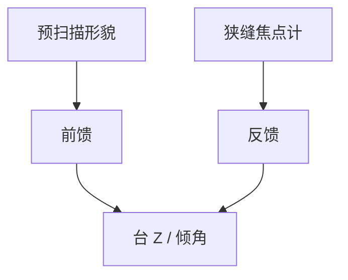
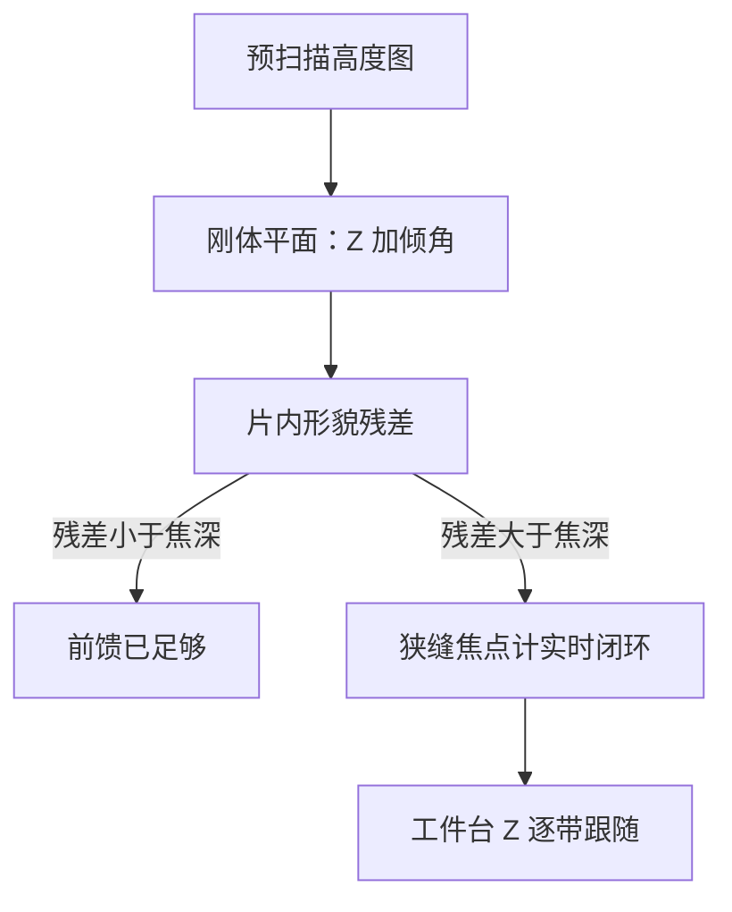

# 焦点传感与晶圆形貌

调平给出刚体；扫描时形貌还在变。焦点传感要跟狭缝下那一条带的高度，而不是跟晶圆中心一个数。

<footer>—— 对照扫描机 focus sensor；[离焦作为像差](/litho/defocus-as-aberration)</footer>

[上一课](/litho/level-sensor-air-gauge)给出曝光前高度图。缺口是动态：扫描中热、夹盘吸真空、浸没力都会改形貌。本课钉焦点传感，不把对准标记提前写完。

## 问题

Bossung 对离焦敏感。狭缝瞬时视场只有毫米级宽，必须跟这条带的 Z。全局一张平面拟合不够：芯片区有 SRAM 高、逻辑低。把所有离焦写成镜头热，会漏掉片。

topography（形貌）可以翻译成晶圆表面的「地势图」：经过前面几十层工艺，表面早已不是平面——密集的 SRAM 区堆得高、稀疏的逻辑区洼下去，片内高度差可达几十纳米以上，比很多层的可用焦深还大。焦点传感要对付的就是这张地势图，不是一个平均高度。

## 方法

狭缝附近光学或气隙焦点计，闭环到工件台 Z 与倾角。采样密度与扫描速度匹配。异常：真空泄漏造成局部鼓包，传感器看见但补偿行程不够就要停机。

常见误区：初学者容易以为「调平」之后晶圆就平了。调平只能修正刚体量——一个高度加两个倾角；芯片内部的地势起伏它动不了。剩下的起伏若超出焦深，就得靠狭缝下的焦点计一边扫描一边实时跟，这正是本课与前课的分工。

```mermaid
flowchart TD
  PRE["预扫描形貌"] --> FF["前馈"]
  SNS["狭缝焦点计"] --> FB["反馈"]
  FF --> Z["台 Z / 倾角"]
  FB --> Z
```

浸没水的厚度变化也是光程。焦点计若在水外标定，水内要加偏移。流体课与本课在此相切。

## 机制

离焦是波前的二次项。传感器把强度/相位对比或气隙换成 Z 误差。带宽必须覆盖扫描引起的形貌空间频率 × 速度。

```mermaid
flowchart TD
  MAP["预扫描高度图"] --> RIG["刚体平面：Z 加倾角"]
  RIG --> RES["片内形貌残差"]
  RES -->|"残差小于焦深"| OK["前馈已足够"]
  RES -->|"残差大于焦深"| REAL["狭缝焦点计实时闭环"]
  REAL --> STAGE["工件台 Z 逐带跟随"]
```

这张图回答的问题是：什么时候预扫描的前馈就够、什么时候必须上实时焦点计。判断标准只剩一条——刚体拟合之后剩下的片内残差是否超过该层的焦深预算。

数字实例：假设扫描速度 250 mm/s，形貌以每毫米一次的尺度起伏，焦点计要跟的就是 250 Hz 的高度信号；若要分辨 0.1 mm 尺度的起伏，就得跟上约 2.5 kHz。带宽不够时，闭环跟的是「平均地势」而不是脚下这一条带，残差原样变成离焦、再变成 CD 抖动。

## 边界

下一课对准传感器：XY 网格，不是 Z。两者标记可能相邻，光学通道分开。

## 小结

- 焦点跟狭缝带，不跟片中心一个数。
- 前馈形貌 + 闭环焦点计。
- 出处：离焦课；扫描机 focus sensor 通识。
