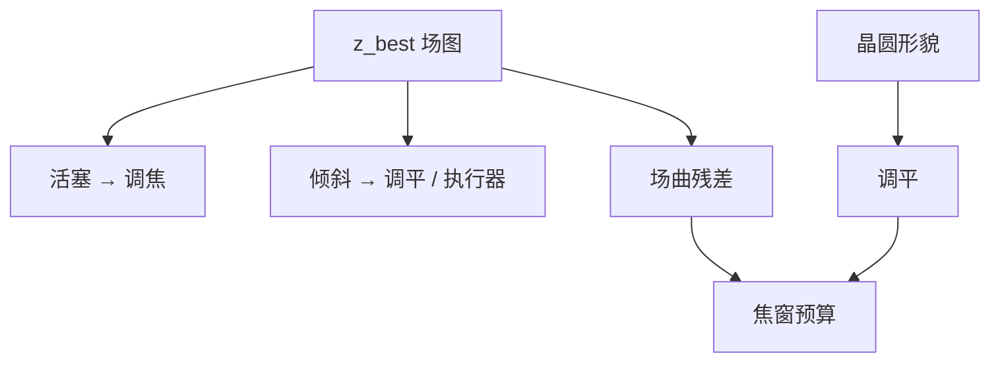

# 焦面倾斜与场曲补偿

最佳焦面若在场上是斜的或弯的，调焦闭环对不准每一个场点；补偿是把可驱动的 $Z_4$ 与调平去贴那张面，不是改 NA。

<footer>—— 场曲与倾斜的车间语言见 Malacara；光刻调平与离焦见 Levinson、Mack</footer>

[上一课](/litho/aberration-nils-sensitivity)把 $c_j$ 接到了 NILS。缺口是：视场上最佳焦面并不平——**倾斜**与**场曲**让狭缝两端和场角的有效离焦不同，敏感度再高也救不了没补偿的几何。本课钉这两项及其补偿，结束「成像的数学骨架」课序。二维孔与线端留给下一课序。不重推 $\mathrm{DOF}=k_2\lambda/\mathrm{NA}^2$ 的公式，只引用[离焦作为像差](/litho/defocus-as-aberration)的 $Z_4$。

## 问题

初级场曲（Petzval 一类）让离轴点的最佳焦面弯离近轴焦面；倾斜让整个焦面相对晶圆法向有一楔。扫描狭缝沿 $x$ 瞬时曝光一条带，带上各点若 $c_4$ 不同，NILS$(z)$ 的窗口对不齐，一层的公共焦窗按最差场点关死。调平传感器看到的是晶圆形貌，镜头场曲是光学面；两者差才是残差离焦。

缺口不是再写一次二次相位，而是：哪些项可以用工件台调平、扫描同步和镜头补偿吃掉，哪些必须当残差进预算。把场曲写成「晶圆不平」，会去拧涂胶；把晶圆翘曲写成「场曲」，会去拧镜头。

### 倾斜不是远心

远心误差是主光线斜率，造成套刻随离焦走，见主干远心课。焦面倾斜是 $z$ 沿场线性变，造成 CD / NILS 沿场变。可以同时存在：一台机既可以远心残差，又可以焦面楔。敏感度上一课已经分开奇偶；本课的倾斜主要吃偶项里的有效 $z$。

扫描方向再平均一次：瞬时倾斜在狭缝宽度上积分。补偿表必须按狭缝坐标建，不能只用场中心的 Bossung。

## 方法

计量：通过焦点的 CD 或 NILS 在狭缝若干点扫 $z$，拟合每点的最佳焦，得到一张 $z_\mathrm{best}(x,y)$。分解成活塞（全局调焦）、倾斜（两轴楔）、弯曲（场曲残差）。晶圆形貌用调平光束另测，相减后才是光学场曲。

补偿：全局 $z$ 跟活塞；工件台或镜头执行器跟楔；剩余弯曲进预算或靠镜头加热/补偿光学（公开可写的是「场相关调焦」，不写未公开行程）。浸没层水膜厚度误差也会冒充倾斜，要与光学项拆开。

### 与畸变、像散的协作

像散把 H/V 最佳焦劈开，场曲对两种取向不是同一张面。补偿若只贴一种取向的 $z_\mathrm{best}$，另一种的 NILS 会掉——上一课敏感度在这里变成场上的取向冲突。畸变是横向位移，不靠调焦消除；不要把网格校正和焦面补偿写成一个环。

## 机制

每个场点的有效离焦 $z-z_\mathrm{best}$ 乘上一课的 $\partial\mathrm{NILS}/\partial z$（即对 $c_4$ 的敏感度），得到场上 NILS 地图。公共工艺窗是地图的交集。补偿降低的是这张地图的峰峰值，不是改变 $\mathrm{NA}$。扫描同步若在狭缝方向留下动态倾斜，等效于补偿环没跟上的楔，CD 沿扫描向拖尾。

## 边界

本课不写未公开的调平激光路数或镜头补偿器规格。EUV 反射系统同样有场曲，只是光路折叠不同，定义仍是 $z_\mathrm{best}$ 面。胶厚与薄膜摆动也会让「最佳焦」随栈变，那是下一单元的反射问题，不要在本课用 BARC 冒充场曲补偿。

至此，傅里叶对 → 采样 → PSF → 传递函数 → 判据 → Abbe/Hopkins → SOCS → 相干 → speckle → 矢量 → 像差敏感度 → 场焦补偿，骨架课序结束。

## 小结

- 场曲与倾斜使 $z_\mathrm{best}$ 随场变，公共焦窗按最差点关。
- 形貌归调平，光学面归镜头/执行器，残差进预算。
- 倾斜不是远心；像散让 H/V 焦面分裂。
- 补偿贴的是 NILS 地图的平坦度，不改截止频率。
- 下一课序：把骨架用到接触孔与线端。
- 出处：Malacara；Levinson；Mack；离焦 $Z_4$ 见主干离焦课。
