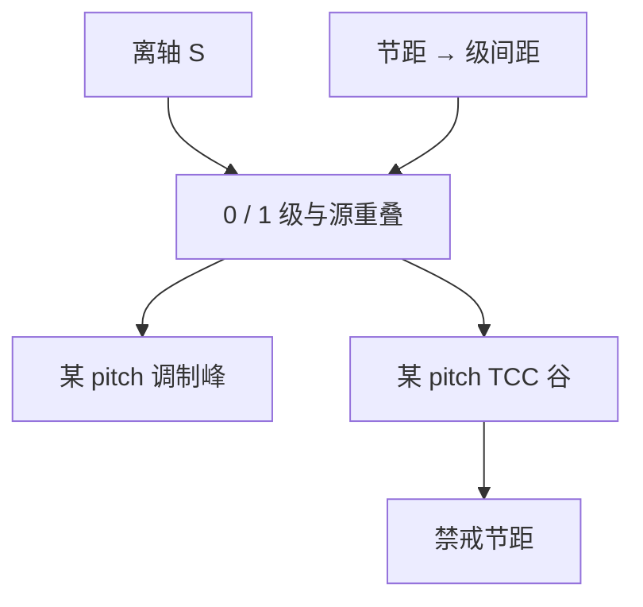

# 禁止节距

离轴照明抬某些齿的重叠，也会让另一些节距的 TCC 掉进谷底；那一段 through-pitch 不是「胶批次」，是核在频率轴上的零点附近。

<footer>—— Hopkins 重叠图像；离轴照明与禁戒节距的产线读法见 Mack，以及 Socha 等对 OAI 下 pitch 行为的讨论</footer>

[上一课](/litho/2d-imaging-contacts-lineend)用二维核读了孔和线端。缺口是：一维密线并不是「越密越难」的单调函数——**某些中间节距**对比和 NILS 比更密或更疏更差，设计规则必须躲开。主干[疏密偏差](/litho/iso-dense-bias)警告过曲线身子上的尖峰；本课把尖峰命名为禁戒节距（forbidden pitch）。角圆化留给[下一课](/litho/corner-rounding)。不重推 $k_1$ 公式。

## 问题

偶极或环形把 $S$ 推到光瞳边缘，特定节距的 0 级与 1 级与源重叠最大，调制最好。节距一变，级次在光瞳里的间距变，重叠可以经过一个几乎为零的区：两级仍都「在瞳内」，却不再与同一块源相交——TCC 对该频率对很小。空中像对比塌陷，Bossung 关死，OPC 加偏置也抬不起斜率。这一段 pitch 叫禁戒节距。

缺口不是再讲一遍离轴照明产品图，而是：禁戒是 **TCC 几何**，换 $\sigma$、换极角、换 NA，谷会移动。把它写成固定纳米表，换照明后表全错。

### 不是截止之外

截止之外是级次进不了瞳，对比理论上为零（单次曝光）。禁戒往往在截止之内：级还在，重叠差。用瑞利式估「最小半节距」看不见这些谷。through-pitch CD 或 NILS 扫描才能定位。

助条（SRAF）会改物体频谱，从而改哪些齿的权重，可以填谷，也可以造新的旁瓣。本课停在前向：谷从哪来。放助条是 OPC。

## 方法

诊断：固定照明与 NA，扫 pitch，画对比、NILS、曝光宽容度。谷底附近即禁戒带。模拟上直接读 TCC 或 SOCS 对应该对频率的权重，不必先切胶。Abbe 图像：看该节距下哪些源点还能同时点亮 0 级与 1 级；源点集合空了，就是禁戒。

设计规则：禁止该带，或强制换层照明/多重曝光。同一层里孤立线和密线要共存时，照明是折中，禁戒带可能落在「半密」逻辑布线——这是 DTCO 要避开的成像约束，不是布线器随机挑 pitch。

### 二维也会禁戒

孔阵列的对角节距、交错通孔，对应二维频率对。一维禁戒表盖不住 SRAM 斜向。上一课的二维斑被切之后，某些阵列周期同样会落在 TCC 谷上。报禁戒必须声明是线栅还是阵列、取向相对偶极。

## 机制

机制就是[Hopkins](/litho/hopkins-tcc) 已经写过的重叠：平移两个光瞳与 $S$ 求交。OAI 把 $S$ 做成窄块，交集对位移极敏感，谷深而窄；常规大 $\sigma$ 把 $S$ 铺开，谷浅，但高峰也不那么高。这是照明在「特定 pitch 性能」与「through-pitch 平滑」之间的权衡，SMO 在代表性图形上求的就是这场权衡，本课不展开优化。

离焦让 $P$ 带相位，重叠面积相同也可以对比反转或再掉——禁戒带随焦点漂。PW 必须包含谷附近的角点。

## 边界

禁戒不是法规名词，是工艺窗口语言。刻蚀微负载也会在 through-pitch 上造峰谷，拆法与 OPE 相同：改照明谷先动的是光学项。禁止把某代逻辑的禁戒纳米区间写成普适表。也不要把 Sparrow 间距当成禁戒 pitch。

## 小结

- 禁戒节距是 TCC 重叠的谷，常在截止之内。
- OAI 让谷深且随照明移动；大 $\sigma$ 较平滑。
- 一维表不等于二维阵列禁戒。
- 诊断用 through-pitch NILS / TCC 权重，不靠瑞利式。
- 下一课：拐角作为二维低通。
- 出处：Hopkins (1953)；Mack；Socha 等对 OAI / pitch 的讨论。
