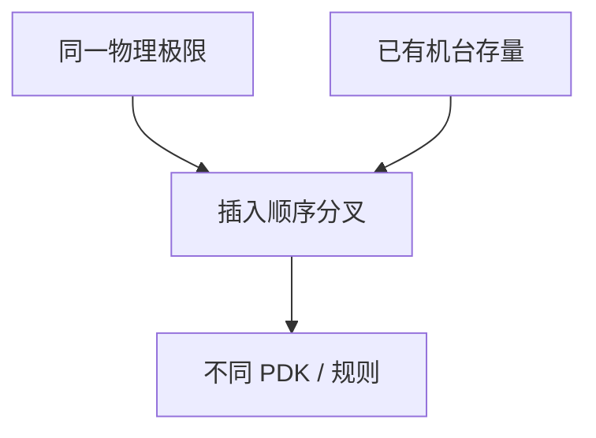

# 代工路线对比

同一世代名下，EUV 层数、高 NA 时间表、GAA/CFET 与背面电源可以完全不同；对比要按层策略，不按广告同步。

<footer>—— 对照领先代工公开节点路径的结构差异；不编造未公布层数</footer>

[上一课](/litho/pfas-resist-regulation)把材料风险放进规划。缺口是各厂怎么走。本课钉代工路线对比。存储器路径不同，留给[下一课](/litho/memory-litho-dram-nand）。

## 问题

TSMC、Intel、Samsung 等公开叙事在：EUV 插入早晚、是否 High-NA、FinFET 到 GAA 的时间、背面电源、命名（N3/N2 vs 18A）。光刻含义：EUV 层数改交叉与瓶颈；High-NA 改半场与薄胶；GAA 改切线与片间距图形。对比必须引用当时公开材料并注明年份，不能把传闻层表当课文本体。

缺口是**路径分叉**，不是谁赢。把三家画成同一条 IRDS 线，会误导 DTCO。

### 公开可说的

结构差异类型：先全 DUV 多重再插 EUV vs 较早 EUV；High-NA 作为研究 vs 插入计划；混跑策略。具体层清单以各厂公开为准，本课不发明。

客户选择代工等于选择一套光刻约束（设计规则、EUV 随机、拼接）。IP 可移植性有光刻成本。

## 方法

列比较轴：CPP/MMP（若公开）、EUV 使用、High-NA、器件架构、封装/键合。每轴用公开出处。内部决策仍用自己的交叉模型。

## 机制

各厂资本存量（已有浸没台数、EUV 台数）、客户组合、风险偏好，使同一物理极限下的插入顺序不同。这是经济与组织，不是光学常数不同。

## 边界

不排名。不泄露非公开层数。路线会改，课文钉轴而不是钉某年新闻。

后课默认：逻辑代工路径分叉；下一课 DRAM/NAND 的光刻负担与逻辑不同。

## 小结

- 代工对比按 EUV 层策略、High-NA、器件架构等轴，不按商品名同步。
- 只引用公开材料并注明年份。
- 分叉来自资本存量与风险，不来自另一套光学。
- 出处：领先代工公开节点叙事的结构对照。
