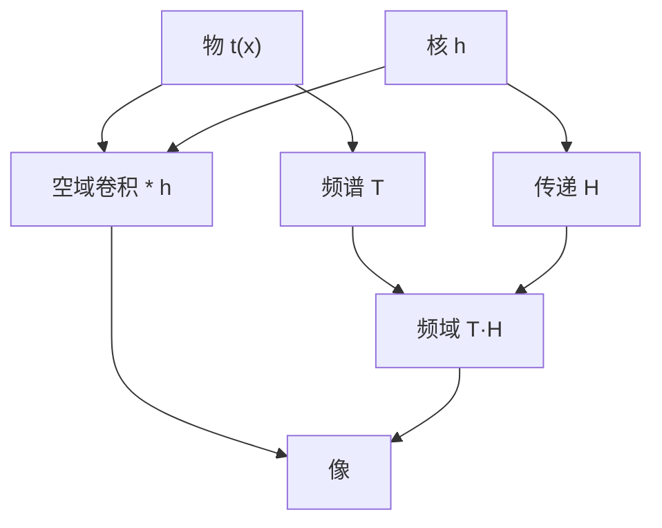

# 傅里叶变换对与卷积

成像计算不是另起一套光学；它把空域的卷积写成频域的相乘，把光瞳写成几对已知的傅里叶对。

<footer>—— Goodman, Introduction to Fourier Optics 对卷积定理与基本变换对的表述</footer>

[上一课](/litho/patterning-inspection-tools)把主干收到检测与量测设备。主干里已经有[阿贝成像](/litho/abbe-imaging)、[Hopkins TCC](/litho/hopkins-tcc)、[瑞利判据](/litho/rayleigh-litho)和 [MTF](/litho/mtf-optics)。缺口是：**还没有把「频谱 × 光瞳」收成后课可以反复调用的代数骨架**——傅里叶变换对与卷积。本课不重推 $\mathrm{CD}=k_1\lambda/\mathrm{NA}$；那条产线式子默认本课的对已经会用。后课默认已经读完本课。

## 问题

阿贝课把像场写成物频谱乘光瞳再逆变换；Hopkins 课把强度写成双线性核。两边都在暗用同一件事：空域卷积 $\leftrightarrow$ 频域相乘。若每次成像都从[单色波与光程](/litho/em-wave-index)重推亥姆霍兹，后课的采样、PSF、SOCS 会失去公共符号。

缺口因此是钉死三件事：傅里叶变换对是哪些、卷积定理说什么、光刻里「物体 / 核 / 像」分别对应哪一侧。不要从显微镜两针孔或产线 $k_1$ 起笔。

### 先约定符号

平面上

$$
T(\mathbf{f})=\iint t(\mathbf{x})\,e^{-2\pi i\mathbf{f}\cdot\mathbf{x}}\,d^2\mathbf{x},\qquad
t=\mathcal{F}^{-1}\{T\}.
$$

$t$ 是物面透过率（或等效薄物体），$T$ 是物频谱，$\mathbf{f}$ 的单位是长度$^{-1}$。光瞳坐标与像方空间频率对齐的约定，沿用阿贝课，本课不再改轴。

一维示意用 $x\leftrightarrow f$ 即可；晶圆图形是二维的，后课孔与拐角必须回到 $\mathbf{x},\mathbf{f}$。不要把「线栅的一维傅里叶变换」当成全部成像。

## 方法

卷积定理：$(t*h)(\mathbf{x})=\mathcal{F}^{-1}\{T(\mathbf{f})H(\mathbf{f})\}$。相干成像里 $h$ 是振幅点扩散，$H$ 就是光瞳 $P$；非相干成像里卷积写在强度上，$H$ 换成 OTF。部分相干没有单条 $H$，但每一源点的相干通道仍是本课这一对。

后课反复出现的对，本课一次性列出，后面只引用：

- $\mathrm{rect}(x)\leftrightarrow\mathrm{sinc}(f)$：有限缝、扫描狭缝、矩形开口的一维骨架。
- $\mathrm{circ}(r)\leftrightarrow\mathrm{jinc}$（第一类贝塞尔）：圆孔光瞳 ↔ 艾里核，下一课 PSF 只用这一条。
- 高斯 $\leftrightarrow$ 高斯：胶模糊、部分照明的光滑源，计算上自闭。
- $\delta(\mathbf{x})\leftrightarrow 1$：点物的谱是平的，光瞳切它就是在量系统自身。
- 平移 $t(\mathbf{x}-\mathbf{a})\leftrightarrow T(\mathbf{f})e^{-2\pi i\mathbf{f}\cdot\mathbf{a}}$：OPC 挪边、邻线位移，全是相因子，不是新原理。

### 强度不是第二套变换

完全相干：先对场做卷积，再取 $|U|^2$。交叉项在频域就是一对频率，这正是 Hopkins 双线性的来源，本课不重写 TCC 积分。完全非相干：强度直接与 $|h|^2$ 卷积。产线落在中间，骨架仍是「每一相干切片用一对，再对源积分」。

## 机制

锐边 $t$ 的谱拖尾；乘有限 $P$ 再变回空域，等效于与衍射核卷积，边变成斜坡——阿贝课已经用这句话解释糊边。本课补的机制是：**这句话是定理，不是比喻**。后课写采样间隔、写 Airy 半径、写相干截止，都是在给 $H$ 的支撑和 $h$ 的宽度命名，不必再发明「成像公式」。

周期线栅的 $T$ 是梳状线；卷积定理变成「只让进瞳的那几根齿重新干涉」。斜照明是 $T$ 在频率轴上平移，对仍是同一对，只是窗相对齿移动。RET 改照明，改的是哪些齿落在 $H$ 的支撑里。

### 后课默认的接口

说到空中像的线性切片，默认先写卷积或先写 $T\cdot H$，再声明相干还是强度。TCC 是部分相干下对这对骨架的组装，不是替代。产线 CD 公式引用[瑞利判据](/litho/rayleigh-litho)，光学核引用本课。

## 边界

本课是标量、等晕、傅里叶光学接口。掩模厚度、矢量边界、胶内沉积都不在这对里。也不要把「会写 FFT」当成已经会成像：离散网格、截止与混叠是下一课。禁止发明未发表的变换对；Goodman 第 2 章的表已经够后课引用。

## 小结

- 成像骨架：空域卷积 $\leftrightarrow$ 频域相乘；光瞳是 $H$ 的一种。
- 基本对：rect–sinc、circ–jinc、高斯、δ、平移相位。
- 相干先卷积场再取模方；非相干卷积强度；部分相干按源切片用同一对。
- 不重推 $k_1\lambda/\mathrm{NA}$；阿贝 / Hopkins / MTF 都建立在这对上。
- 下一课：把连续对落到采样网格。
- 出处：Goodman, *Introduction to Fourier Optics*；波动接口见 Born &amp; Wolf。
