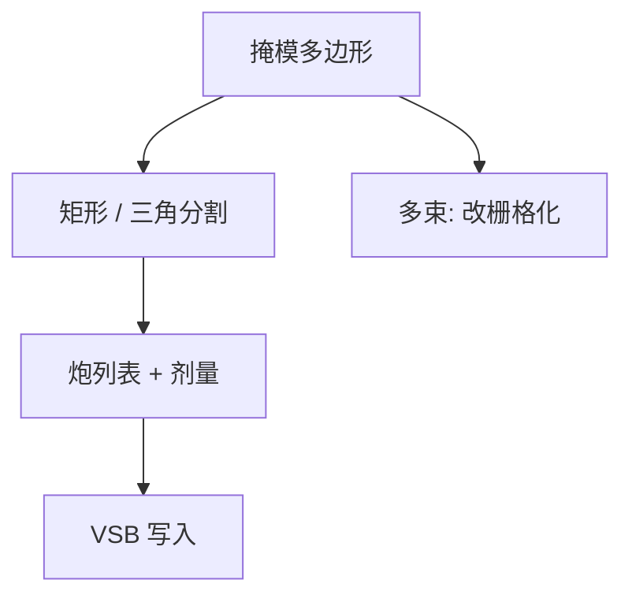

# 分割 fracturing

VSB 只认识矩形与少数三角形；分割把多边形收成炮，炮数就是写入日历的分子。

<footer>—— 对照 VSB 掩模写入与 fracturing 的公开工程讨论</footer>

[上一课](/litho/mask-data-prep)把作业单与坐标钉死。缺口是多边形还要切成写模机 primitive。本课钉 fracturing。掩模工艺修正如何再挪这些炮，留给[下一课](/litho/mpc）。

## 问题

可变成形束（VSB）一次曝光一个矩形（有时三角形）孔径。任意多边形必须分割成不重叠或允许有限重叠的炮。OPC 碎片越短、助条越碎、拐角越多，炮数涨得比面积快。曲线若先折成微矩形，炮数再乘一截——这正是 [多束写入](/litho/multibeam-mask-writer) 要躲开的墙。

缺口是**切法与炮数**，不是再讲 MDP 校验和。把 fracturing 理解成「显示三角化」，会漏掉：分割要满足最大/最小炮尺寸、纵横比、以及后段 PEC 对炮中心的假设。切得太碎，时间墙；切得太贪心，边出现台阶，mask CD 与放置变差。

### 重叠炮不是免费平滑

有些流允许炮重叠并调制剂量，用灰度逼近斜边。这能减少台阶，但重叠区的剂量非线性与 PEC 核纠缠，校准更难。合同若按「炮数」考核产能，重叠策略会被惩罚；若按「边粗糙」考核，又必须重叠。二者要在同一张预算里谈。

多束机把 fracturing 换成栅格化。本课对象是 VSB 炮；后课数据量与写入时间会把两条路径对照，不在这里写某型号的最大炮表。

## 方法

算法通称：先切曼哈顿矩形，剩余斜边用梯形/三角形或小矩形阶梯逼近。目标函数是炮数、最大边误差、以及避免细长炮（充电与库仑效应更差）。与 MRC 的接口：分割不能把合法多边形切成违例的细条——有时要先合并 jog 再切。

输出是炮列表：位置、长宽、剂量权重。这是写模机的真正输入。die-to-database 的金标准通常仍是分割前多边形；检验到的边与炮台阶之间的差，要有明确公差。

## 机制

孔径成形有最小尺寸与离散台阶。小于最小炮的特征只能靠邻近炮的剂量拖尾「印出来」，或被 MRC 禁止。因此 fracturing 不是纯计算几何：它被电子光学硬件量化。台阶的空间频率若落在晶圆通带内，会经 MEF 变成晶圆 LER 的一截——通常掩模台阶远在通带外，但过碎的助条例外。

## 边界

分割不提高分辨率。它只把几何投影到机台基。ILT 曲线在 VSB 上「能切」不等于「写得完」；产能论证必须报炮数，不能只报 clips 漂亮。不要把某 EDA 分割器的专有启发式写成物理定律。

后课默认：VSB 路径上几何已经是炮；MPC 在炮或多边形上补偿工艺，不是再切一次拓扑。

## 小结

- VSB fracturing 把多边形收成矩形/三角炮；炮数驱动写入时间。
- 切法受最小炮、台阶误差与 PEC 假设约束，不是任意三角化。
- 多束路径用栅格化代替炮列表。
- 出处：VSB 写掩模与 fracturing 的公开工程论述；SPIE Photomask。
