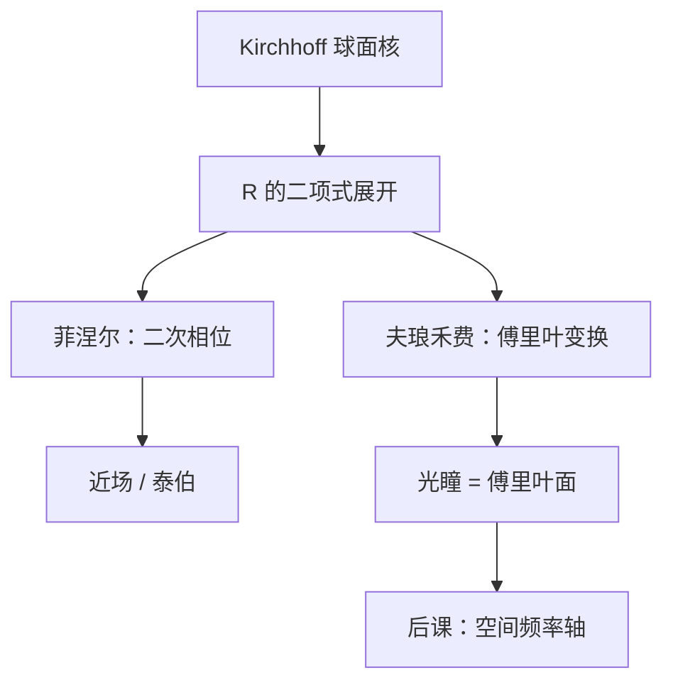

# 菲涅尔与夫琅禾费

球面子波的相位里藏着观察距离；留下二次项是近场（菲涅尔），只留线性项是远场（夫琅禾费），投影物镜的光瞳平面被故意放在后一种极限里。

<footer>—— Goodman, Introduction to Fourier Optics 对菲涅尔 / 夫琅禾费衍射的展开</footer>

[上一课](/litho/kirchhoff-diffraction)把孔径上的边值钉成 Kirchhoff 薄屏，积分核仍是 $e^{ikR}/R$。缺口是：**$R$ 的哪几阶相位必须保留**。上一课不负责按 $z$ 砍泰勒；本课把近场与远场写成同一积分的两个极限。空间频率如何给这些平面波命名，留给[衍射与空间频率](/litho/diffraction-spatial-freq)。仍不要写产线 CD。

## 问题

精确 $R=\sqrt{z^2+(x-x')^2+(y-y')^2}$ 让每个观察点都要做一次无法化简的面积分。光刻却经常问两类问题：掩模近处（接近式、泰伯自成像）要不要二次相位；进了投影物镜之后，光瞳上看到的是不是孔径的傅里叶变换。缺口因此是展开判据，而不是再争论铬上该不该写零。

菲涅尔数 $N_F=a^2/(\lambda z)$（$a$ 为孔径特征半径）把「近」和「远」收成无量纲数：$N_F\sim 1$ 必须留二次项；$N_F\ll 1$ 才进入夫琅禾费。扫描投影的物–镜距离按几何看并不「无穷远」，但透镜的二次相位抵消了菲涅尔项，光瞳仍落在夫琅禾费域——这是镜头的作用，不是把晶圆搬到千米之外。

### 二次项与线性项不是两种物理

同一 Kirchhoff 积分，对 $R$ 在光轴附近做二项式展开：常数项给出整体相位，$z$ 分母给出球面振幅，二次项是菲涅尔，把孔径坐标与观察坐标的交叉项再丢掉只剩 $\exp\bigl[-ik(xx'+yy')/z\bigr]$，积分变成傅里叶变换，即夫琅禾费。

「远场」在傅里叶光学里指相位的线性化，不自动等于「强度按 $1/z^2$ 的几何远」。光瞳平面上的级次图是夫琅禾费图样；晶圆上的空中像还要再经过一次变换。

## 方法

菲涅尔近似下（一维示意）

$$
U(x,z)\propto \frac{e^{ikz}}{z}\int U(x',0)\,\exp\Bigl(\frac{ik}{2z}(x-x')^2\Bigr)\,dx'.
$$

这是与二次相位核的卷积，传播可逆，直到倏逝分量被丢掉为止。泰伯距离上周期物会自成像，靠的就是这层二次相位的周期性。接触 / 接近式光刻活在菲涅尔区；投影光刻把物镜插进去，有意离开它。

夫琅禾费：二次相位在孔径上可视为常数（或被透镜配平），

$$
U(x,z)\propto e^{ikz}\exp\Bigl(\frac{ik x^2}{2z}\Bigr)\int U(x',0)\,e^{-ik xx'/z}\,dx'.
$$

积分是孔径场的傅里叶变换。Goodman 的透镜傅里叶变换性质把「无穷远」换成后焦面：投影物镜的出瞳坐标与物面空间频率对齐——后课的频率轴从这里开始有几何座位。

### 镜头不是把近场「变成」远场的魔法

透镜引入的光程（第一课的 $\int n\,ds$）抵消物方菲涅尔二次相位，使光瞳满足夫琅禾费条件。像方再来一次，晶圆落在物的（被光瞳切过的）像。本课不定义 $\mathrm{NA}$；只要求后课说「光瞳是傅里叶面」时，承认已经取了本课的远场极限。

$1/z$ 的振幅随距离掉，干涉条纹的疏密由相位梯度决定。丢掉二次相位却仍在 $N_F\sim 1$ 的区域算对比，级次位置会整根错。

## 机制

近场里，不同面元到观察点的程差还随横向位置二次变化，点物的「像」是菲涅尔衍射斑，不是几何点。远场（或焦面）里，横向结构只通过线性相位——也就是空间频率——进入积分，孔径形状的傅里叶分量直接出现在光瞳上。周期掩模的分立级，正是夫琅禾费核挑出来的那些 $\delta$ 峰。

上一课的倾斜因子在两种极限里都还在，只是夫琅禾费常把它并进缓慢变化的振幅，讨论级次位置时先忽略。机制仍是相干叠加，不是「光线在某个距离开始衍射」。

### 后课默认的接口

说到投影成像的物–瞳关系，默认夫琅禾费 / 透镜傅里叶变换；说到接近式或层间近场串扰，默认菲涅尔。角谱是同一传播的平面波基底，下一课给它装上 $f_x=n\sin\theta/\lambda$。

## 边界

展开假定傍轴或至少 $z$ 大于横向尺度；高 $\mathrm{NA}$ 边缘光线的 $R$ 展开要留更高阶，后课矢量成像再管偏振，本课不把 $\mathrm{NA}$ 写进判据。也不要把夫琅禾费理解成「必须真空传播很远」：透镜可以就地制造傅里叶面。本课不引用未公开的物镜焦面公差。

有限带宽让每个 $\lambda$ 的菲涅尔数不同，那是色差课的微扰，此处仍单色。

## 小结

- Kirchhoff 核已给定；本课按 $z$ 决定留二次项还是只留傅里叶核。
- 菲涅尔数 $a^2/(\lambda z)$ 判断近场；透镜把光瞳放到夫琅禾费域。
- 近场是卷积，远场是孔径的傅里叶变换。
- 后课的空间频率轴坐在夫琅禾费光瞳上。
- 本课不定义 $\mathrm{NA}$，不写瑞利 CD。
- 出处：Goodman, *Introduction to Fourier Optics*。
