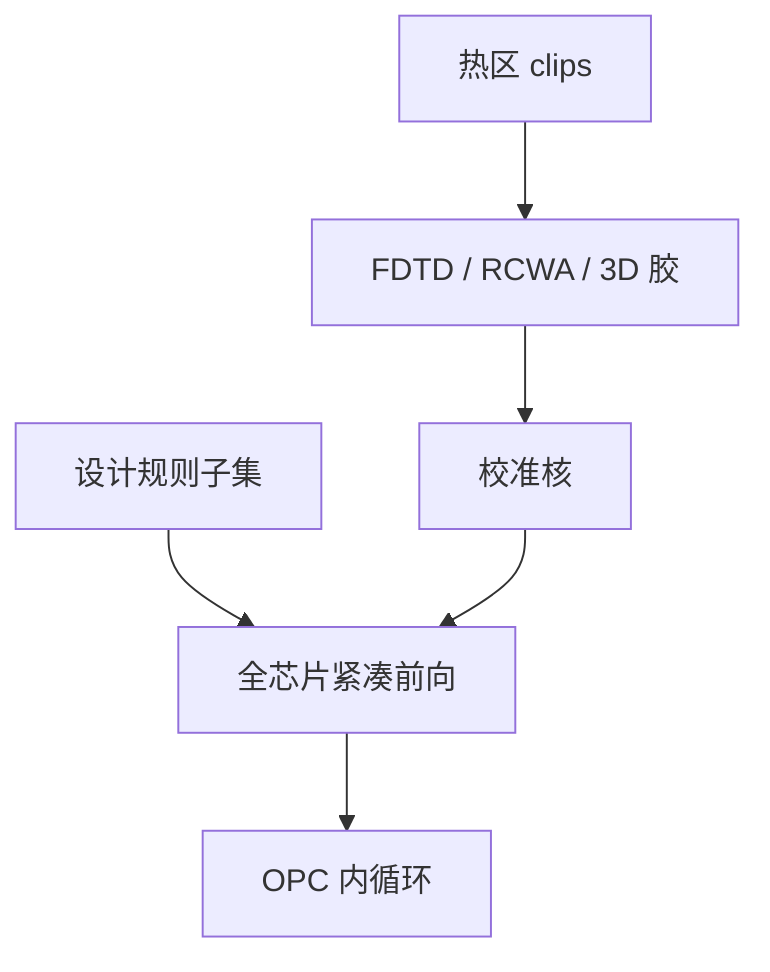

# 全芯片仿真的计算量

全芯片要的不是麦克斯韦处处真解，是在签核期限里把每一条可印边扫完；算力合同决定谁进内循环、谁只能抽热区。

<footer>—— 对照计算光刻对全芯片前向成本的公开讨论；紧凑对严格见 Wong / Erdmann 传统</footer>

[上一课](/litho/etch-model-calibration)把光学–胶–刻蚀收成可调用核。缺口是墙钟：同一条核扫完全场要多少机时，从而 OPC 内循环、LRC 抽检和实验室 3D 各占哪一层。[紧凑对严格](/litho/compact-vs-rigorous) 已声明分工；本课钉数量级，不重写 FDTD。[光刻友好设计](/litho/lfd) 下一课才问：设计侧如何少制造必须仿真的坏图形。

## 问题

一片 26 mm × 33 mm 的场，纳米级边长、多重曝光与 PV-band 点，把严格电磁当 OPC 内核会把周期拉到不可交货。[FDTD 掩模](/litho/fdtd-mask) 与 [RCWA](/litho/rcwa) 是老师，不是每晚全场引擎。紧凑核（TCC 卷积、CM 胶、密度刻蚀）把每碎片变成可并行的滤波；即便如此，高 NA、曲线 ILT、多过程角仍把集群打满。

缺口是**谁付算力**，不是再推一次成像积分。把「全芯片严格」写进签核清单，等于没有签核日期。

### 三层前向，三张账单

实验室：剪辑上的 EMF + 3D 胶，校准用。OPC：全芯片紧凑，必须在掩模数据准备窗口内收敛。LRC：比 OPC 更稀的过程角，但仍是全场或准全场。三者共用模型版本，不能各算各的几何。

碎片并行不等于线性加速：热区迭代、掩模规则回修和跨碎片 jog 会把尾延迟拉长。看 P95 墙钟，不只看平均 TFLOPS。

## 方法

成本粗账：场面积 / 碎片面积 × 过程角 × 波长/偏振通道 × 每碎片卷积。SOCS 截断、核半径、刻蚀核层数都是旋钮。GPU 把卷积变便宜，不把 EMF 变成全芯片。抽样策略：规则阵列用周期模型；二维库、SRAM、切线用加密 clips。与 [域分解](/litho/domain-decomposition-mask) 的关系：分解降低单块 EMF，仍盖不住 1011 量级的边。

工程合同写清：OPC 允许的核、LRC 的 PV 点集、热区才升级严格。模型残差课已经要求保持集；本课补的是保持集也必须能在预算内重跑。

签核日历比集群峰值更硬：掩模数据准备窗口一关，未扫完的角等于没签。故过程角集合要按层风险分级——金属二维层多角，周期鳍少角——而不是全球同一套 FEM 点。Mack 把模型分层写成工程常识；Levinson 把签核写成可交货日期。本课把两者乘在一起。掩模数据准备窗口（书写机排队、fracture、MPC）是外生截止：仿真若吃掉窗口，版就晚到，产能损失比「模型再准一纳米」更大。因此算力账要和掩模周期同一张日历，而不是只报集群利用率。

## 机制

Hopkins TCC 把源–瞳变成若干 SOCS 核，复杂度从「每源点一次成像」降到「若干次卷积」。胶与刻蚀是边邻域算子，复杂度随核半径和多边形数走。曲线 ILT 增加控制点，MPC 再乘一层。全芯片可完成，是因为几何被设计规则先投影到「可核化」子集——下一课 LFD 正是减少核必须修补的坏邻域。

曲线掩模把多边形数换成样条控制点，卷积次数未必降，MPC 与 MRC 检查反而升。算力合同要单独给 ILT 层一行，不能沿用曼哈顿层的碎片小时。

## 边界

算力账不替代计量：核快而残差大，只是更快地签错。不编造某厂「一夜全芯片 FDTD」或未公开的加速比。EUV 随机蒙特卡洛不是全芯片默认。

后课默认：全场签核走紧凑；严格解留校准与热区。设计若能少生成必须重仿真的图形，账单才进得去下一课的 LFD。

## 小结

- 全芯片前向是紧凑核的面积 × 过程角账单，严格电磁不进内循环。
- OPC、LRC、实验室三层共用版本，墙钟合同不同。
- 规则子集决定有多少边必须被核修补。
- 出处：计算光刻全芯片成本通称；Mack / Levinson 对模型分层的工程叙述。
