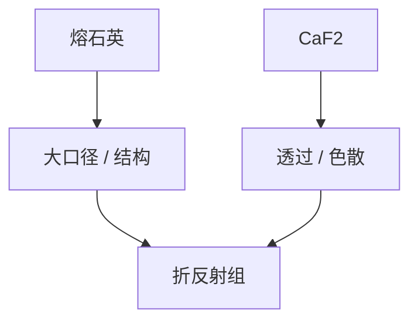

# 熔石英与 CaF₂

193 nm 能用的大块光学材料就这几样：熔石英扛大部分，CaF₂ 补深紫外色散与透过。选错牌号，致密化和双折射一起来。

<footer>—— 对照 193 nm 投影光学材料通识；[致密化](/litho/lens-compaction)、[双折射](/litho/birefringence-polarization)</footer>

[上一课](/litho/lens-compaction)把熔石英损伤写成寿命。缺口是材料分工：哪些面必须 CaF₂、哪些熔石英就够。本课钉材料，不写镀膜配方。

## 问题

空气与水都不吸收 193 nm 到不能用，但玻璃会。普通光学玻璃在此是黑的。熔石英透过尚可、可做大口径，却有致密化与 $dn/dT$。CaF₂ 透过更好、色散不同，但硬脆、热导与应力双折射更麻烦，大口径贵。折反射设计是在这两种约束里分配厚度。

## 方法

末片与高通量面优先低吸收牌号；色差敏感组用 CaF₂。浸没接触面还要抗水与清洗。采购与再抛光周期进镜头寿命账，与气体罐分开。

157 nm 曾把 CaF₂ 推到极限后放弃量产。193 nm 浸没是材料还能撑住的最后一档 DUV 波长台阶。

## 机制

电子带隙决定本征吸收边；杂质和 OH 决定尾吸收，尾吸收决定热与致密化速率。CaF₂ 立方晶，应力下双折射，后课展开。

## 边界

下一课如何量这台由两种材料拼起来的镜头的像差，而不是材料证书。

## 小结

- 193 nm 物镜是熔石英 + CaF₂ 的分配问题。
- 材料选择直接决定致密化与双折射预算。
- 出处：DUV 光学材料通识；致密化课。
