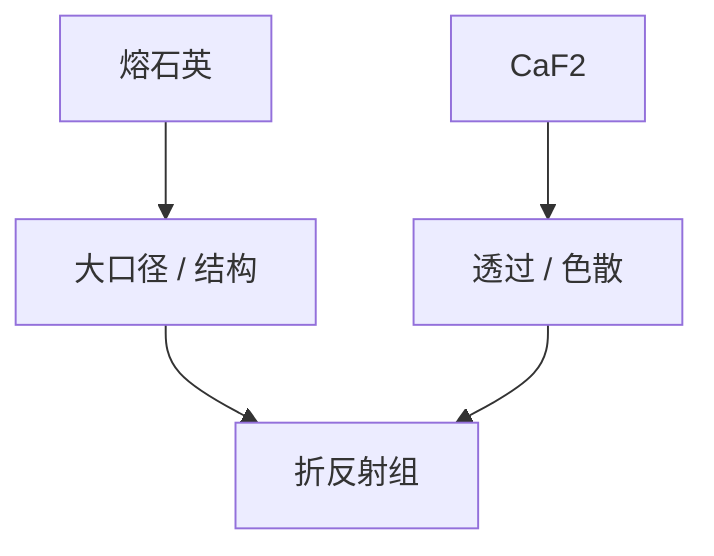
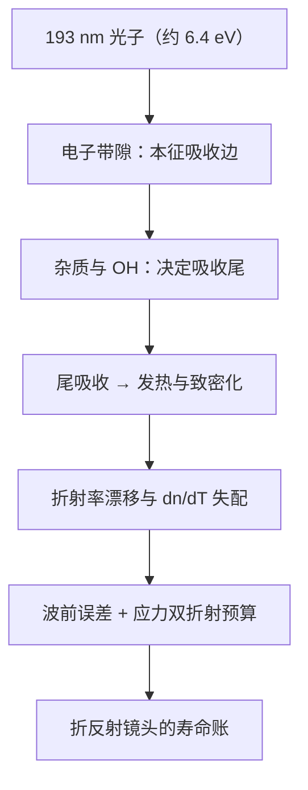

# 熔石英与 CaF₂

193 nm 能用的大块光学材料就这几样：熔石英扛大部分，CaF₂ 补深紫外色散与透过。选错牌号，致密化和双折射一起来。

<footer>—— 对照 193 nm 投影光学材料通识；[致密化](/litho/lens-compaction)、[双折射](/litho/birefringence-polarization)</footer>

[上一课](/litho/lens-compaction)把熔石英损伤写成寿命。缺口是材料分工：哪些面必须 CaF₂、哪些熔石英就够。本课钉材料，不写镀膜配方。

## 问题

空气与水都不吸收 193 nm 到不能用，但玻璃会。普通光学玻璃在此是黑的。熔石英透过尚可、可做大口径，却有致密化与 $dn/dT$。CaF₂ 透过更好、色散不同，但硬脆、热导与应力双折射更麻烦，大口径贵。折反射设计是在这两种约束里分配厚度。

常见误区：日常经验里「玻璃都透明」，就以为随便挑一块都行。普通光学玻璃里的过渡金属杂质和网络缺陷在 193 nm 是强吸收体，几毫米厚的普通玻璃在深紫外下接近不透明；能透过大通量 193 nm 的合成熔石英与 CaF₂ 是极少数被挑出来的例外。

直觉类比：CaF₂ 与熔石英的「色散不同」，就像两根粗细不同的弹簧——同样受力（波长变化）伸长量不同。把两者配对使用，可以让凸透镜与凹透镜在不同波长下的弯折互相抵消，这正是消色差配组（achromat）的老手艺，只是这次压到 193 nm。

## 方法

末片与高通量面优先低吸收牌号；色差敏感组用 CaF₂。浸没接触面还要抗水与清洗。采购与再抛光周期进镜头寿命账，与气体罐分开。

```mermaid
flowchart TD
  FS["熔石英"] --> BULK["大口径 / 结构"]
  CAF["CaF2"] --> UV["透过 / 色散"]
  BULK --> CAT["折反射组"]
  UV --> CAT
```

157 nm 曾把 CaF₂ 推到极限后放弃量产。193 nm 浸没是材料还能撑住的最后一档 DUV 波长台阶。

## 机制

电子带隙决定本征吸收边；杂质和 OH 决定尾吸收，尾吸收决定热与致密化速率。CaF₂ 立方晶，应力下双折射，后课展开。

数字实例：光子能量 $E=1240/\lambda(\mathrm{nm})$，193 nm 对应约 6.4 eV；熔石英带隙约 7 eV 量级，余量只有一两个 eV。吸收边就悬在头顶附近，所以 ppm 级的金属杂质或 OH 基团都足以在带隙里「搭桥」，把吸收尾拖进工作波段。

```mermaid
flowchart TD
  PH["193 nm 光子（约 6.4 eV）"] --> BAND["电子带隙：本征吸收边"]
  BAND --> IMP["杂质与 OH：决定吸收尾"]
  IMP --> HEAT["尾吸收 → 发热与致密化"]
  HEAT --> DN["折射率漂移与 dn/dT 失配"]
  DN --> WFE["波前误差 + 应力双折射预算"]
  WFE --> LIFE["折反射镜头的寿命账"]
```

## 边界

下一课如何量这台由两种材料拼起来的镜头的像差，而不是材料证书。

## 小结

- 193 nm 物镜是熔石英 + CaF₂ 的分配问题。
- 材料选择直接决定致密化与双折射预算。
- 出处：DUV 光学材料通识；致密化课。
