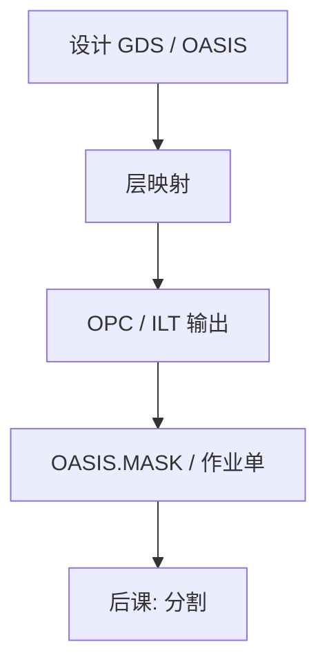

# GDSII 与 OASIS

版图若不能无损、可核对、可压缩地交给掩模厂，后面的 MPC、写入和检验都在猜客户想印什么。

<footer>—— 对照 SEMI P39 OASIS 与 Calma GDSII 流格式的产业通称</footer>

[上一课](/litho/high-na-throughput-economics)把高 NA 的产能与片成本钉成经济账。缺口是：晶圆侧再贵的光子，也要先变成一张可写的版。本课起一门新课——掩模制造与数据准备——从交换格式钉起。分层与布尔派生，留给[下一课](/litho/layout-layers-flow）。

## 问题

设计库交出来的是多边形流，不是扫描机认的铬图。历史上的交换语言是 Calma GDSII：层号、数据类型、边界、路径、结构引用。它能表达几乎一切曼哈顿与折线多边形，但重复单元、曲线逼近和小 jog 会把文件胀到 TAPOUT 墙。SEMI P39 的 OASIS（Open Artwork System Interchange Standard）用更紧的重复记录、模态坐标和压缩，把同一套几何收成小一个数量级的流；面向写版的 OASIS.MASK（SEMI P44）再限制成掩模厂吃得下的子集。

缺口因此是**交接口径**，不是再讲一次 [OPC](/litho/opc) 怎么挪边。把 GDSII 当「唯一真实」，会在曲线 ILT 上先撞磁盘与网络；把 OASIS 当「另一种画图软件」，会漏掉：校验和、模态计数与精确网格必须与合同里的数据库单位一致，否则后道 fracturing 在对另一张图。

### 数据库单位不是显示精度

GDSII/OASIS 的坐标是整数网格。用户单位（微米）乘以数据库单位才是纳米级边。网格若粗于写模地址栅，OPC 碎边会先量化误差；网格若细到亚纳米却没有对应的写栅，只是把文件和 MRC 检查变慢。合同必须写清 DBU、精度与允许的几何类型（路径是否先展成边界、是否允许曲线记录）。

OASIS 不是「压缩包里的 GDS」。它是另一种记录语法。比对必须在展开后的几何等价上做，不能比文件字节。

## 方法

流的路径：设计 GDS/OASIS → 层映射与派生 → OPC/ILT 输出 → 掩模数据准备。每一跳都要能回答：多边形集合是否与上一跳等价（在约定公差内）。OASIS 的 repetition、ctrans 和 modal variables 是为了让标准单元阵列和 SRAM 不把同一多边形写一万遍；展开给 fracturing 时必须可逆核对。

曲线层若仍先折成微矩形再进 GDSII，文件与 [曲线 MRC](/litho/curvilinear-mrc) 会一起炸。能走原生曲边或密折线的 OASIS 路径，才是后课数据量课的前提。本课只钉：格式选错，后面所有校正都在错误几何上算。

## 机制

GDSII 是顺序记录加结构层次；引用深度一深，流式工具必须建符号表。OASIS 把常用属性变成模态——下一条记录默认继承坐标与层——所以解码器状态机错一位，后面整层错位。这就是为什么掩模厂要官方校验器，而不是「能打开的浏览图」。

网格量化是第一种系统误差：边被吸到最近网格点，短 jog 消失或加倍。这与晶圆侧 MEF 无关，却会在写版 PEC 之前就已经改了频谱。后课默认：说到「客户数据」，先问是 GDSII 还是 OASIS、DBU 多少、是否 OASIS.MASK 子集。

## 边界

格式不提高 NA，不缩短写入时间。它只决定几何能否无损到达 MDP。专利与加密包装（某些专有流）若不能在掩模厂展开核对，检验的 die-to-database 会失去金标准。不要发明「OASIS 比 GDS 一定准一个数量级」的 CD 数字——准的是语法与压缩，不是光刻分辨率。

后课默认读者已经知道：掩模链的输入是带网格的多边形流；层怎么变成一张版，下一课才拆。

## 小结

- GDSII 是历史交换流；OASIS / OASIS.MASK 是为重复与掩模子集收紧的 SEMI 格式。
- 合同要写 DBU、几何类型与等价核对，不能只比文件大小。
- 曲线层不应先折成微矩形再进 GDSII，否则文件与 MRC 先炸。
- 出处：SEMI P39 OASIS；SEMI P44 OASIS.MASK；Calma GDSII 流惯例。
