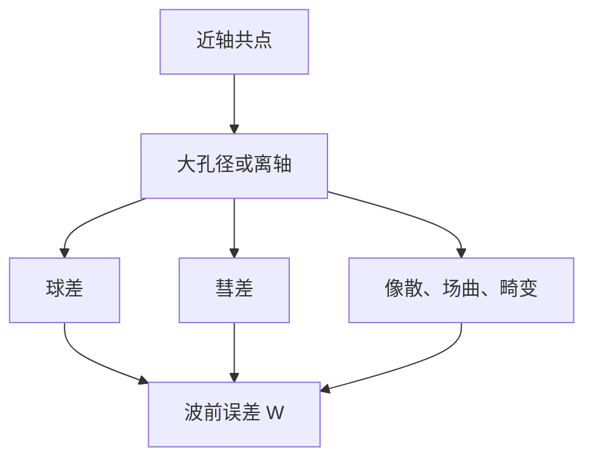

# 几何像差一览

近轴之外的光线不再交于同一点；球差、彗差、像散、场曲与畸变把理想像点糊成斑或把直线拉歪。

<footer>—— 据 Born &amp; Wolf, Principles of Optics 第 5 章 Seidel 像差与 Hecht, Optics 的整理</footer>

[上一课](/litho/stop-pupil-fov)建立了光瞳与 NA。本课不重定义入瞳。缺口是：[薄透镜成像方程](/litho/thin-lens-equation) 假定所有近轴光线共点；孔径开大、视场离轴之后，各环带落在哪？后课波前误差与工艺窗口都假设你认得这些形状。

## 问题

$\sin\theta\approx\theta$ 只在光轴附近成立。边缘环带的光程与近轴不同，轴外物点的子午与弧矢截面也不对称。没有像差分类，无法读镜头验收里的 RMS 波前，也无法理解为何投影物镜要用许多片去抵消球差。缺口是几何像差的名单与波前语言，不是再开大一次 NA。

### 像差名单不是分辨率公式的展开项

几何像差降低对比度、弯曲焦面、改倍率，从而收紧工艺窗口。它们不在本课被写成一条 CD 公式。把五级 Seidel 逐项塞进「分辨本领」，会把衍射极限与几何糊斑混成一件事。本课只分类；衍射何时必须请回来，见两课之后的标量边界。

Seidel 初级：球差、彗差、像散、场曲、畸变。更高阶用 Zernike 多项式拟合出瞳波前 $W$。光刻镜头验收常报一组 Zernike 系数，而不是再画一遍光线扇。

## 方法

轴上：球差——边缘光线与近轴焦点沿轴分离，单靠离焦不能同时对准所有环带。轴外：彗差——像点拖彗尾；像散——切向与弧矢焦点分离；场曲——最佳焦面弯曲，中心与边缘不能同时最清；畸变——$M$ 随视场变，直线变枕形或桶形，点仍可能相当「尖」。

这五类要分开记，因为矫正手段不同：球差主要随孔径的高次幂涨，开大 NA 先痛球差；彗差和畸变随视场涨，扫描狭缝再宽就先痛这两项。像散与场曲让「焦」不再是一个面。光刻物镜把残余压进波前预算之后，日常讨论才回到衍射；本课名单是为了读懂「为什么不能无限开孔径和视场」。

像差等价于出瞳波前相对理想球面的偏差 $W(\rho,\phi)$。$\mathrm{RMS}\,W$ 足够小则接近衍射极限（经验上常提 $\lambda/14$ 量级的 Marechal 判据，本课当验收口诀，不当推导）。光刻物镜的设计目标是全视场、全 NA 下把 $W$ 压进预算。

Zernike 多项式把 $W$ 投到正交项上，球差、彗差各占几项。验收报系数，是为了不把五类 Seidel 与高阶混在一张扇形图里说不清。

## 机制

多片不同折射率、非球面与对称布局用来交换像差符号，使残余进入衍射预算。照明在瞳上的权重会改变「有效」像差：同一组 $W$，中心照明与边缘照明看到的斑不同。本课不把照明优化写完，只指出像差是瞳函数的一部分。

畸变直接吃套刻：全视场纳米级 overlay 要求畸变残差同样是纳米。远心（上一课）减少离焦引起的倍率漂移，与畸变控制一起服务对准。色差是 $n(\lambda)$ 导致的 $f$ 随波长变，与单色 Seidel 并列，带宽课再提。

球差与场曲会把「最佳焦点」变成视场的函数：中心合焦时边缘已经离焦，工艺窗口被视场切薄。彗差与像散则让同一视场点的点扩散不对称，线宽随方向变。这些都还是几何光学语言；对比度掉到什么程度必须算衍射，两课后再划边界。设计上用对称组消彗差、用分离的正负透镜消场曲，是同一本账的工程面，本课不把镜头专利写进来。

## 边界

本课给 Seidel 直觉，不展开光线追迹软件。也不把像差当成「不能用几何光学」的理由——几何光学仍描述主光线与焦面；衍射描述斑的波动结构。下一课 [亮度、照度与光学扩展量预备](/litho/photometry-etendue-prep) 问的是功率与立体角，不是把斑再分类。

色差单独记账，是因为带宽课会给出 $\Delta\lambda$；本课单色五级已经够用来解释「为何物镜很复杂」。后课默认：理想共轭被五类初级像差修正；波前 $W$ 在出瞳上；畸变改倍率、场曲改最佳焦面。

## 小结

- 五级 Seidel：球差、彗差、像散、场曲、畸变。
- 波前 RMS 衡量离衍射极限有多远；光刻物镜用多片抵消。
- 畸变吃套刻；场曲与球差吃焦深与视场一致性。
- 像差名单不是 CD 公式；衍射边界两课后再收。
- 出处：Born &amp; Wolf, *Principles of Optics*；Hecht, *Optics* 第 11 章。
