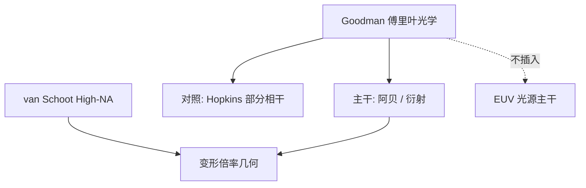

# Goodman 傅里叶光学

透镜是傅里叶变换器：物的频谱在焦面排开，光瞳做乘法窗，像是被截断频谱的干涉。光刻投影是这本书里的相干 / 部分相干成像，而不是另一门数学。

<footer>—— Joseph W. Goodman, Introduction to Fourier Optics</footer>

附录对照，不插入主干。[上一课](/litho/vanschoot-high-na-paper)对照了 High-NA 变形光学论文。本篇对照 Goodman《傅里叶光学导论》：主干 [阿贝成像](/litho/abbe-imaging) 与 [衍射与空间频率](/litho/diffraction-spatial-freq) 已经按课序把「频谱被光瞳低通」写进产线语言；书则从标量衍射、傅里叶变换透镜和相干传递函数系统讲起。这里只映射章节与树，避免每一课再从惠更斯原理重写。

## 问题

主干禁止百科：阿贝课从掩模频谱接到投影光瞳，立刻走向 NA 与产线。Goodman 的读者可能先读 Fresnel / Fraunhofer，再读 4f 系统，再读成像。附录的缺口是：如何引用这本书而不把树打乱成教材目录。

van Schoot 论文用的是 EUV 多层与倍率约束；Goodman 不管 13.5 nm。两者都是附录，分工不同：一篇对照产品几何论证，一篇对照标量傅里叶成像的共同语言。

### 与阿贝课的分工

阿贝课已经说：物衍射 → 光瞳截断 → 像面干涉。Goodman 把同一件事写成算子：相干脉冲响应是光瞳的傅里叶逆，传递函数是缩放后的光瞳。主干用阿贝把直觉钉在显微镜/投影上；附录用 Goodman 指出符号从哪来。不要在主干再抄一章衍射积分。

Goodman 以标量、单色为主。光刻的部分相干、矢量、薄膜栈在 Hopkins / 矢量成像课。不要把书的相干传递函数直接当 OPC 核。

## 方法

对照表（概念级，不代替读书）：衍射与空间频率 ↔ 树的衍射课；傅里叶透镜与阿贝 ↔ 阿贝课；相干成像与截止 ↔ [透镜 NA](/litho/lens-na)；抽样与空间带宽 ↔ 计算光刻离散化的背景，但不在主干展开成通信课。部分相干在 Goodman 有专章，主干对应 [Hopkins](/litho/hopkins-tcc) 与 SMO，附录只点名「书里有，树里另叶」。

High-NA 变形倍率不是 Goodman 的例题。读 van Schoot 需要的几何光学与角谱，书提供角谱语言，不提供 4×/8×。

### 不要当课程序列

若按 Goodman 章节当主干，读者会在胶、套刻、EUV 源之前先读完标量衍射全书。树的选择是：只用阿贝+衍射两叶把傅里叶钉住，其余进产线。本附录防止「缺一本教材」的焦虑，也防止把教材插回 EUV 光源课序。

## 机制

投影光刻的掩模频谱、光瞳函数、像强度，正是 Goodman 成像一章的对象；部分相干把互强度换成双线性核，书与 Hopkins 论文在这里会合。OPC 把这个算子求逆，书不负责求逆。EUV 多层反射、三维掩模超出标量薄屏，书的 Kirchhoff 假设要让位给严格电磁课。

因此：Goodman 解释「为什么是低通、为什么有截止频率」；阿贝课解释「为什么光刻师从这一句出发」；产品课解释「截止之后工厂还缺什么」。

引用格式用书名与作者，不要编造版次年份当唯一标准，更不要给这本书捏一个 arXiv 号。

## 边界

本课不把 Fresnel 积分抄进正文，也不用书的习题当 TAPOUT。矢量、多层、胶、随机效应都不在 Goodman 的主方程里。书里的空间滤波例子可以对照光瞳优化的直觉，但 SMO 的部分相干代价函数不在这本书的习题里。后课 Naulleau 随机效应论文对照胶与光子统计，与本篇的标量成像正交。

不要发明章节与树叶的一一编号表。映射保持到「概念 ↔ 已有叶」。

Tufte 课程序列优先于任何教材目录。书是对照，不是上一课的续章。

## 小结

- Goodman 提供标量傅里叶成像的共同语言；主干已用阿贝/衍射两叶吸收直觉。
- 附录只映射，不把教材插进 EUV 或 OPC 课序。
- 部分相干、矢量、多层要另叶；不要用相干传递函数冒充 OPC 核。
- 与 van Schoot 对照篇分工：一书一产品光学论文。
- EUV 多层与三维掩模超出标量薄屏，要让位给严格电磁课。
- 出处：Goodman, *Introduction to Fourier Optics*；主干阿贝 / 衍射课。
