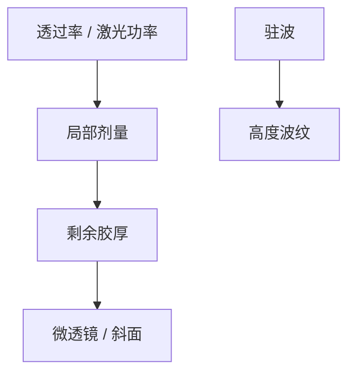

# 灰度光刻

二元掩模只印「有/无」；灰度把局部剂量映射成胶的剩余厚度，一次曝光做出斜面和微透镜。

<footer>—— 对照 grayscale lithography 与剂量调制三维胶轮廓的通称</footer>

[上一课](/litho/mems-patterning)需要三维结构。缺口是如何不用许多层二元曝光去堆斜面。本课钉灰度光刻。双光子把三维做到体素，留给[下一课](/litho/two-photon-3d）。

## 问题

灰度：掩模透过率连续或分多档，或激光直写调功率，使胶在显影后高度随剂量变。用于微透镜阵列、DOE、MEMS 斜面。校准是胶的对比度曲线（γ）与显影，薄膜驻波会调制高度——轨道与薄膜课的物理在此变成高度噪声。

缺口是**剂量→高度**，不是平面 CD。把灰度当 OPC 的剂量 MPC，对象错了：这里高度是产品。

### 与 VSB 灰度炮的区别

掩模写入灰度是为了斜边逼近；本课是晶圆/器件灰度。同词不同层。

低 γ 胶对灰度友好（高度渐变），对 IC 锐边不友好。胶不能两头讨好。

## 方法

设计：透过率图或激光位图。校准：台阶高度计或光学轮廓。工艺：厚胶、软烘、显影终点。转印：有时再回流（resist reflow 课）把台阶熔成光滑透镜。

## 机制

剩余厚度是溶解速率对剂量积分的结果。驻波给出 z 方向条纹，灰度表面变「波纹」。抗反射与烘烤与 IC 相同物理，规格源换成表面 rms。

## 边界

灰度不服务 MMP 逻辑。动态范围受胶 γ 与掩模档数限制。不把 3D IC 的多层金属当灰度。

后课默认：二维剂量可映射高度；下一课非线性双光子把曝光关在焦点体素里。

## 小结

- 灰度光刻把剂量写成胶高度，服务微光学与 MEMS 斜面。
- 胶 γ 与驻波决定高度精度。
- 与掩模写入灰度同词不同对象。
- 出处：grayscale lithography 通称。
