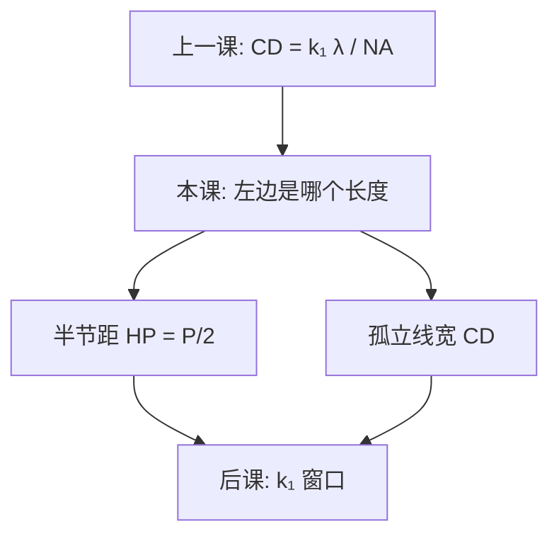

# 半节距对线宽

瑞利式里代入的那个长度，必须先声明是半节距还是某条孤立线的线宽；两者都可以叫 CD，却不是同一个空间频率上的量。

<footer>—— 据 ITRS 对 DRAM / MPU 半节距与栅长分列，以及 Mack 对 HP 与孤立 CD 的区分整理</footer>

[上一课](/litho/rayleigh-litho)把产线分辨率写成 $\mathrm{CD}=k_1\lambda/\mathrm{NA}$，并警告节点名不能当 $\mathrm{CD}$ 反推 $k_1$。缺口是：公式左边那个长度本身还没钉死——密集线的半节距（half-pitch, HP）和孤立线的线宽，数值不同，对应的空间频率也不同。本课只把这两个几何量分开。[k₁ 窗口](/litho/k1-factor-window)要用对的那一个去算工作点，本课不提前做 RET。

## 问题

上一课的例子用「大约 43 nm」演示 $k_1=0.30$ 的 ArF 浸没，但没有说 43 nm 是密金属的半节距，还是孤立栅的底宽。密栅的最小周期 $P$ 决定能进瞳的衍射级；半节距定义为

$$
\mathrm{HP}=P/2.
$$

等线等空时，线宽恰好等于 HP，于是「CD」和「HP」碰巧同一个数。孤立线没有邻居，频谱更宽，阈值切出的线宽可以小于同一工艺下还能分开的最小 HP。把孤立 CD 填进瑞利式再报 $k_1$，会把分辨率说得比光学通带更乐观。

ITRS 把这件事写成两列：DRAM 金属半节距是密集周期的度量；MPU 物理栅长是一条可以更瘦的孤立（或半孤立）线。商品节点名后来两列都不跟，缺口因此是「代入公式前先选几何」，不是再推导一遍 $k_1$。

### 半节距是周期，线宽是阈值切出来的宽度

HP 只依赖阵列周期，与占空比无关：1:1 与 1:3 的密栅可以有同一个 HP，线宽却差一倍。线宽（CD）是空中像被胶切出来的那条宽度，随剂量、焦点、占空比和邻近变。产线规格里「目标 CD」几乎总是线宽；路线图里「分辨率」几乎总应先报 HP。混用一个缩写，后课的曝光宽容度会不知道纵轴是谁。

等线等空只是 HP 与线宽重合的特例。讨论 $k_1$ 时默认写 $\mathrm{HP}\cdot\mathrm{NA}/\lambda$，并声明图形类别。把孤立栅长叫做「节点半节距」，是 ITRS 分列之后仍常见的误贴。

## 方法

量密集分辨率：画一组变节距的 1:1 线栅，找到工艺窗仍活着的最小 $P$，再报 $\mathrm{HP}=P/2$。量孤立 CD：同一剂量、焦点下量一条环境足够空的线，报的是宽度，不是半个「虚构周期」。两条曲线都要，才能解释为什么同一台机、同一胶，密线已经并线，孤立线还可以再瘦。

ITRS / 后来的 IRDS 用半节距做层与层、代与代的可比尺度，正是因为它绑定周期、绑定通带。MPU 栅长另列，是承认逻辑栅往往不是 1:1 密栅。读旧路线图时，先看表头是 Metal 1 half-pitch 还是 printed gate length，再决定能不能拿来算 $k_1$。

### 后课默认

说到「这一层的 $k_1$」，默认先给出 HP 或明确写出孤立 CD。后课窗口、MEEF、邻近都按图形类别分行，不再把一个纳米数同时当周期和线宽。

## 机制

投影光学的截止由最大空间频率 $\mathrm{NA}/\lambda$ 决定。周期 $P$ 的密栅，一级衍射的角频率是 $1/P$；能进瞳、能形成调制，才谈得上把两条线分开。HP 把这条周期约束收成习惯用的「半个节距」。孤立线的能量散在连续谱上，边缘位置由局部 ILS 和胶阈值决定，不存在「必须分开的第二条线」，所以线宽可以小于当时的最小 HP。这不是瑞利式失效，而是左边换了被测量。

Mack 强调：分辨率增强首先改的是密栅还能活的最小 HP；孤立线的瘦法更多是剂量、OPC 和胶衬度，与通带地板不是同一句话。ITRS 分列，就是把「周期能力」和「最瘦那根线」分开记账，免得节点名把两者捏成一个市场数字。

商业「N nm」既不是 HP 也不是栅长。本课禁止用节点名回代 $k_1$。要算工作点，用该层曝光的 $\lambda$、$\mathrm{NA}$ 和该层图形的 HP 或声明过的 CD。

## 边界

本课不给某代逻辑的金属 HP 表，不把 ITRS 某年版的纳米数当今天的工艺点。孔阵列的「半节距」是二维周期的另一套定义，后课接触孔再写，这里不把 1D HP 公式直接贴到孔上。

也不要把刻蚀后的线宽偷偷换成曝光 HP：转印会改占空比，周期在自对准多重里才被薄膜再劈。[ADI 对 AEI](/litho/adi-aei) 会分开两套 CD；HP 若来自设计周期，声明是设计 HP 还是量到的阵列周期。

## 小结

- 瑞利式左边必须声明：密集半节距 $\mathrm{HP}=P/2$，或孤立线宽。
- 等线等空时两者重合；一般情况线宽不是半节距。
- ITRS 把 DRAM HP 与 MPU 栅长分列；节点名后来两列都不跟。
- $k_1$ 默认用 HP 算通带工作点；孤立 CD 另报。
- 出处：ITRS 半节距表头惯例；Mack, *Fundamental Principles of Optical Lithography*。
