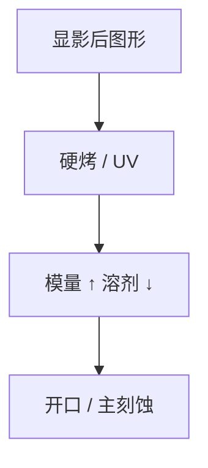

# 硬烤与 UV 固化

硬烤提高模量、赶尽溶剂，让胶扛得住开口等离子体；UV 固化走交联，热预算可以更低。

<footer>—— 对照 post-develop hard bake / UV cure 在转印前的公开用途</footer>

[上一课](/litho/descum)清完渣。缺口是膜还软：主刻蚀、真空、电子束量测都会流胶或放气。本课钉硬烤与 UV 固化，不写剥离灰化。

## 问题

软烤只为曝光。显影后聚合物网络更开、溶剂和显影液残余仍在。不硬化：刻蚀中流、倒塌阈值低、SEM 收缩（[CD-SEM 收缩](/litho/cd-sem-shrink)）。烤太高：图形圆化、CD 涨、甚至裂。需要一条「转印前热/光」预算。

## 方法

热板硬烤：温度低于分解、高于软烤，时间分钟级。UV（宽带或 172 nm 一类，以设备公开能力为准）诱发交联，可降热。金属氧化物胶的硬化化学不同，不要套 CAR 的温度表。固化后再量 CD，才是给刻蚀的合同尺寸。

UV 固化对深层胶的穿透有限，厚 SOC 不能指望一次 UV 烤透。分层固化或只固化成像层。

## 机制

交联与致密化提高 $E$，毛细与等离子体下的变形变小。体积收缩改 CD 与应力。光酸若还在，高温会继续反应——与 PEB 不同，这是图形已形成后的二次反应，可能糊边。

## 边界

下一课轨道–扫描仪联机：硬化在 track 上，曝光在 scanner 上，时间线要对上。

## 小结

- 硬烤/UV 是转印前的力学与放气预算。
- 过热糊边；过低流胶。合同 CD 应在固化后量。
- 出处：hard bake / UV cure 工艺通识。
