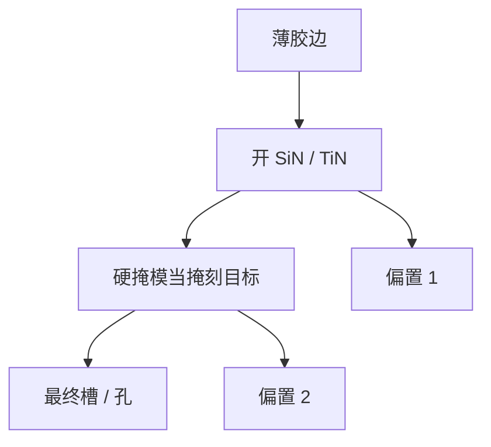

# 硬掩模 SiN / TiN

薄胶只负责定义边；纵向深度交给更耐打的膜。SiN 与 TiN 一类硬掩模把成像预算和深度预算拆开。

<footer>—— 对照多层抗蚀剂 / 硬掩模转印的产线通称；[三层 SOC](/litho/trilayer-soc-sog) 已写有机硬掩模栈</footer>

[上一课](/litho/ler-transfer-smoothing)把边频谱的转印写完。缺口是材料栈：EUV 薄胶和浸没薄胶都不够直接啃厚介质或硅。[三层胶](/litho/trilayer-soc-sog) 与 [RIE](/litho/rie-pattern-transfer) 已引入硬掩模角色；本课钉 SiN、TiN 在集成里的位置——无机掩模如何改选择比、形貌和计量。各向异性与侧壁钝化，留给[下一课](/litho/anisotropy-passivation）。

## 问题

SiN（或 SiOxNy）常用作接触/浅槽的介电硬掩模；TiN 出现在金属硬掩模（MHM）与某些栅/BEOL 栈。胶先转到硬掩模，再以硬掩模为掩去刻目标。选择比窗口从「胶对目标」变成两段：「胶对硬掩模」×「硬掩模对目标」。每段可单独优化气体，代价是多一步、新缺陷（硬掩模残、金属沾污）和新的 CD 偏置。

缺口是**为何是这两种膜、以及偏置如何进 OPC**，不是重讲三层涂覆顺序。TiN 不透明或高反射，影响对准与 overlay 标记衬度；SiN 应力影响翘曲（后课晶圆形变）。OPC 核必须声明是对着哪一跳 AEI。

### 金属硬掩模的计量陷阱

TiN AEI 的 SEM 衬度、充电与真实硅 AEI 不同。把 MHM CD 当最终电学 CD，会把后续金属填充偏置漏掉。签核轮廓要写「MHM AEI」还是「最终槽」。

硬掩模厚度是 AR 与选择比的旋钮：太薄打穿，太厚开口 AR 升、胶更难转印。厚度均匀性变成全场 CDU 项。

## 方法

栈设计：胶 / SiARC 或 SOC / SiN 或 TiN / 目标。每跳食谱独立，成对计量独立校准核。与 BARC open 课衔接：开硬掩模的那一跳往往是 CD 敏感步。TiN 要用无残或可控残的剥离，避免金属污染前道。应力与后续对准：标记设计课已有传感器；本课要求硬掩模开窗策略不毁掉标记。

OPC 核的 AEI 目标必须写明跳数。混用「开 TiN 后」和「最终槽」两套 SEM，密度斜率会拧反。Levinson 把 ADI/AEI 当合同；硬掩模只是把 AEI 拆成两张合同。

## 机制

硬掩模把「成像用薄胶」和「刻穿用厚掩」解耦。第一跳：低 AR、对胶选择比适中。第二跳：高 AR、对硬掩模高选择比、强钝化。CD 偏置是两跳之和，密度核可能要分层。TiN 还可能在等离子体中产金属副产物，改变放电——食谱窗口比 SiN 更脏，颗粒与缺陷检测要跟上。

两跳偏置必须分账：开硬掩模的 CD 敏感步与最终槽的 AR 步不是同一个核。混报 AEI 会让 OPC 去修错的一跳。

## 边界

不规定某节点必须用 TiN 或 SiN。不重写 ALD 成膜全文。金属硬掩模与后道集成的污染控制只点名，细节属缺陷课。

后课默认：深度预算在硬掩模上，胶只定义边。下一课写如何用钝化把硬掩模开口刻直。

## 小结

- SiN/TiN 把成像与深度拆成两跳选择比，CD 偏置是级联。
- 计量轮廓必须声明看到哪一跳。
- 应力、反射、金属残是集成税。
- 出处：多层硬掩模转印通称；Levinson 流程叙述；三层胶前课。
