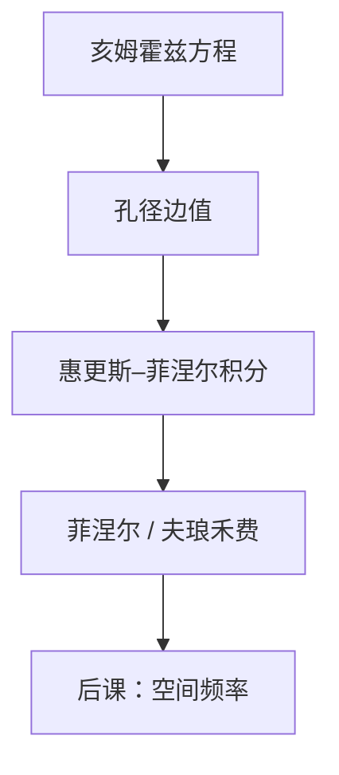

# 亥姆霍兹与惠更斯–菲涅尔

亥姆霍兹方程约束单色场在每一点如何弯曲；惠更斯–菲涅尔积分把一块已知孔径上的场，写成下游每一点的二次子波叠加。

<footer>—— 据 Born &amp; Wolf, Principles of Optics 对标量衍射的 Kirchhoff / 惠更斯–菲涅尔表述整理</footer>

[上一课](/litho/em-wave-index)已经把单色复振幅 $U$、折射率 $n$ 和光程钉死，$U$ 满足亥姆霍兹方程 $(\nabla^2+n^2 k_0^2)U=0$。缺口是：方程是局部的，掩模开口却是一块有限边界。只说「平面波是特解」，算不出缝后面某处的场。本课把亥姆霍兹收成衍射积分；空间频率怎么给这些子波命名，留给[衍射与空间频率](/litho/diffraction-spatial-freq)。不要从瑞利判据起笔：那条产线公式还没有光瞳，更没有积分核。

## 问题

均匀介质里亥姆霍兹处处成立，但光刻要的是「已知物面透过率，求像面前的场」。这是边值问题。惠更斯的图像是：波前上每一点当作新的球面子波源；菲涅尔补上倾斜因子，使正前方贡献大、擦边方向贡献小。没有这层积分，后课的角谱只是换基底，推导从哪块面积出发并不清楚。

缺口因此是给上一课的 $U$ 一个从孔径走到观察点的核，而不是重讲 $n$ 与光程。光程仍然进入相位：子波走过的几何程乘 $n$，再乘 $k_0$，与第一课同一套符号。

### 积分核不是又一个折射率

Kirchhoff 用格林定理把亥姆霍兹变成面积分：观察点场由孔径上的 $U$ 与 $\partial U/\partial n$ 决定。惠更斯–菲涅尔是它的常用近似——孔径上每面元贡献 $\propto U(\mathbf{r}')\,e^{ikr}/r$，再乘倾斜因子。$n$ 已经在 $k=nk_0$ 里；不要把「子波强度」误写成新的材料参数。

本课仍是标量。偏振边界条件、掩模吸收体厚度，会改孔径上的 $U$ 本身，那是后课的电磁缺口。这里假定薄物面已经给出了标量 $U$。

## 方法

约定物面在 $z=0$，观察点在 $z\gt 0$。惠更斯–菲涅尔（菲涅尔近似下）把场写成

$$
U(x,y,z)\propto \iint U(x',y',0)\,\frac{e^{ikR}}{R}\,K(\theta)\,dx'dy',
$$

$R$ 是面元到观察点的距离，$K(\theta)$ 是倾斜因子。$k$ 里的 $n$ 来自上一课。当 $z$ 远大于孔径、且横向频率不太高，相位里的 $R$ 可展到二次项（菲涅尔）或只留线性项（夫琅禾费）。投影物镜的光瞳平面，正是把物面场送到夫琅禾费域的那一段。

Rayleigh–Sommerfeld 把 Kirchhoff 的边界矛盾收掉，核更干净；光刻仿真里角谱传播与它等价：每个平面波分量乘 $\exp(ik_z z)$。本课不展开算法，只承认：亥姆霍兹加上辐射条件，唯一地决定了这块积分。

### 近场与远场是同一积分的两个极限

菲涅尔区保留二次相位，掩模近处的泰伯自成像、接触式接近式光刻都靠它。扫描投影把物镜插在中间，有意走到夫琅禾费，好让光瞳成为空间频率的坐标系。本课两条都要：积分是一条，后课只取远场极限去谈级次。

$e^{ikR}/R$ 的 $1/R$ 是球面波振幅；相位才是干涉的主角。丢掉相位只加强度，就退化成非相干的「几何照度」，衍射条纹全部消失。

## 机制

铬缝把入射平面波截断。截断后的场不能再只沿原方向走：积分核把每个面元的子波送到所有允许的 $k_z$ 实数方向，观察点是这些子波的相干叠加。亮暗条纹来自光程差，不是来自「光线拐弯」。上一课的平面波基，现在可以读成：把积分核做傅里叶变换，子波包变成角谱。

倾斜因子压掉大角度贡献，对应后课「可传播频率不超过 $n/\lambda$」的萌芽——擦边方向的子波接近倏逝，积分自动变弱。本课不引入 $\mathrm{NA}$；截止要等光瞳课才变成合同上的数。

### 后课默认的接口

说到衍射，先承认场由孔径上的惠更斯积分（或等价角谱）决定，不再从麦克斯韦方程重推单色波。物面 $U$ 可以是复透过率乘照明；照明若有许多互不相干方向，强度在积分之后再加，那是部分相干课的缺口。

## 边界

本课不管透镜玻璃里的折射面如何逐面追迹：物镜被后课收成光瞳函数，等于在夫琅禾费域乘一个窗。也不处理有限带宽：每个 $\omega$ 各做一次亥姆霍兹，再对光谱积分，是色差课的事。Kirchhoff 在边缘上场值跳跃，严格电磁学不成立，但对开口远大于波长的铬缝，标量积分已经够后课用。

不要把惠更斯原理理解成「波前真的铺满点光源」的本体论；它是亥姆霍兹边值的构造。点扩散、艾里斑、瑞利 CD，一律还没有定义。

## 小结

- 亥姆霍兹是局部约束；成像要的是孔径到观察点的积分核。
- 惠更斯–菲涅尔（及 Kirchhoff / Rayleigh–Sommerfeld）把上一课的 $U$ 推进到下游。
- 相位仍是 $k_0$ 乘光程；近场取菲涅尔，光瞳取夫琅禾费。
- 角谱是同一积分的平面波基底，下一课给它装上空间频率轴。
- 本课不引入 $\mathrm{NA}$，不写产线 CD 公式。
- 出处：Born &amp; Wolf, *Principles of Optics*（标量衍射与惠更斯–菲涅尔）。
