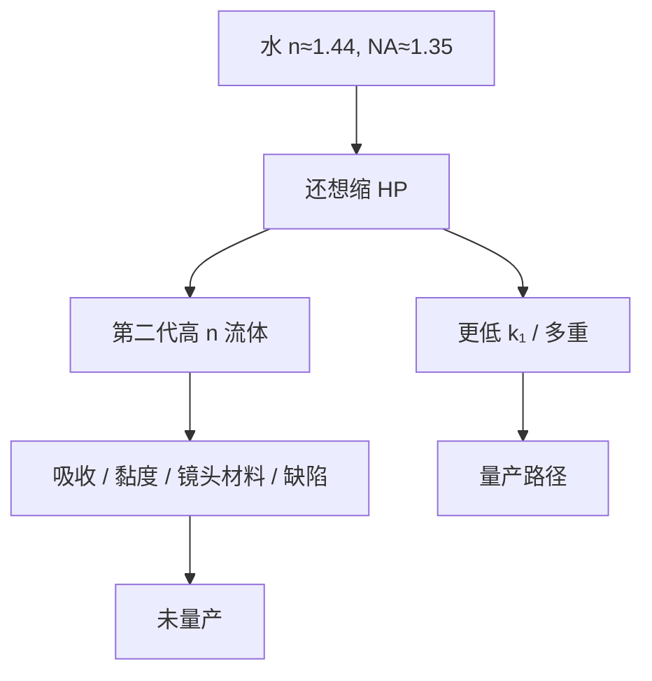

# 高 n 浸没液

水把 NA 送到 1.35 之后，第二代更高折射率的流体在实验室里走过一圈：吸收、黏度、最后透镜材料和缺陷，没有把量产 NA 再抬一档。

<footer>—— 据 2000 年代高折射率浸没（high-n immersion）公开研发史整理，第二代流体未进入量产</footer>

[上一课](/litho/topcoat-leaching)把水–胶界面的浸出和面涂写成隔离问题。缺口是：水的 $n\approx 1.44$ 已经用尽之后，有没有一种更稠、更「光学」的液体把 $n\sin\theta$ 再往上推。本课钉高 $n$ 浸没液的公开结局：研发有，量产无。干式层与浸没层如何分工，留给[下一课](/litho/dry-vs-immersion-layer）。

## 问题

[ArF 浸没](/litho/arf-immersion) 用水把设计 NA 做到约 1.35。瑞利式还想在 193 nm 上缩 HP，下一条路是更大的 $n$ 或更小的 $k_1$。第二代浸没液的公开目标是 $n$ 明显高于水，搭配高折射率最后透镜材料，把 NA 推向 1.5 以上量级。同时 157 nm 干式路线已经退出量产台阶，193 nm 被寄予「再浸一次」。

缺口不是再设计一个喷淋头，而是介质本身：吸收必须在 193 nm 足够低，黏度必须允许高速弯月面，与胶、面涂、镜头镀膜必须兼容，缺陷必须可及水的水平。公开史是这些约束没有同时被量产满足。本课不编某流体的折射率到小数点后三位当「差点成功」的叙事。

### 灌更高 n 的液体 ≠ 自动更高 NA

与上一课程重复过的教训相同：$\mathrm{NA}=n\sin\theta$ 要求物镜按新的 $n\sin\theta$ 设计，并要最后一片玻璃/晶体的折射率跟上。高 $n$ 流体若镜头材料跟不上，角度预算浪费。Mack 对「灌水不会把旧 NA 乘上 $n$」的警告，对第二代液体同样成立。

公开讨论里出现过第二代流体与 LuAG 一类高折射率晶体镜头元件的组合研究。它们停在材料吸收、双折射、供应与缺陷，而不是停在一篇未公开的量产 wph 表。本课不编产能。

## 方法

读这段历史的方法是列约束清单，而不是列产品型号。光学：193 nm 吸收、色散、与最后表面匹配。流体力学：黏度、弯月面稳定、回收纯度——[浸没头](/litho/immersion-hood) 为水优化的喷淋与回收，不能假设换液仍成立。化学：浸出、溶胀、残液染色镜头。缺陷：气泡、水印的同类，外加高 $n$ 液特有的残留膜。每一条在水上已经很紧，换液往往更紧。

工程结论（公开）：保持水、NA 1.35，分辨率继续用 RET 与多重图形去买。高 $n$ 不是「下一代浸没机」的量产旋钮。

### 后课默认

说到浸没介质，默认超纯水，$n$ 取公开的约 1.44 量级，NA 取设计值约 1.35。说到「高 NA」，在 DUV 上不要默认为第二代流体；EUV High-NA 是反射光学另一课。

## 机制

提高 $n$ 能在同样孔径角下提高 NA，或在同样 NA 下减小角度、改善偏振与焦深——这是光学动机。流体侧，高 $n$ 往往来自更大的电子极化率，伴随吸收边靠近 193 nm、黏度上升。弯月面毛细数改，浸没头回收窗口改。镜头最后元件若改用高 $n$ 晶体，应力双折射和均匀性会进像差预算。缺陷生成率一旦高于水，良率先于分辨率把项目停掉。

因此失败模式是系统的，不是「差一种添加剂」。公开研发史把它写成 193 nm 浸没的边界：水是量产点，更高 $n$ 是未关闭的实验室分支。

不要把 hyper-NA 的宣传幻灯片读成已安装机台。DUV 量产停在水浸没；再往下的节点用多重图形和 EUV，不是用第二代液。

## 边界

不评价某供应商流体牌号，不发明吸收系数表。不把这段历史写成「本可以代替 EUV」——即便 NA 再抬一档，单次 $k_1$ 地板仍在，多重与短波长仍会出场。下一课要回答的是：既然高 $n$ 没来，哪些层继续干式、哪些层必须水浸没。

157 nm 的失败与高 $n$ 浸没的未量产是两条不同的路线，不要合成「193 之后没有光学进步」。水浸没本身就是进步；第二代流体不是它的量产续集。面涂与浸出是水化学的账，换更高 $n$ 的有机或含添加剂流体时，浸出与染色通常更凶，隔离问题不会自动消失。

## 小结

- 第二代高 $n$ 浸没液在公开研发中被探索，未成为量产介质。
- 约束是吸收、黏度、最后透镜材料与缺陷，不是缺一个喷淋头。
- 灌液不会自动乘出更高 NA；镜头必须按新 $n\sin\theta$ 设计。
- 量产默认仍是水、约 1.35 NA；更小 HP 走 RET、多重与 EUV。
- 换更高 $n$ 流体时浸出与染色通常更凶，隔离账不会消失。
- DUV 量产停在水浸没；hyper-NA 幻灯片不是已安装机台。
- 出处：2000 年代 high-n immersion 公开研发史；Mack 对浸没 NA 设计的论述。
