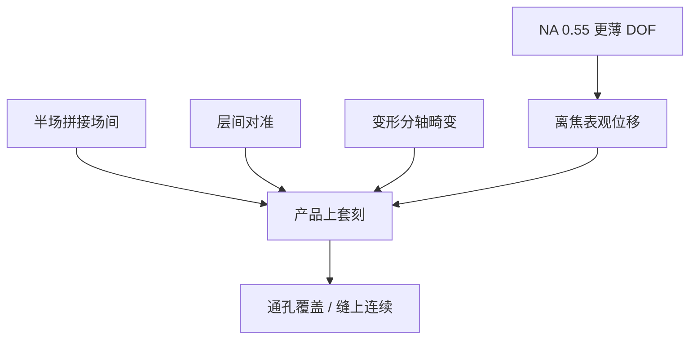

# High-NA 套刻

0.55 把套刻预算收得更紧：半场拼接要场间对准，更薄焦深和变形光学把残差放大成 CD 与通孔覆盖失效。

<footer>—— 归纳自 ASML 对 High-NA / EXE 套刻与拼接挑战的公开描述</footer>

[上一课](/litho/high-na-stitch)把大 die 写成两次半场曝光和一条缝。缺口是：缝上的场间对准只是套刻账的一页——层间 overlay、匹配机台、变形畸变和离焦引起的表观位移，在 NA 0.55 下同时变苛刻。本课钉 High-NA 套刻。胶厚与焦深如何抢同一段 $z$ 预算，留给[下一课](/litho/high-na-resist-budget)。

## 问题

[套刻](/litho/litho-overlay) 的定义没变：本层相对下层（或同层另一次曝光）的位置残差。变的是公差与来源权重。节距随 0.55/0.33 约缩到 60%，通孔覆盖窗口按面积更苛刻。拼接引入「场 A 对场 B」这一项，NXE 全场产品没有。变形光学让 X/Y 倍率不同，畸变、放大和扫描同步误差要分轴建模，不能用各向同性 4× 的高阶 overlay 多项式原样搬过来。

ASML 公开把 overlay 与 stitching 写成 High-NA 量产导入的核心挑战之一，与源功率、pellicle、胶并列，而不是「NA 高了自然更准」。本课描述这条挑战结构，不编造 EXE 的纳米规格表。

### 焦深把套刻和 CD 焊在一起

DOF $\propto\lambda/\mathrm{NA}^2$，0.55 相对 0.33 大约按 $(0.33/0.55)^2\approx 0.36$ 变薄。硅片不平整、卡盘指纹、掩模热，都会让局部离焦。非理想远心或残差倾斜时，离焦表现为 CD 兼表观位移。High-NA 上「只看 overlay 标记、不问焦」会漏掉通孔覆盖的真实失效。磁浮台与调焦带宽必须进入同一份预算。

单机套刻、匹配套刻、产品上套刻三种定义仍然适用。High-NA 导入期最容易把开发机上的单机数当成 HVM 产品上套刻。公开挑战描述针对的是后者。

## 方法

对准传感器、编码器网格和双台策略继承真空 Twinscan，但网格密度、热校正和变形场模型按 EXE 重写。拼接层：先套下层，再套邻场，校正环要能同时收平移/放大/旋转与缝上的高阶跳变。交叉匹配：同一节点里 NXE 与 EXE 混跑时，DUV–EUV 那套 cross-match 还要加上 0.33–0.55 的光学指纹差。

计量：缝上专用标记、场内高阶、以及与 CD-SEM 的覆盖相关性。只优化标记 overlay 而通孔链失效，说明标记与器件的 M3D/阴影不同——[斜入射](/litho/euv-oblique-shadow) 的警告在 0.55 更重。计算光刻把 overlay 残差当作热点输入，而不是假设缝上残差为零。

### 拼接项与层间项分账

场间（stitch）overlay 坏，同一层金属在缝上错位或双线。层间 overlay 坏，通孔落在下层线外。两者可以同时超，来源不同：前者是两次半场的对准与掩模匹配；后者含工艺变形、下层标记质量和镜头匹配。预算必须拆开，否则会拧错校正。

## 机制

更高 NA 提高光学对比，有助于某些层的套准读出，但目标图形更小，同样纳米残差的相对伤害更大。变形使扫描向与狭缝向的掩模台速度比不同（4× vs 8× 几何），同步误差投影到硅片时分轴加权。热：更大镜子、更高功率密度，掩模与镜头漂移更快，动态 overlay 进扫描。随机孔位置抖动看起来像 overlay，根子是光子/化学，修对准网格无效。

工厂经济：High-NA 单次省下的双重套刻层，可能被拼接层和更严的产品上套刻部分吃回。ASML 的公开叙事是挑战可管理、需整机与工艺一起资格认证，而不是「0.55 自动优于双重 0.33 的套刻」。

不要把 NXT 浸没产品页上的 overlay 纳米数抄到 EXE 上当结论。平台、真空、变形、半场都不同。本课只用公开的挑战描述：拼接 + 更高 NA + 更薄焦深。

## 边界

本课不编造 EXE:5000/5200 的 overlay 规格，不把投资者日上某一代配置产能与套刻捆成课后答案。也不重写对准传感器光学。后课默认：说到 High-NA 良率，套刻账含缝、层间、分轴畸变和离焦耦合。胶厚预算从焦深侧再切一刀。

出处：ASML High-NA / EXE 对 overlay 与 stitching 的公开挑战描述；van Schoot 场几何；套刻定义见 overlay 课。磁浮台细节见已有工件台课。

芯粒若避开拼接，场间项消失，层间与 DOF 项仍在。套刻挑战不是「只有大芯片才有」，只是大芯片多一页缝。

## 小结

- High-NA 套刻在更小节距上更苛刻，并新增半场场间项。
- 变形光学要求分轴畸变与同步模型，不能搬 NXE 各向同性多项式。
- 更薄焦深让离焦变成 CD 与表观位移，必须与 overlay 联立。
- 拼接项与层间项分账；随机孔抖不是对准能修的。
- 不编造 EXE 纳米规格；下一课从胶厚抢 DOF 写起。
- 出处：ASML EXE / High-NA 公开挑战描述；van Schoot。
