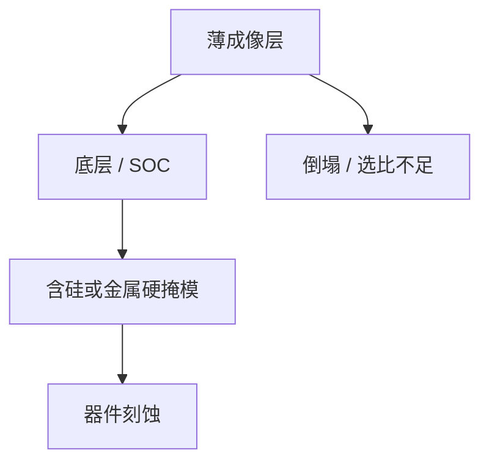

# 高 NA 薄胶的转印

成像层只剩十几纳米时，干法必须靠底层和硬掩模把深宽比接下去。转印失败的表现是倒线、掉选择比，不是曝光矩阵上 CD 还有窗。

<footer>—— 对照 van Schoot 等 High-NA 成像；Levinson 多层硬掩模；金属氧化物胶的耐干法讨论</footer>

[上一课](/litho/underlayer-secondary-electron)把潜像写到薄胶与界面电子。缺口是显影之后：浮雕太矮，直接当器件刻蚀掩模不够。本课钉高 NA 薄胶的图形转印。一层芯片要铺多少张 EUV 版，留给[下一课](/litho/euv-layers-per-node）。

## 问题

[胶厚预算](/litho/high-na-resist-budget) 要求薄膜以满足焦深和倒塌；吸收课要求薄膜内仍有事件。显影后线高/线宽若仍想守约 2:1，高度只剩十纳米量级。前端刻蚀的深度远大于此，必须多层转印：成像层 → 底层/旋涂碳 → 含硅硬掩模 → 器件膜。金属氧化物胶自身耐干法，可以少一层，但仍要平面化和开口。

缺口是转印栈，不是再算一次 DOF。曝光窗开着、干法把线倒掉或 CD 漂移，整层仍报废。选择比、聚合物沉积、ALD/ALE 微调属于集成，但起点是光刻留下的矮浮雕。

不要把 0.33 NA 上「三十纳米 CAR 直接挡刻」的流程拷到 EXE。High-NA 默认成像层是牺牲的记录介质。

## 方法

栈资格：每层选择比、开口偏置、线宽缩进、缺陷（桥、断）。轨道涂布与烘烤窗口与底层电子课绑定。干法：先打开薄胶下的有机层，再转硅硬掩模；等离子体对矮线的离子轰击和侧壁聚合物要重新开窗口。金属氧化物：配体解离后的金属氧网络当第一硬掩模，底层改管黏附与下一段。

计量：显影后 CD 不是终点，转印后 CD 和剖面才是。OPC 若只校准显影 SEM，会把刻蚀偏置当成光学偏置。

### 倒塌发生在显影，墙却在转印

深宽比判据看显影后湿态和干燥。转印等离子体再施加侧向离子和聚合物，矮线可能在干法里折断或变细。资格认证要覆盖显影→硬掩模开口全程，不能只过曝光矩阵。表面活性剂漂洗和超临界干燥是倒塌课的手段，High-NA 薄胶把它们从可选项变成栈的一部分。

## 机制

离子刻蚀的选择比有限，掩模消耗量 $\Delta t \approx$ 刻蚀深度 / 选择比。$\Delta t$ 大于胶厚则图形没。多层把深度分配给更耐的膜。随机孔缺失在转印中会被放大成硬掩模开孔失败，缺陷规格在成像层就要严于最终器件——转印有自己的 MEEF。High-NA 半节距更小，同样的侧壁角误差占 CD 比例更大。

ALD/ALE 可以修剖面，补不回成像层已经缺失的孔。转印不是随机效应的保险箱。

## 边界

本课不统计某节点 EUV 用了几层金属、几层切，下一课才写层数与节点。不重写 FinFET/GAA 器件集成。转印偏置必须进 OPC 校准片，否则光学模型会背刻蚀的锅。出处：van Schoot High-NA；Levinson 硬掩模；euv-resist 金属胶耐刻；胶厚预算课。

## 小结

- 高 NA 薄胶默认走多层硬掩模转印，显影 CD 不是终点。
- 选择比和倒塌把成像层厚度与集成栈锁在一起。
- 下一课：这些转印步骤在整节点上对应多少张 EUV 版。
- 出处：van Schoot；Levinson；金属氧化物胶公开讨论。
