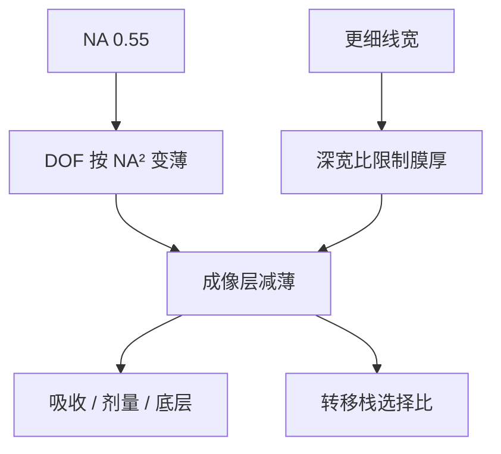

# High-NA 胶厚预算

焦深按 $\mathrm{NA}^2$ 变薄之后，胶膜不再是「够厚才耐刻」的独立规格，而必须和轴向窗口、倒塌深宽比写在同一张预算表上。

<footer>—— 对照 van Schoot 等对 High-NA 成像与焦深的公开讨论；胶厚与工艺窗口亦见 Levinson</footer>

[上一课](/litho/high-na-overlay-na)把 High-NA 的横向合同收到套刻：半场拼接、变形倍率下的层间位移，已经是一等良率项。缺口是轴向。硅片侧 NA 从 0.33 到 0.55，[焦深](/litho/depth-of-focus)按 $\lambda/\mathrm{NA}^2$ 再削一截；胶若仍按 0.33 的厚度涂，膜本身就可能撑满甚至溢出可用焦深，倒塌与刻蚀选择比同时告急。本课钉胶厚预算。真空磁浮台如何把残余离焦压进这张窗，留给[下一课](/litho/euv-maglev-stage)。

## 问题

瑞利式 $\mathrm{DOF}=k_2\lambda/\mathrm{NA}^2$ 在 EUV 真空里 $n=1$。NA 比 $0.55/0.33\approx 1.67$，分母平方约 $2.8$。公开仿真把 0.55 的可用焦深说成相对 0.33（以及浸没 DUV 习惯的百纳米量级）再掉两到三倍，整体焦点窗可落到数十纳米。胶膜厚度、晶圆台阶、扫描 $z$ 残差必须挤进同一段。

另一条墙是倒塌。半节距跟 NA 一起缩，线宽往 8 nm 量级走时，深宽比仍想守在约 2:1，膜厚就得掉到约 15–20 nm 一档，而不是 0.33 上常见的三十纳米级。厚胶既吃焦深，又在显影时更容易倒。缺口因此是：薄膜还要转印、还要吸收够光子，不能只报一个「越薄越好」。

### 胶厚不是刻蚀余量的自由变量

厚胶曾经是硬掩模选择比的保险。High-NA 把保险取消了：成像层必须薄，转印改由底层、含硅硬掩模或金属氧化物胶自身的耐干法来补。把胶厚仍当「刻蚀工程师的独立旋钮」，会在曝光矩阵上先看到窗口消失，再在干法上看到倒线。预算要从成像往下派，而不是从刻蚀往上加。

不要把「High-NA 胶必须 15 nm」写成机台规格。公开讨论的是量级与深宽比逻辑；具体膜厚随层别、CAR 还是金属氧化物、底层栈而变。本课钉的是预算结构，不是某一张涂布配方。

## 方法

预算拆三块。光学：Bossung 与 E–D 窗的焦轴宽度，必须大于胶厚贡献的「膜内离焦」加上调平残差、场曲与掩模三维引起的最佳焦点漂移。材料：成像层减薄后，吸收截面或底层必须把[随机效应](/litho/euv-stochastics)的有效光子数补回来，否则薄胶只是把泊松体积再缩小。转印：成像层之下的转移栈按选择比设计，允许胶在显影后只剩很矮的浮雕。

工程上常把成像层、底层、硬掩模分开资格认证，而不是把「一张厚 CAR」从 NXE 拷到 EXE。金属氧化物胶的高吸收、高选择比，正是为这张薄预算准备的工作点，见 [EUV 胶](/litho/euv-resist)；它不自动放宽焦深，只让薄膜仍能蚀穿。

### 深宽比、焦深与光子同时记账

倒塌判据按显影后线高/线宽。焦深判据按空中像沿 $z$ 仍够 NILS 的区间。光子判据按膜内吸收事件数。三张表的交集才是可涂的厚度。只满足倒塌而膜太薄、吸收不够，缺陷率会先于平均 CD 越界；只加厚换光子，焦深与倒塌又先死。

## 机制

胶有物理厚度 $t$。空中像在膜内沿 $z$ 变化，阈值切出来的侧壁是这段积分的结果。$t$ 接近 DOF 时，膜顶与膜底不在同一焦面，侧壁角与 CD 对离焦更敏感，窗口按面积而不是按中心点 CD 收缩。掩模三维还让不同节距的最佳焦点错开，van Schoot 一类 High-NA 成像讨论把这件事与 DOF 放在同一张图上：胶越厚，越吃不起焦点漂移。

光子面密度由剂量决定，体密度还乘吸收。减 $t$ 而不加吸收或剂量，$\bar N$ 下降，LCDU 与缺孔变差。所以薄胶预算必须同时改化学或改剂量，不能只改涂布转速。

Levinson 把工艺窗口写成剂量–焦点平面上的合格区；胶厚进入的是焦轴能否装下膜、台阶与残差。把胶厚只写在材料规格书里、不写进 E–D 窗，等于漏记一维。

## 边界

胶厚预算不替代套刻，也不提高 NA。半场拼接的位移仍按上一课；本课只回答「这一次曝光的膜能不能站在焦深里」。公开文献给的是趋势与仿真量级，不是 EXE 出厂的胶厚表。计量在薄膜上的偏置会变，CD-SEM 与散射测量都要按薄胶重标定，不能沿用 0.33 的厚膜配方。

后课默认：说到 High-NA 工艺窗口，胶厚已经是焦轴上的一等项，不再把「涂厚一点」当作免费的刻蚀余量。

引用「焦点窗不到 40 nm」一类仿真时写清图形、照明与胶平台。把某一 clips 的数当成所有层的机台规格，会过度悲观或过度乐观。

## 小结

- High-NA 把 DOF 按 $\mathrm{NA}^2$ 削薄，胶厚必须进入焦轴预算。
- 更细线条把倒塌深宽比也压到薄膜（公开讨论约 15–20 nm 量级）。
- 薄胶的光子与转印要靠吸收、剂量和底层补，不能只减涂布厚度。
- 掩模三维引起的最佳焦点漂移与膜厚叠加，窗口按面积算。
- 出处：van Schoot 等 High-NA 成像与焦深公开论述；Levinson, *Principles of Lithography*。
