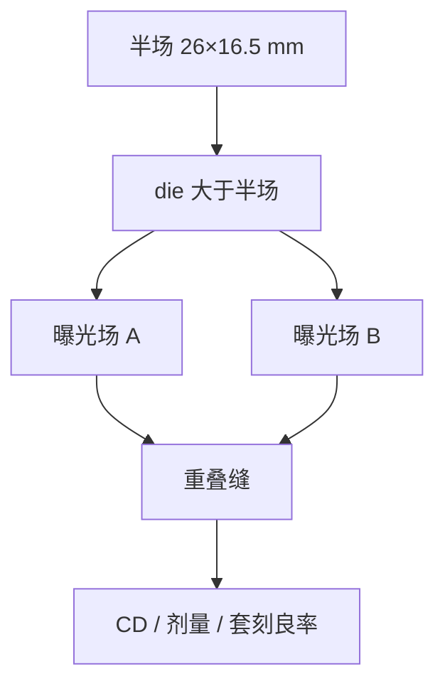

# High-NA 半场拼接

变形光学把曝光场在狭缝向切成约 16.5 mm；比半场大的芯片要两次曝光在缝上接起来。

<footer>—— 据 van Schoot 与 ASML EXE 对半场几何与拼接的公开说明</footer>

[上一课](/litho/asml-high-na)把 EXE 写成 NA 0.55、变形 4×/8×、场约 26 × 16.5 mm。缺口是：半场是光学可行的代价，不是芯片尺寸的上限——HPC 大 die 必须沿狭缝向把图形切成两次曝光，缝上的剂量、CD 和套刻成为新的良率项。本课钉半场拼接。拼接加上更高 NA 的套刻预算，留给[下一课](/litho/high-na-overlay-na)。

## 问题

NXE 全场约 26 × 33 mm，多数逻辑 die 一次曝光盖住。EXE 在狭缝向减半，是因为 [变形倍率](/litho/anamorphic-projection) 把掩模场瘦下来以保住 6 英寸版与 CRA。硅片上 300 mm 仍排很多场；变的是单场面积。超过约 16.5 mm 狭缝向尺寸的芯片，必须两次曝光拼接（stitch）。

缝不是「画一条线切开」那么干净。两次曝光各有自己的掩模、对准、剂量和阴影指纹。缝区图形要在金属/通孔公差内连续，计算光刻要为重叠带设计分割规则。小芯片、芯粒可以避开拼接；大 die 把拼接当成与随机、焦深并列的良率项。

### 半场不是半片晶圆

公开场尺寸约 26 mm（扫描）× 16.5 mm（狭缝）。晶圆上照样步进；产能会计多一次曝光、多一次对准，而不是只能做半片。van Schoot 的公开几何把这件事写成 High-NA 的结构后果，而不是某个客户的可选模式。

拼接方向是狭缝向（场的短边），扫描向仍约 26 mm。不要把「半场」理解成扫描行程减半，否则会把工件台同步和掩模台行程写错。

## 方法

设计—工艺协同：在缝上放允许重叠的结构，或把关键节距避开缝，或用两次互补图形在重叠带里交叉。OPC 对缝两侧分别建模型，因为两次曝光的 CRA 方位、照明足迹和透镜指纹不同。套刻标记要能独立量「场 A 对下层」和「场 A 对场 B」。

机台侧：两次曝光的对准网格、剂量匹配和焦面必须在缝上连续。双工件台不自动保证两次半场是同一热历史——中间可能换掩模、等源稳定。EXE:5000 偏工艺开发、5200 向量产，公开叙述包含把拼接做成可制造，而不是只演示单场分辨率。

### 与双重 EUV 的差别

0.33 的 EUV 双重是为了节距，两次曝光覆盖同一场。High-NA 拼接是为了场尺寸，两次曝光覆盖相邻半场，目标是同一层连续图形。两者都吃套刻，但分割规则不同：双重按颜色分解；拼接按几何切场。不要把 LELE 的染色表直接贴到缝上。

## 机制

光学上，缝两侧的主光线角和畸变残差不同，CD 与最佳焦点会在缝上跳。剂量若在重叠带里相加，必须按设计成「恰 complementary」或「非打印重叠」，否则局部过曝。阴影 HV 偏置在两场里指向不同的狭缝坐标，缝上可能出现左右边不对称的突变。

产能：大 die 的曝光次数按半场计数，TPT 相对「同等 NA 的全场」吃亏；这是与 0.33 双重比总成本时必须进模型的项。ASML 公开的是场几何与拼接必要性，不在本课编造 EXE 的量产 wph。

重叠带宽度是设计规则，不是物镜焦距。太窄则套刻稍偏就断线；太宽则两次剂量叠加窗口难收。计算光刻与 DTCO 共同收这条带。

## 边界

本课不写未公开的缝宽微米数，不编造某代 EXE 的拼接套刻纳米规格。芯粒若把 die 切到半场以内，拼接可以从该产品消失，但机台仍是半场光学。后课默认：说到 High-NA 大芯片，先问缝，再问层间 overlay。

出处：van Schoot High-NA 公开论文；ASML EXE 对 half-field 与 stitching 的公开说明。0.55、4×/8×、26 × 16.5 mm 是已在整机课给出的合同，本课只把拼接当主缺口。

存储器阵列若一刀切在重复单元上，缝的可重复性有时比逻辑好修；逻辑后段疏密和切层在缝上更毒。产品 mix 决定拼接痛不痛。

## 小结

- EXE 半场约 26 × 16.5 mm；更大 die 必须两次曝光拼接。
- 缝上要同时收 CD、剂量连续性和场间套刻。
- 拼接不是 LELE 染色；分割按几何切场。
- 产能按半场曝光次数计，不在本课写 wph。
- 下一课把拼接残差放进更高 NA 的套刻预算。
- 出处：van Schoot；ASML EXE 半场公开材料。
