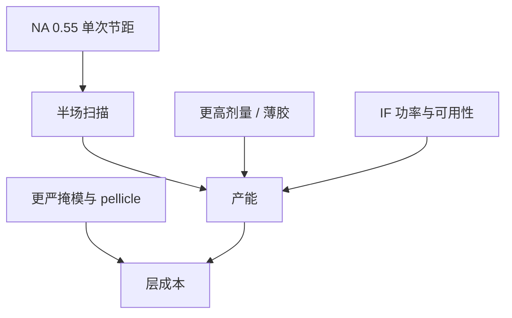

# 高 NA 的产能与经济

0.55 NA 把单次节距往下推，也把场切成半场、把胶涂薄、把源功率再要一档。产能是半场拼接、剂量和可用性乘出来的，不是 NA 的线性奖励。

<footer>—— 据 van Schoot、ASML 对 EXE / High-NA 生产力的公开讨论</footer>

[上一课](/litho/euv-single-expose-limit)把 0.33 单次墙钉在 NILS 与随机上。缺口是：抬 NA 买更小节距，工厂要付什么。本课钉 High-NA 的产能与经济。EUV 进阶课序收到这里；下一课程从版图数据到掩模制造另起，不在本课重写 GDS 或 DUV 掩模厂。

## 问题

单次极限课给出三条出路。High-NA 是其中最重资产的一条：硅片侧 NA 0.55、变形倍率、半场扫描、更紧焦深、更薄胶、往往更高剂量。IF 功率路线往 500 W–1 kW 的公开目标，很大一块是为这张账服务。半场意味着同样芯片面积要更多次扫描拼接，[套刻](/litho/high-na-overlay-na) 与 [stitch](/litho/high-na-stitch) 吃良率；名义 wph 不能按 0.33 全场线性外推。

缺口是把这些税加总，而不是再推一遍瑞利。经济比较的对象是：High-NA 单次 vs 0.33 多重 EUV vs 继续浸没，在掩模张数、工艺步、良率和资本之间。

不要把产品页 wph 抄成物理上限。声明的剂量、场利用率、可用性一变，数字立刻变。本课只保留公开的结构关系。

## 方法

产能：$TPT \propto$ 可用功率 / 剂量 × 场面积 / 扫描开销 × 可用性。High-NA：场面积约半，剂量可能升，开销含拼接与更密对准，可用性含源、膜、收集镜。源功率必须先把半场和 $T^2$ 补回，才谈「比 0.33 更快」。

成本：工具资本、厂务电力（CO₂ 链墙插）、掩模（变形、更严 CDU、pellicle）、胶与硬掩模栈。掩模侧 8×/4× 变形让版图和 MDP 规则改变——具体 GDS/OASIS、分层和 fracturing 由下一课程写，本课只指出：High-NA 把掩模数据准备从可选项变成产能链的一环，版图错误会直接浪费半场扫描。

### 和 0.33 多重比的是步数税

双重 EUV 或切层要两张版、两次对准、两倍随机机会。High-NA 单次用资本和半场换回步数。交叉点随源可用性、pellicle 破膜率和拼接良率移动。没有可维持的千瓦源，交叉点会滑回 0.33 多重——功率路线课在经济上的落点。

## 机制

光学增益来自 NA，系统损失来自 $R^N$、半场、变形照明足迹和随机剂量。van Schoot 等把 High-NA 写成成像与系统的联合设计：没有 1 kW 级可维持源和可用 pellicle，NA 只是更贵的低产机。经济上，当 0.33 多重的掩模张数、套刻和缺陷超过 High-NA 半场税时，插入才合理——与层数课的插入逻辑同一把尺，刻度换成资本。

EUV 进阶到此收束光源–光学–掩模部件–胶转印–节点经济。掩模制造课程从数据格式起笔，不再重讲 pellicle 物理或锡滴 LPP。

## 边界

本课不写 GDSII 与 OASIS 的记录结构，那是下一课程第一课。不重写 DUV 掩模坯、铬膜、雾化。不编造 EXE 出货片/小时。出处：van Schoot High-NA；ASML EXE 生产力公开材料；功率路线与单次极限课。

后课默认：说到 High-NA「值不值」，先问半场 TPT、剂量、源可用性和掩模成本，再问 NA 数字。

## 小结

- High-NA 用 NA 换节距，用半场、剂量、源功率和掩模严规格付钱。
- 产能会计与 0.33 相同结构，系数更苛刻；比较对象是多重 EUV 的步数税。
- 本课程结束。下一课程进入掩模制造与数据准备，从版图文件格式起，不回头重写本课的膜与源。
- 出处：van Schoot；ASML High-NA 公开讨论；本课序功率与单次极限。
