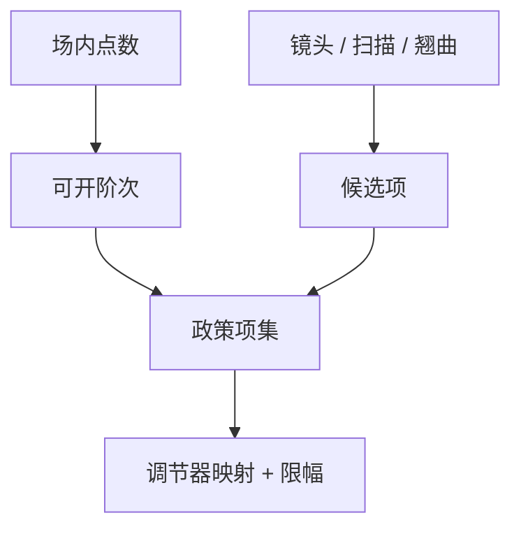

# 高阶场内校正

线性项吃掉场的刚体；弓形、扫描偏扭和工艺弯月要靠场内高阶项，而项数不得超过抽样能辨识的自由度。

<footer>—— 对照 ASML 对高阶 overlay 校正的公开论述；[高阶套刻](/litho/high-order-overlay) 已钉来源</footer>

[上一课](/litho/overlay-control-loop)给出套刻环。缺口是开哪些场内项：[高阶套刻](/litho/high-order-overlay) 已列镜头、扫描与翘曲来源；本课钉**控制政策**：默认开几阶、何时升级、如何防止噪声拟合。批次分派与重工，留给[下一课](/litho/lot-disposition-rework）。

## 问题

场内校正项一多，残差图变花就是过拟合：边场点少、噪声当弓形，下一场补反。项太少，工艺弯月留在器件上，规格只在场心满足。政策应是：稳态用经能力验证的项集；事件（换胶、新 PECVD 应力、新掩模书写指纹）后加密抽样，再决定是否升级项。

缺口是**可辨识性**，不是再列 Zernike 式的套刻多项式。扫描机提供的校正器有物理限幅；模型项还要映射到可执行的台/镜头调节，否则只是计量拟合，曝光时做不到。

### 场间与场内不要抢账

晶圆径向膨胀主要是场间；镜头畸变是场内。把径向全塞进场内高阶，产品换场排布就崩。 holistic 校正把晶圆、场、扫描方向分开，政策应保持这本账。

新掩模的书写指纹是「场内且稳定」的，可用掩模专用校正，不必每片重估。把它当随机高阶，会污染机台指纹。

## 方法

项集版本与抽样计划同发。验证：保持场加密计量，看预测残差是否下降、是否在新产品上泛化。映射：项 → 扫描机调节器行程，检查饱和。与 CD：某些调节器（镜头加热补偿）同时动 CD， holistic 要联合，本课只要求套刻项不要偷偷拧照明。

新产品导入用加密计量跑两周，再决定稳态项集。把导入期的高阶项直接冻进量产，会把首批噪声变成永久指纹。ASML 公开论述强调校正与采样匹配，本课把匹配写成政策版本号。

## 机制

最小二乘拟合高阶项，设计矩阵由测点坐标决定。点布局差则条件数爆。正则化或固定不显著项，等于降低有效阶次。控制上，用上一批系数的 EWMA，而不是本片噪声系数直接曝光——除非本片对准点数已经支撑该阶（少见）。

项数受点数与调节器行程双重约束。过拟合的残差图变花；政策失败的标志是新产品上泛化变差。

## 边界

不重复高阶来源的全文。不编造某 Twinscan 的项名称表。High-NA 半场拼接有自己的场内不连续，不在本课用光滑多项式假装。

后课默认：项集与抽样绑定，过拟合即政策失败。下一课：残差仍超规格时如何分派与重工。

## 小结

- 场内高阶项数受抽样自由度与调节器行程约束。
- 稳态项集与事件升级要分开。
- 掩模指纹与机台指纹分账。
- 出处：ASML 高阶 overlay 校正公开论述；前课来源不重写。
