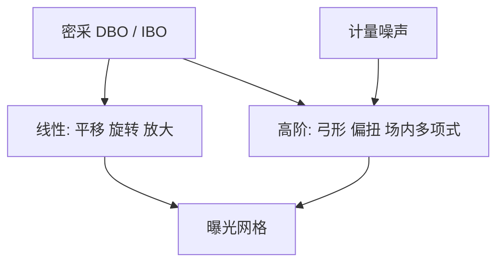

# 高阶套刻

平移、旋转、放大只是网格的线性骨架。场内弓形、扫描偏扭与晶圆翘曲的高阶项，要靠够密的标记读数才能看见、才能补。

<footer>—— 据 ASML 对 overlay 校正与高阶模型的公开论述整理</footer>

[上一课](/litho/dbo-ibo)把读数选在 IBO 或 DBO 上，并指出加密采样是为了拟合。缺口是模型：扫描机默认能补的线性项吃不掉镜头残差、扫描同步和工艺翘曲的弯曲。本课钉高阶套刻。这些校正由谁在什么时候量、怎么回写到曝光网格，留给[下一课](/litho/yieldstar-dbo)的机内计量角色。

## 问题

对准课已经把网格写成平移、旋转、放大。[套刻 Overlay](/litho/litho-overlay) 也提过线性与高阶场内、场间模型。本课补差：产品残差里剩下的空间频率，从哪来、用什么多项式或扫描仪校正项去吃。只报场平均 overlay，等于把弯月形指纹平均成一个看起来合格的点。

来源包括：投影物镜畸变的高阶、扫描方向的同步与偏扭、工件台与晶圆的热瞬态、薄膜应力翘曲、以及掩模书写指纹。线性项对场心有效时，四角和边场可以已经超标。缺口是场内/场间的阶次，不是再选一次 DBO。项一旦开放，残差图应变平滑而不是变花；变花就是噪声在被拟合。

### 采样密度决定看得见的阶

一项 $k$ 阶场内模型，点数少了会欠定或把噪声拟合进去。上一课 DBO 的吞吐优势在这里兑现：同样划片预算下更多点，高阶才可识别。点再多，若全在槽边上，芯片内仍有未建模残差——加密的是槽，不是有源区。

高阶校正补的是曝光时的网格，不是把已刻死的下层搬回来。下层翘曲只能尽量拟合，不能当「无限阶免费套准」。

## 方法

场间（interfield）：片级网格，描述晶圆平移、旋转、放大、以及径向/弓形的低阶翘曲。场内（intrafield）：每场或每组场的放大、旋转、扫描偏扭、弓形等。ASML 公开材料把这类能力说成 overlay 校正 / 高阶模型 / 与计量闭环，具体产品名随世代变，本课不拿未公开系数表当教材。

流程：曝光后（或显影后）密采套刻 → 拟合允许的项 → 下一片或本片后续场把校正送回扫描机。过拟合会把计量噪声写成下一场的假指纹，残差看起来更花。项集要按层冻结，换一层薄膜应力，再开放哪些项。

边场权重要单独看：点数少时高阶项会把边残差「补」到场心去，产品死在边上。

### 与线性匹配的分工

混跑匹配套刻首先锁线性：两台机器的放大/旋转一致。高阶匹配更难，因为镜头指纹不同。公开讨论里的 DUV–EUV cross-matching 强调的是产品上残差，不是「高阶项越多越好」。项加到镜头不可重复的那一阶，就是在拟合当天噪声。

## 机制

扫描投影把「场」沿狭缝积分。扫描方向的速度误差表现为场内 $y$ 相关的套刻；狭缝方向的镜头畸变表现为 $x$ 相关。热载在浸没和 EUV 上都改晶圆与台子的瞬态形状，时间上慢于单场、快于整批，所以校正有本片实时与批次 APC 两档。薄膜应力给出碗状或鞍状，场间高阶吃它；吃不完的部分变成边场系统残差。

LELE 把两次曝光的相对高阶直接写成节距指纹：场四角节距和场心不同。SADP 层内自对准，但切层对鳍的高阶套刻仍在。预算必须按策略拆，不能对所有层开放同一套项。

「高阶 overlay 更好」只在项与物理源对齐、且采样可识别时成立。把多项式阶数当分辨率竞赛，会把噪声写进产品。

## 边界

本课不发明 ASML 未公布的残差纳米数，也不把某一代 NXT 的演示 overlay 复制成所有层的高阶能力。计算光刻不直接减小套刻，但图形对套刻的敏感度（切线、孔）决定哪些高阶必须补。标记不对称的系统偏置会被高阶模型当成真指纹——上一课的工艺风，本课的模型会认真地把它补进下一片，方向可能更错。

后课默认：说到产品套刻控制，已包含线性加受控高阶；计量机必须供得起密度。YieldStar 一类如何挂在扫描机旁边，下一课只讲产品角色。

场内校正与掩模加热补偿不是同一个旋钮。掩模热膨胀有自己的时间尺度，硬塞进晶圆高阶会把空闲时的网格弄脏。

## 小结

- 线性项是骨架；弓形、偏扭与翘曲要高阶项才看得见。
- 采样密度和标记位置决定项能否识别，DBO 加密为此服务。
- 过拟合把计量噪声写进下一场；项集按层冻结。
- 工艺不对称会被模型当真指纹，先收标记再加阶。
- 出处：ASML overlay 校正与高阶模型的公开论述；Levinson 对套刻控制的讨论。
