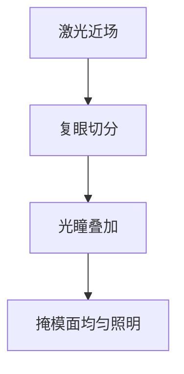

# 均光器与复眼

激光近场并不均匀。复眼把光束切成子孔径再叠到光瞳上，均匀的是照明，不是把相干性抹成零。

<footer>—— 对照照明均光 / fly's-eye integrator；[部分相干](/litho/partial-coherence)</footer>

[上一课](/litho/laser-gas-lifetime)停在激光出口。缺口是：出口光束有热点和椭圆，不能直接打掩模。本课钉均光器与复眼，接到 [离轴照明](/litho/off-axis-illumination)，不重做 σ。

## 问题

未均光的照明会把激光近场印到掩模上，CD 随狭缝位置变，像一台坏了的剂量机。均光要把空间均匀性做到百分比级，同时形成可调光瞳（环、偶极）。把均匀性写成「激光稳了就匀」，忽略积分器。

## 方法

复眼（fly's-eye）：阵列透镜把入射切成许多通道，在后续光瞳面重叠。光棒（rod）积分是另一条路。下游可变光瞳（[FlexRay](/litho/flexray-pupil)）在已均光的场上整形。设计同时管：场均匀、光瞳填充、透过率。

通道数太少，均匀性有残纹；太多，透过率与对准公差变差。斑纹平均也依赖通道数与脉冲数。

## 机制

每条通道带一部分空间相干结构。重叠后强度均匀，互相干不完全消失，所以 σ 与光瞳形状仍由后续光阑定义。这是 [空间相干](/litho/temporal-spatial-coherence) 在硬件上的实现，不是新的波动方程。

## 边界

下一课 REMA 刀片切的是已均光的场，不是激光腔。

## 小结

- 复眼把不均匀激光叠成均匀掩模照明，并预备光瞳。
- 均匀性与部分相干是两件事，不要互相替代。
- 出处：照明积分器通识；部分相干课。
