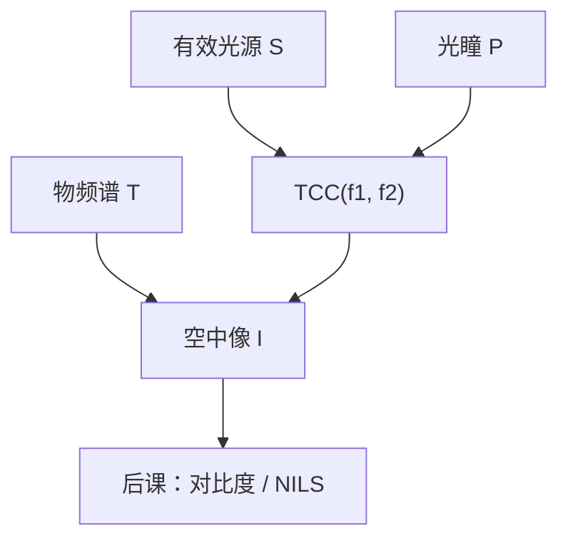

# Hopkins TCC

部分相干强度对物体是双线性的；传递交叉系数把光源与光瞳的重叠先算死，掩模只进一对频率。

<footer>—— H. H. Hopkins, On the diffraction theory of optical images, Proc. R. Soc. Lond. A (1953)</footer>

[上一课](/litho/coherence-sigma)把有效光源钉在单位光瞳上，支撑由 $\sigma$（或环带内外径）划定。缺口是：若对每个源点各做一次相干成像再加强度，掩模一改就要重扫整个源。Hopkins 把顺序换成：先把源与两个错位光瞳收成四维核 $\mathrm{TCC}(\mathbf{f}_1,\mathbf{f}_2)$，强度对物频谱双线性。空中像对比怎么读，留给[空中像与对比度](/litho/aerial-image-contrast)。本课不从瑞利判据重讲分辨率。

## 问题

上一课的源点叠加在概念上已经完备，计算上却把照明与物体缠在一起。工艺上照明、镜头几天不变，版图每个层次都变。缺口因此是一个**与掩模无关**的核：照明形状和光瞳函数进 TCC，物体只通过频谱的一对频率进来。没有这个核，后课的 OPC 无法把「光学算子」从多边形循环里提出来。

完全相干是退化：TCC 变成光瞳的乘积 $P(\mathbf{f}_1)P^*(\mathbf{f}_2)$。完全非相干则 TCC 只依赖差频，成为光瞳的自相关。产线落在中间，必须保留完整的四维函数。

### 四维不是装饰

物频谱 $T(\mathbf{f})$ 是二维的；强度涉及 $T(\mathbf{f}_1)T^*(\mathbf{f}_2)$，自变量是一对二维频率，故 TCC 是四维。不要把它画成「又一条 MTF 曲线」。MTF 是非相干或单频对比的切片；TCC 才是部分相干的完整核。

Hopkins 的有效光源 $S(\mathbf{f})$ 就是上一课的光瞳填充。圆、环、四级全部进 $S$，不进掩模。换照明 = 换 TCC，旧光学模型作废。

## 方法

标量形式（频率归一到像方 $\mathrm{NA}/\lambda$）写

$$
\mathrm{TCC}(\mathbf{f}_1,\mathbf{f}_2)=\iint S(\mathbf{f})\,P(\mathbf{f}+\mathbf{f}_1)\,P^*(\mathbf{f}+\mathbf{f}_2)\,d^2\mathbf{f}.
$$

几何上：把投影光瞳复制两份，分别平移到 $-\mathbf{f}_1$、$-\mathbf{f}_2$，与光源重叠的那块面积（再计光瞳复相位）就是该频率对的传递。空中像

$$
I(\mathbf{x})=\iint T(\mathbf{f}_1)T^*(\mathbf{f}_2)\,\mathrm{TCC}(\mathbf{f}_1,\mathbf{f}_2)\,e^{2\pi i(\mathbf{f}_1-\mathbf{f}_2)\cdot\mathbf{x}}\,d^2\mathbf{f}_1\,d^2\mathbf{f}_2.
$$

这就是双线性：对 $T$ 不是线性滤波。相干像场的 $|U|^2$ 展开后，交叉项正是这对频率。

### 本征展开只是算法

把 TCC 看成对 $(\mathbf{f}_1,\mathbf{f}_2)$ 的核，做本征分解（SOCS 一类），强度变成少数相干核的平方和。本课不讲数值秩、不讲 GPU。只承认：四维核是确定的物理对象，计算上可以压成几个相干通道，而不改变 Hopkins 的定义。

离焦与像差进 $P$ 的相位，因而进 TCC，不进 $S$。$\sigma$ 改 $S$ 的支撑。两个旋钮在公式里位置不同，不能互相替代。

## 机制

某一对频率能否对强度有贡献，看平移后的两个光瞳与光源有没有交集。密图形对应大的 $|\mathbf{f}|$，平移大，重叠变瘦，TCC 变小——这就是部分相干下「高频掉对比」的积分图像，不必先画艾里斑。源拉成环，重叠区域搬家，某些节距的 TCC 升、另一些降：RET 改照明的全部机制已经写在这个重叠里。

双线性意味着邻域：一点的强度依赖周围开口的交叉项，光学直径由 TCC 的频率宽度决定。后课 OPC 修边，修的就是这套交叉项，不是本地偏置。

### 后课默认的接口

说到部分相干成像，默认强度由 TCC 双线性给出；$S$ 由 $\sigma$ 与光瞳图案决定，$P$ 含 $\mathrm{NA}$、离焦与像差。空中像课只读 $I(\mathbf{x})$ 的对比，不再把源点循环重讲一遍。矢量 TCC 把 $P$ 换成偏振通道，定义结构相同，那是高 $\mathrm{NA}$ 课的缺口。

## 边界

1953 年的标量 Hopkins 不含掩模厚度、不含胶内矢量沉积。TCC 对固定照明与镜头是常数，对扫描狭缝场点可以变（镜头指纹），那是场相关模型，不是新原理。也不要把 TCC 叫做「相干因子」：$\sigma$ 是 $S$ 的半径，TCC 是重叠积分。

本课不引用未公开的 OPC 引擎截断秩。后课需要的只是：核存在、与掩模分离、对 $T$ 双线性。

## 小结

- TCC 是源与两个错位光瞳的重叠，四维，掩模无关。
- 空中像对物频谱双线性；相干 / 非相干是两种退化。
- 换 $\sigma$ 或光瞳图案 = 换 TCC；离焦进 $P$ 也改 TCC。
- 本征分解是计算，不是新的成像理论。
- 下一课从 $I(\mathbf{x})$ 读对比度。
- 出处：Hopkins (1953), *Proc. R. Soc. Lond. A*；产线用法见 Mack。
