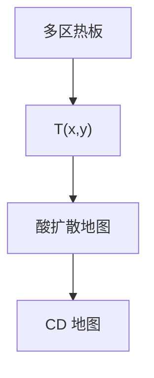

# 热板均匀性

PEB 差一度，酸扩散差一截。热板地图会印到 CD 地图上，看起来像扫描仪场内剂量。

<footer>—— 对照 PEB 热板多区控温与 CD 相关的工艺实践</footer>

[上一课](/litho/track-scanner-link)要求尽快 PEB。缺口是：到了热板，温度还是 $T(x,y)$。主干 [PEB 温度](/litho/peb-bake) 写过化学；本课写轨道热板的空间均匀与多区补偿。

## 问题

多区加热、边缘散热、接近式气隙、晶圆翘曲，使 PEB 不是一个数。CAR 的 CD 对 PEB 敏感度可以到 nm/°C 量级（依胶而定）。不量热板、只调扫描剂量，会把热地图补偿进光学，换胶或换热板就全塌。

## 方法

热板校准用测温晶圆或内嵌传感器，做空间图，调区功率。生产用「PEB 敏感度 × 允许 $\Delta T$」进 CDU 预算。接近式气隙必须受控，否则均匀性随片而变。软烤硬烤同样有地图，但 PEB 通常最毒。

边缘场更冷是常见模态。边缘 exclusion 与 EBR 已经切掉一部分，剩下的边缘芯片仍可能吃 PEB 梯度。

## 机制

扩散长度 $\propto \sqrt{D(T)t}$，$D$ 对 $T$ 指数敏感。一度的空间差不是线性 CD 差的「一度」，而是 Arrhenius。所以热板规格用温度而不是用「看起来差不多」。

## 边界

下一课轨道缺陷：热板颗粒、升华物、背面接触，与温度地图是两条账。

## 小结

- PEB 热板地图会伪装成光学 CDU。
- 多区校准进预算，不要只调剂量。
- 出处：PEB 课；热板工艺通识。
