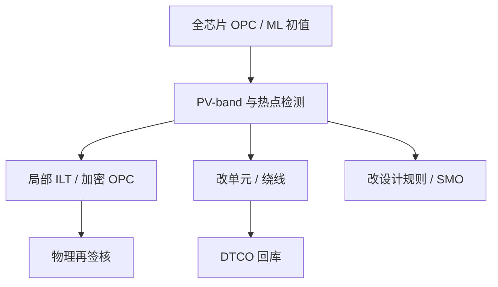

# 热点修复

全芯片 OPC 收的是平均合同；真正死在良率上的是少数设计热点。修掩模、改设计还是改规则，是 DTCO 的选择，不是再跑一夜计算。

<footer>—— 对照 DTCO 对 litho hotspot 的公开工程讨论</footer>

[上一课](/litho/ml-opc)把学习模型限定为前向加速或初值，签核仍落在物理成像上。缺口是：物理 OPC 加 ML 暖启动之后，仍会留下局部不可印或窗口为零的图形——设计热点（hotspot）。本课钉热点修复。[DTCO](/litho/dtco-patterning) 如何把修复反馈进库，下一课展开；这里先把「这一处怎么处理」钉死。

## 问题

全场 EPE 可以合格，SRAM 边角、标准单元拼接、密度跳变处仍出现桥接、断线、孔缩小。原因可能是模型外推、MRC 夹紧、禁戒节距、或设计本来就在窗口悬崖上。[PW-OPC](/litho/pw-opc) 降低发生率，不保证零。ML 若在热点邻域外推，还会造出光滑的假安全。

热点不是检查器上的 MRC 红旗。MRC 绿、模拟却在角点死，或硅片 SEM 才看见。问题是检测–分类–处置的闭环，以及处置权在掩模还是在设计。

### 三类处置不要混成「再 OPC」

掩模侧：局部 ILT、加密碎片、加/改 SRAF、定向修复。设计侧：改线端、加通孔冗余、挪绕线、换单元变体。工艺侧：改剂量/焦点中心、光源微调——牵动全场，很少为单点启用。把设计错误交给掩模硬扛，TAPOUT 会把窗口卖光。

热点清单必须带来源：纯模拟、在线检测、还是电性失效。三类的假阳性不同，修法不同。

## 方法

检测：全芯片 PV-band、热点分类器（可含 ML，但要用物理再确认）、以及硅片上的工艺窗监测图形。分类：光学可修 / 须改设计 / 须改规则。可修的进局部逆问题，范围要盖住光学直径，否则边界再造新热点。须改设计的退回单元库或路由器，带上失败的工艺点图像，而不是只标一个坐标。

与 MRC 修复的分工：MRC 是可写性；热点是可印性。先夹紧再发现热点，可能是夹紧造成的，要回看 fixup 日志。先修热点再炸 MRC，则走回上一课。

### 库与路由器

重复出现的热点说明单元或布线规则有洞。修复一万处相同的线端，不如改一版库。这就是 DTCO 的入口：热点统计驱动设计规则下一版，而不是 OPC 团队无限局部 ILT。

## 机制

热点是邻域算子的坏点：禁戒节距上对比崩溃、三维阴影把某一取向推下窗、刻蚀密度跳变。局部 ILT 能在透镜通带里找更好的形状，但自由度仍受 MRC 与写版约束。若物理上对比不足，掩模再弯也没有光子。那时必须放宽间距或改照明——后者是 SMO 级决策。

ML 分类器加速找点，不能当处置器。域外设计（新单元、新层）上的「热点分数」要物理复核，否则会漏报真点、狂报假点。

「修热点」在管理上要有冻结点：过了某日只允许掩模补丁，不准再改库。日历与物理要写在同一流程里。

## 边界

本课不写具体单元轨道高度，也不把机器学习网络结构当修复算法。不要发明某节点的热点密度数字。后课默认：OPC 收敛之后还有热点清单，处置分掩模/设计/规则三轨。

硅片随机缺陷不是设计热点；剂量不足的泊松尾要胶与剂量预算，见随机效应课。

热点修复不是对客户版图的美化。未授权改设计会改时序。处置权必须在设计合同里写清。

## 小结

- 全芯片均值合格后，良率仍死在局部热点。
- 处置分掩模局部逆、改设计、改规则/光源三轨，不要一律再 OPC。
- ML 可找点，处置与签核必须物理。
- 重复热点应升级为 DTCO 改库，而不是万次局部补丁。
- 出处：DTCO 与 litho hotspot 的公开工程讨论。
