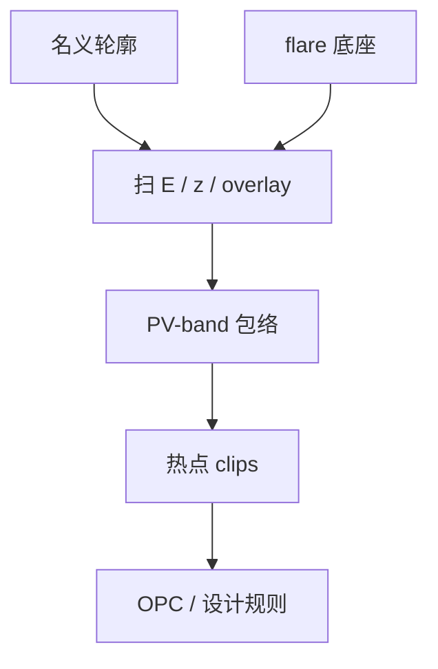

# 热点与过程变化

名义剂量、名义焦点上的轮廓合格，不表示剂量与焦点在规格矩形里扫一圈时仍合格。热点是过程变化下先死的那些局部图形。

<footer>—— 据计算光刻通称：hotspot 与 PV-band；OPC 评价里的工艺窗口带</footer>

[上一课](/litho/flare-and-stray)把长程散射写成全场剂量底座，对比随开孔率变。缺口是局部：同一底座上，某些二维拐角、线端、孔对 $(E,z)$ 与套刻的敏感远高于密线栅。本课钉设计热点与过程变化带（PV-band）。平均 CDU 被刻蚀改写成 AEI，留给[下一课](/litho/cdu-etch-bias)；本课的对象仍是显影后轮廓在窗口里动了多少。

## 问题

[OPC](/litho/opc) 已经要求评价不能只看中心点，而要看 PV-band：剂量与焦点在规格矩形里扫一圈，轮廓包络是否仍让出套刻与电学余量。本课把这句话从 OPC 课的评价句，收成计量课序里的失效模式。Flare 改的是缓变底座，热点是底座之上仍会先桥连、先缩断、先掉孔的那些 clips。

缺口因此是「哪些图形在过程变化下越界」，不是再测一次 Kirk flare。全场平均 CD 合格时，SRAM 拐角或切断端可以已经在 PV-band 外。热点清单是层的合同附件，不是 OPC 工程师的可选海报。

### PV-band 不是 E–D 窗的别名

E–D 窗是选定关键图形的平均 CD 合格面积。PV-band 是同一组过程变化下，轮廓扫出的几何包络（加或不加套刻偏移）。窗大而带厚，说明图形在窗里扭动——电学仍可能死。计算光刻用带厚当目标，FEM 用面积当目标，两张图要一起读。

热点检测是在全芯片上找 PV-band 越界的局部，不是只对 FEM 垫上的线栅负责。垫合格、产品死，是选题偏差。

## 方法

模拟：在校准过的光学 + 胶模型上，对全芯片或热区 clips 扫剂量、焦点、可选套刻与掩模误差，输出 EPE / 桥连 / 断线指标。命中的热点回 OPC 或改设计规则。硅片验证用 SEM 审查这些坐标，而不是再平均进 OCD。Flare 模型必须开着，否则开阔区旁边的暗图形会被漏掉——上一课的底座是热点的前置，不是替代。

过程变化的矩形从产品控制图来：实际剂量 CDU、实际焦指纹、实际套刻，而不是教科书上的 $\pm 10\%$ 与 $\pm 50\,\mathrm{nm}$ 随便填。矩形填大了，热点满天飞；填小了，签核通过、硅片失败。

掩模误差（MEEF 大的边）要进带的第三轴，否则热点清单会漏掉掩模厂能修的那一类。

### 与随机缺孔的边界

PV-band 是平均轮廓的过程变化。EUV 孔的随机缺失是尾部事件，平均带仍可能「开着」。热点清单要另叠随机感知项，不能用 PV-band 绿色宣言零缺孔。[stochastic-holes](/litho/stochastic-holes) 已经分开均值与极值，这里只禁止偷换。

## 机制

二维图形的 NILS 在拐角处掉得快，离焦时等高线收缩不对称，线端缩回、拐角变圆，桥连与断开在带的两侧。SRAF 在窗边沿可能打印，成为新热点。Flare 随局部开孔率抬 $I_\mathrm{min}$，密区里的孤立暗线与开阔区里的密线，热点清单不同。同一套 OPC 在两块密度上不能当同一张带。

套刻偏移把邻层图形推进带内：通孔相对金属的热点是光刻带与套刻的卷积，不是纯 CD。LELE 的颜色边界更是人为热点源。计算光刻通称把这些叫 process-window limiting patterns，不叫镜头坏了。

只展示一条密线的 PV-band 变窄，是 SMO/ILT 海报的选题偏差。逻辑后段的二维热点才决定这一层签核。

## 边界

本课不把某次 ILT 案例的带厚改善写成节点良率，也不讨论未公开的全芯片小时数。镜头像差是设计波前，flare 是散射底座，热点是图形在两者之上的局部失败——三个旋钮，修错不收敛。后课默认：计量签核包含热点 SEM，不只是场均值 CDU。

刻蚀会把 ADI 热点平移或放大成 AEI 热点，下一课才写偏置；本课若用刻蚀后 SEM 验热点，必须声明，不能和 OPC 的显影模型对打。

PV-band 的剂量轴来自产品剂量控制，不是胶衬度曲线的全量程。把 $\gamma$ 测到的极端剂量填进带，热点会假性爆炸。

## 小结

- 热点是过程变化下先越界的局部图形；PV-band 是轮廓包络。
- 与 E–D 窗面积不同：窗大仍可带厚。
- Flare 底座必须进模拟，否则密度相关热点漏检。
- 平均带看不见随机缺孔；验证用 SEM 坐标，不用 OCD 均值。
- 出处：计算光刻通称（OPC / SMO / ILT 的 PV-band 与 hotspot）；Mack / Levinson 对窗口图形交集的讨论。
